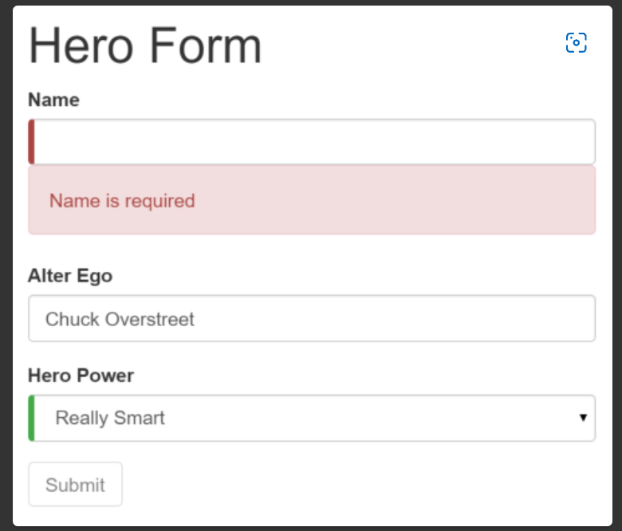

# MyApp

This project was generated with [Angular CLI](https://github.com/angular/angular-cli) version 13.3.6.

## Development server

Run `ng serve` for a dev server. Navigate to `http://localhost:4200/`. The application will automatically reload if you change any of the source files.

## Code scaffolding

Run `ng generate component component-name` to generate a new component. You can also use `ng generate directive|pipe|service|class|guard|interface|enum|module`.

## Build

Run `ng build` to build the project. The build artifacts will be stored in the `dist/` directory.

## Running unit tests

Run `ng test` to execute the unit tests via [Karma](https://karma-runner.github.io).

## Running end-to-end tests

Run `ng e2e` to execute the end-to-end tests via a platform of your choice. To use this command, you need to first add a package that implements end-to-end testing capabilities.

## Further help

To get more help on the Angular CLI use `ng help` or go check out the [Angular CLI Overview and Command Reference](https://angular.io/cli) page.

===================== tutorial =====================

## Create a new workspace and an initial application

You develop applications in the context of an Angular workspace. A workspace contains the files for one or more projects. A project is the set of files that comprise an application or a library. For this tutorial, you will create a new workspace.

1. To create a new workspace and an initial application project:

2. Ensure that you are not already in an Angular workspace folder. For example, if you have previously created the Getting Started workspace, change to the parent of that folder.

Run the CLI command ng new and provide the name angular-tour-of-heroes, as shown here:

~~~
ng new angular-tour-of-heroes
~~~

3. The ng new command prompts you for information about features to include in the initial application project. Accept the defaults by pressing the Enter or Return key.

The Angular CLI installs the necessary Angular npm packages and other dependencies. This can take a few minutes.

It also creates the following workspace and starter project files:

- A new workspace, with a root folder named angular-tour-of-heroes
- An initial skeleton app project in the src/app subfolder
- Related configuration files

The initial app project contains a simple Welcome application, ready to run.

## Run the application

The Angular CLI includes a server, for you to build and serve your app locally.

1. Navigate to the workspace folder, such as my-app.

2. Run the following command:
   
~~~
cd angular-tour-of-heroes
ng serve --open
~~~

> The ng serve command builds the app, starts the development server, watches the source files, and rebuilds the application as you make changes to those files.
>
>The --open flag opens a browser to http://localhost:4200.

You should see the application running in your browser.

 

## `Angular Components`

- The page you see is the `application shell`. The shell is controlled by an Angular `component` named `AppComponent`.
- `Components`are the fundamental building blocks of Angular applications. 
- They display data on the screen, listen for user input, and take action based on that input.

 

## Make changes to the application
****
Open the project in your favorite editor or IDE and navigate to the src/app folder to make some changes to the starter application.

You'll find the implementation of the shell AppComponent distributed over three files:

1) `app.component.ts` : The component class code, written in TypeScript.
2) `app.component.html`: The component template, written in HTML.
3) `app.component.css`: The component's private CSS styles.

 

### `Change the application title`

 

- Open the component class file (app.component.ts) and change the value of the `title` property to 'Tour of Heroes'.

~~~
title = 'Tour of Heroes';
~~~

- Open the component template file (app.component.html) and delete the default template generated by the Angular CLI.
- Replace it with the following line of HTML.

~~~
<h1>{{title}}</h1>
~~~

- The double curly braces are Angular's `interpolation binding syntax`. This interpolation binding presents the component's `title` property value inside the HTML header tag.
- The browser refreshes and displays the new application title.

### `Add application styles`

 

Most apps strive for a consistent look across the application. The CLI generated an empty styles.css for this purpose. Put your application-wide styles there.

Open src/styles.css and add the code below to the file.

~~~
/* Application-wide Styles */
h1 {
  color: #369;
  font-family: Arial, Helvetica, sans-serif;
  font-size: 250%;
}
h2, h3 {
  color: #444;
  font-family: Arial, Helvetica, sans-serif;
  font-weight: lighter;
}
body {
  margin: 2em;
}
body, input[type="text"], button {
  color: #333;
  font-family: Cambria, Georgia, serif;
}
button {
  background-color: #eee;
  border: none;
  border-radius: 4px;
  cursor: pointer;
  color: black;
  font-size: 1.2rem;
  padding: 1rem;
  margin-right: 1rem;
  margin-bottom: 1rem;
  margin-top: 1rem;
}
button:hover {
  background-color: black;
  color: white;
}
button:disabled {
  background-color: #eee;
  color: #aaa;
  cursor: auto;
}

/* everywhere else */
* {
  font-family: Arial, Helvetica, sans-serif;
}
~~~

 

### Summary

- You created the initial application structure using the Angular CLI
- You learned that Angular components display data
- You used the double curly braces of interpolation to display the application title

 

 

## `1 - The hero editor`

 

The application now has a basic title. Next you will create a new component to display hero information and place that component in the application shell.

 

### `Create the heroes component`
 

- Using the Angular CLI, generate a new component named heroes.

~~~
ng generate component heroes
~~~

The CLI creates a new folder, src/app/heroes/, and generates the three files of the HeroesComponent along with a test file.

The HeroesComponent class file is as follows:

~~~
import { Component, OnInit } from '@angular/core';

@Component({
  selector: 'app-heroes',
  templateUrl: './heroes.component.html',
  styleUrls: ['./heroes.component.css']
})
export class HeroesComponent implements OnInit {

  constructor() { }

  ngOnInit(): void {
  }

}
~~~

You always import the Component symbol from the Angular core library and annotate the component class with @Component.

@Component is a decorator function that specifies the Angular metadata for the component.

The CLI generated three metadata properties:
- `selector`: The component's CSS element selector.
- `templateUrl`: The location of the component's template file.
- `styleUrls`: The location of the component's private CSS styles.

The CSS element selector, 'app-heroes', matches the name of the HTML element that identifies this component within a parent component's template.

The ngOnInit() is a lifecycle hook. Angular calls ngOnInit() shortly after creating a component. It's a good place to put initialization logic.

Always export the component class so you can import it elsewhere … like in the AppModule.

#### `Add a hero property`

 

Add a hero property to the HeroesComponent for a hero named "Windstorm".

~~~
hero = 'Windstorm';
~~~

 

#### `Show the hero`

 

Open the heroes.component.html template file. Delete the default text generated by the Angular CLI and replace it with a data binding to the new hero property.

~~~
<h2>{{hero}}</h2>
~~~

 

### `Show the HeroesComponent view`

 

To display the HeroesComponent, you must add it to the template of the shell AppComponent.

Remember that app-heroes is the element selector for the HeroesComponent. So add an <app-heroes> element to the AppComponent template file, just below the title.

~~~
<h1>{{title}}</h1>
<app-heroes></app-heroes>
~~~

Assuming that the CLI ng serve command is still running, the browser should refresh and display both the application title and the hero name.

 

### `Create a Hero interface`

 

A real hero is more than a name.

- Create a Hero interface in its own file in the src/app folder. Give it id and name properties.

~~~
[app/components/hero.ts]
export interface Hero {
  id: number;
  name: string;
}
~~~

- Refactor the component's hero property to be of type Hero. Initialize it with an id of 1 and the name Windstorm.

The revised HeroesComponent class file should look like this:

~~~
import { Component, OnInit } from '@angular/core';
import { Hero } from '../hero';

@Component({
  selector: 'app-heroes',
  templateUrl: './heroes.component.html',
  styleUrls: ['./heroes.component.css']
})
export class HeroesComponent implements OnInit {
  hero: Hero = {
    id: 1,
    name: 'Windstorm'
  };

  constructor() { }

  ngOnInit(): void {
  }

}
~~~

> The page no longer displays properly because you changed the hero from a string to an object.

 

### `Show the hero object`

 

Update the binding in the template to announce the hero's name and show both id and name in a details layout like this:

~~~
<h2>{{hero.name}} Details</h2>

id: {{hero.id}}

name: {{hero.name}}

~~~

The browser refreshes and displays the hero's information.

 

### `Format with the UppercasePipe`

 

Modify the `hero.name` binding like this:

~~~
<h2>{{hero.name | uppercase}} Details</h2>
~~~

 

- The browser refreshes and now the hero's name is displayed in capital letters.
- The word `uppercase` in the interpolation binding, right after the pipe (`|`) character, activates the built-in `UppercasePipe`.
- [Pipes](https://angular.io/guide/pipes) are a good way to format strings, currency amounts, dates and other display data.
- Angular ships with several built-in pipes and you can create your own.

 

### Edit the hero

- Users should be able to edit the hero name in an `<input>` textbox.
- The textbox should both `display` the hero's `name` property and `update` that property as the user types.
- That means data flows from the component class `out to the screen` and from the screen `back to the class`.
- To automate that data flow, setup a two-way data binding between the `<input>` form element and the `hero.name` property.

 

#### `two-way binding`

 

- Refactor the details area in the `HeroesComponent` template so it looks like this:

~~~ 

  <label for="name">Hero name: </label>
  <input id="name" [(ngModel)]="hero.name" placeholder="name">

~~~

 

- `[(ngModule)]` : Is Angular's two-way data binding syntax.
- Here it binds the `hero.name` property to the HTML textbox so that data can flow in `both directions`: from the `hero.name` property to the textbox and from the textbox to the `hero.name`

 

#### `The missing FormsModule`

 

- Notice that the application stopped working when you added `[(ngModel)]`.
- To see the error, open the browser development tools and look in the console for a message like:

~~~
Template parse errors:
Can't bind to 'ngModel' since it isn't a known property of 'input'.
~~~

 

- Although `ngModel` is a valid Angular directive, it isn't available by default.
- It belongs to the optional `FormsModule` and you must opt-in to using it.

 

### AppModule

 

- Angular needs to know how the pieces of your application fit together and what other files and libraries the application requires. This information is called `metadata`.
- Some of the metadata is in the `@Component` decorators that you added to your component classes. 
- Other critical metadata is in `@NgModule` decorators.
- The mos important `@NgModule` decorator annotates the top-level `AppModule` class.
- The Angular CLI generated an `AppModule` class in `src/app/app.module.ts` when it created the project.
- There is where you opt-in to the `FormsModule`

 

#### `Import FormsModule`

 

- Open `AppModule` (app.module.ts) and import the `FormsModule` symbol from the `@angular/forms` library.

~~~
import { FormsModule } from '@angular/forms'; <-- NgModel lives here
~~~

 

- Then add `FormsModule` to the `@NgModule` metadata's `imports` arrya, which contains a list of external modules that the application needs.

~~~
[app.module.ts (#NgModule imports)]
imports: [
  BrowserModule,
  FormsModule
],
~~~

 

- When the browser refreshes, the application should work again. You can edit the hero's name and see the changes reflected immediately in the `<h2>` above the textbox.

 

### Declare HeroesComponent

 

- Every component must be declared in `exactly one` [NgModule](https://angular.io/guide/ngmodules).
- You didn't declare the `HeroesComponent`. So why did the application work?
- It worked because the Angular CLI declared `HeroesComponent` in the `AppModule` when it generated that component.
- Open `srx/app/app.module.ts` and find `HeroesComponent` imported near the top.

~~~
import { HeroesComponent } from './heroes/heroes.component';
~~~

 

- The `HeroesComponent` is declared in the `@NgModule.declarations` array.

~~~
[src/app/app.module.ts]
declarations: [
  AppComponent,
  HeroesComponent,
],
~~~

 

> `AppModule` declares both application components, `AppComponent` and `HeroesComponent`.

### `Summary`
- You used the CLI to create a second `HeroesComponent`
- You displayed the `HeroesComponent` by adding it to the `AppComponent` shell
- You applied the `UppercasePipe` to format the name.
- You used two-way data binding with the `ngModel` directive
- You leraned about the `AppModule`
- You imported the `FormsModule` in the `AppModule` so that Angular would recognize and apply the `ngModel` directive.
- You learned the importance of declaring components in the `AppModule` and appreciated that the CLI declared it for you.

 

## `2 - Display a seleciton list`

 

- In this page, you'll expand the Tour of heroes application to display a list of heroes, and allow users to select a hero and display the hero's details.

 

### Create mock heroes

 

- You'll need some heroes to display.
- Eventually you'll get them from a remote data server. For now, you'll create some `mock heroes` and pretend they came from the server.
- Create a file called `mock-heroes.ts` in the `src/app/` folder. Define a `HEROES` constant as an array of ten heroes and export it. The file should look like this.

~~~
import { hero } from './hero'

export const HEROES: Hero[] = [
  { id: 12, name: 'Dr.nice' },
  { id: 13, name: 'Bombasto' },
  { id: 14, name: 'Celeritas' },
  { id: 15, name: 'Magneta' },
  { id: 16, name: 'RubberMan' },
  { id: 17, name: 'Dynama' },
  { id: 18, name: 'Dr. IQ' },
  { id: 19, name: 'Magma' },
  { id: 20, name: 'Tornado' }
]
~~~

 

### Display Heroes

 

- Open the `HeroesComponent` class file and import the mock `HEROES`.

~~~
import { HEROES } from '../mock-heroes'
~~~

 

- In the same file (`HeroesComponent` class), define a component property called `heroes` to expose the `HEROES` array for binding.

~~~
export class HeroesComponent implements OnInit {
  heroes = HEROES;
}
~~~

 

#### `List heroes with *ngFor`

 

Open the `HeroesComponent` template file and make the following changes:
1) Add an `<h2>` at the top
2) Below it add an HTML unordered list (`<ul>`) element.
3) Insert an `<li>` within the `<ul>`
4) Place a `<button>` inside the `<li>` that displays properties of a `hero` inside `` elements.
5) Sprinkle some CSS classes for styling (you'll add the CSS styles shortly).

 

Make it look like this:

~~~
[heroes.component.html]

<h2> My Heroes </h2>
<ul class="heroes">
  <li>
    <button>
      {{hero.id}}
      {{hero.name}}
    </button>
  </li>
</ul>
~~~

 

That displays an error since the property 'hero' does not exist. To have access to each individual hero and list them all, add an `*ngFor` to the `<li>` to iterate through the list of heroes:

~~~
<li *ngFor="let hero of heroes">
~~~
 

- The `*ngFor` is Angular's `repeater` directive. It repeats the host element for each element in a list.
- The syntax in this example is as follows:

`<li>` : The host element.
`heroes`: Holds the mock heroes list from the `HeroesComponent` class, the mock heroes list.
`hero`: Holds the current hero object for each iteration through the list.

> Don't forget the asterisk (*) character in front of `NgFor`. It's a critical part of the syntax.

 

After the browser refreshes, the list of heroes appears.

> `Interactive Elements`
> 
> NOTE: Inside the `<li>` element, wee've wrapped the hero's details in a `<button>` element. Later on we make the hero clickable, and it is better for accessibility purposes to use natively interactive HTML elements (e.g `<button>`) instead of addign event listeners to non-interactive ones (e.g. `<li>`).
> 
> For more details on accessibility, see [Accessibility in Angular](https://angular.io/guide/accessibility)

 

### `Style the heroes`

 

- The heroes list should be attractive and should respond visually when users hover over and select a hero from the list.
- In the [first tutorial](https://angular.io/tutorial/toh-pt0#app-wide-styles), you set the basic styles for the entire application in `styles.css`.
- That stylesheet didn't include styles for this list of heroes.
- You could add more styles to `styles.css` and keep growing that stylesheet as you add components.
- You may prefer instead to define private styles for a specific component and keep everything a component needs - the code, the HTML, and the CSS - together in one place.
- This approach makes it easier to re-use the component somewhere else and deliver the component's intended appearance even if the global styles are different.
- You define private styles either inline in the `@Component.styles` array or as stylesheet file(s) identified in the `@Component.styleUrls` array.
- When the CLI generated the `HeroesComponent`, it created an empty `heroes.component.css` stylesheet for the `HeroesComponent` and pointed to it in `@Component.styleUrls` like this.

~~~
[src/app/components/heroes/heroes.component.ts](@Component)

@Component({
  selector: 'app-heroes',
  templateUrl: './heroes.component.html',
  styleUrls: ['./heroes.component.css']
})
~~~

 

- Open the `heroes.component.css` file and paste in the private CSS styles for the `HeroesComponent`. You'll find them in the [final code review](https://angular.io/tutorial/toh-pt2#final-code-review) at the bottom of this guide.

> Styles and stylesheets identified in `@Component` metadata are scoped to that specific component. The `heroes.component.css` styles apply only to the `HeroesComponent` and don't affect the outer HTML or the HTML in any other component.

 

### Viewing details

 

- When the user clicks a hero in the list, the component should display the selected hero's details at the bottom of the page.
- In this section, you'll listen for the hero item click event and display/update the hero details.

 

#### `Add a click event binding`

 

- Add a click event binding to the `<button>` in the `<li>` like this:

~~~
<li *ngFor="let hero of heroes">
  <button type="button" (click)="onSelect(hero)">
</li>
~~~

- This is an example of Angular's [event binding](https://angular.io/guide/event-binding) syntax.
- The parentheses around `click` tell Angular to listen for the `<button>` element's `click` event.
- When the user click in the `<button>`, Angular executes the `onSeleect(hero)` expression.
- In the next section, define an `onSelect()` method in `HeroesComponent` to display the hero that was defined in the `*ngFor` expression.

 

#### `Add the click event handler`

 

- Rename the component's `hero` property to `selectedHero` but don't assign any value to it since there is no `selected hero` when the application starts.
- Add the following `onSelect()` method, which assigns the clicked hero from the template to the component's `selectedHero`.

~~~
selectedHero?: Hero:
onSelect(hero: Hero): void {
  this.selectedHero = hero;
}
~~~

 

#### `Add a details section`

 

- Currently, you have a list in the component template.
- To click on a hero on the list and reveal details about that hero, you need a section for the detils to render in the template.
- Add the following to `heroes.component.html` beneath the list section:

~~~

  <h2>{{selectedHero.name | uppercase}} Details</h2>
  
id: {{selectedHero.id}}

  

    <label for="hero-name">Hero name: </label>
    <input id="hero-name" [(ngModel)]="selectedHero.name" placeholder="name">
  

~~~

 

- The hero details should only be displayed when a hero is selected.
- When a component is created initially, there is no selected hero, so we add the `*ngIf` directive to the `
` that wraps the hero details, to instruct Angular to render the section only when the `selectedHero` is actually defined (after it has been selected by clicking on a hero).

> Don't forget the asterisk (*) character in front of `ngIf`. It's a critical part of the syntax.

 

### Style the selected hero

 

- To help identify the selected hero, you can use the `.selected` CSS class in the [styles you added earlier](https://angular.io/tutorial/toh-pt2#styles).
- To apply the `.selected` class to the `<li>` when the user clicks it, use class binding.

 

- Angular's [class binding](https://angular.io/guide/attribute-binding#class-binding) can add and remove a CSS class conditionally.
- Add `[class.some-css-class]="some-condition"` to the element you want to style.
- Add the following `[class.selected]` binding to the `<button>` in the `HeroesComponent` template:

~~~
[class.selected]="hero === selectedHero"
~~~

 

- When the current row hero is the same as the `selectedHero`, Angular adds the `selected`CSS class.
- When the two heroes are different, Angular removes the class.
- The finished `<li>` looks like this:

~~~
<li *ngFor="let hero of heroes">
  <button [class.selected]="hero === selectedHero" type="button" (click)>="onSelect(hero)">
    {{hero.id}}
    {{hero.name}}
  </button>
</li>
~~~

 

### Summary

 

- The Tour of Heroes application displays a list of heroes with a detail view.
- The user can select a hero and see that hero's details.
- You used `*ngFor` to display a list
- You used `*ngIf` to conditionally include or exclude a block of HTML.
- You can toggle a CSS style class with a `class` binding.

 

## `3 - Create a feature component`

 

- At the moment, the `HeroesComponent` displays both the list of heroes and the selected hero's details.
- Keeping all features in one component as the application grows will not be maintainable.
- You'll want to split up large components into smaller sub-components, each focused on a specific task or workflow.
- In this page, you'll take the first step in that direction by moving the hero details into a separate, reusable `HeroDetailComponent`.
- The `HeroesComponent` will only present the list of heroes.
- The `HeroDetailComponent` will present details of selected hero.

 

### Make the HeroDetailComponent

 

- Use the Angular CLI to generate the new component named `hero-detail`.

~~~
ng g component hero-detail
~~~

 

The command scaffolds the following:
- Creates a directory `src/app/components/hero-detail`

Inside the directory four files are generated:
- A CSS file for the component styles.
- An HTML file for the component template.
- A TypeScript file with a component class named `HeroDetailComponent`
- A test file for the `HeroDetailComponent` class.

The command also adds the `HeroDetailComponent` as a declaration in the `@NgMOdule` decorator of the `src/app/app.module.ts` file.

 

#### `Write the template`

 

- Cut the HTML for the hero detail from the bottom of the `HeroesCOmponent` template and paste it over the generated boilerplate in the `HeroDetailComponent` template.
- The pasted HTML refers to a `selectedHero`.
- The new `HeroDetailComponent` can present `any` hero, not just a selected hero.
- So replace "selectedHero" with "hero" everywhere in the template.
- When you're done, the `HeroDetailComponent`template should look like this:

~~~

  <h2>{{hero.name | uppercase}} Details</h2>
  
id: {{hero.id}}

  

    <label for="hero-name">Hero name: </label>
    <input id="hero-name" [(ngModel)]="hero.name" placeholder="name">
  

~~~

 

#### `Add the `@Input()` hero property`

 

- The `HeroDetailComponent` template binds to the component's `hero` property which is of type `Hero`.
- Open the `HeroDetailComponent` class file and import the `Hero` symbol.

~~~
import { Hero } from './src/app/interfaces/hero.ts'
~~~

- The `hero` property [must be an `Input` property](https://angular.io/guide/inputs-outputs), annotated with the `@Input()` decorator, because the `external HeroesComponent` [will bind to it](https://angular.io/tutorial/toh-pt3#heroes-component-template) like this:

~~~
<app-hero-detail [hero]="selectedHero"></app-hero-detail>
~~~

- Amend the `@angular/core` import statement to include the `Input` symbol.

~~~
import { Component, OnInit, Input } from '@angular/core';
~~~

- Add a `hero` property, preceded by the `@Input()` decorator.

~~~
@Input() hero?: Hero;
~~~

- That's the only change you should make to the `HeroDetailComponent` class.
- There are no more properties.
- There's no presentation logic.
- This component only receives a hero object through its `hero` property and displays it.

 

### Show the HeroDetailComponent

 

- The `HeroesComponent` used to display the hero details on its own, before you removed that portion of the tempalte.
- This section guides you through delegating logic to the `HeroDetailComponent`.
- The two components will have a parent/child relationship.
- The parent `HeroesComponent`will control the child `HeroDetailComponent` by sending it a new hero to display whenever the user selects a hero from the list.
- You won't change the `HeroesComponent` class but you will change its tempalte.

 

#### `Update the HeroesComponent template`

 

- The `HeroDetailComponent` selector is `'app-hero-detail'`.
- Add an `<app-hero-detail>` element near the bottom of the `HeroesComponent` template, where the hero detail view used to be.
- Bind the `HeroesComponent.selectedHero` to the element's `hero` property like this:

~~~
<app-hero-detail [hero]="selectedHero"></app-hero-detail>
~~~

- `[hero]="selectedHero"` is Angular [property binding](https://angular.io/guide/property-binding).
- It's a `one way` data binding from the `selectedHero` property of the `HeroesComponent` to the `hero` property of the target element, which maps to the `hero` property of the `HeroDetailComponent`.
- Now when the user clicks a hero in the list, the `selectedHero` changes.
- When the `selectedHero` changes, the `property binding` updates `hero` and the `HeroDetailComponent` displays the new hero.
- The revised `HeroesComponent` template should look like this:

~~~
<h2>My Heroes</h2>

<ul class="heroes">
  <li *ngFor="let hero of heroes">
    <button [class.selected]="hero === selectedHero" type="button" (click)="onSelect(hero)">
      {{hero.id}}
      {{hero.name}}
    </button>
  </li>
</ul>

<app-hero-detail [hero]="selectedHero"></app-hero-detail>
~~~

- The browser refreshes and the application starts working again as it did before

 

### `What changed?`

 

- As [before](https://angular.io/tutorial/toh-pt2), whenever a user clicks on a hero name, the hero detail appears below the hero list. Now the `HeroDetailComponent` is presenting those details instead of the `HeroesComponent`.
- Refactoring the original `HeroesComponent` into two components yields benefits, both now and in the future:
    1) You reduced the `HeroesComponent` responsabilities.
    2) You can evolve the `HeroDetailComponent` into a rich hero editor without touching the parent `HeroesComponent`.
    3) You can evolve the `HeroesComponent` without touching the hero detail view.
    4) You can re-use the `HeroDetailComponent` in the template of some future component.

 

### `Summary`

- You created a separatem reusable `HeroDetailComponent`.
- You used a [property binding](https://angular.io/guide/property-binding) to give the parent `HeroesComponent`control over the child `HeroDetailComponent`.
- You used the [`@Input` decorator](https://angular.io/guide/property-binding) to make the `hero` property available for binding by the external `HeroesComponent`.

 

## `4 - Add Services`

 

- The Tour of Heroes `HeroesComponent` is currently getting and displaying fake data.
- After the refactoring in this tutorial, `HeroesComponent` will be lean and focused on supporting the view.
- It will also be easier to unit-test with a mock service.

 

### Why Services

 

- Components shouldn't fetch or save data directly and they certainly should'nt knowingly present fake data.
- They should focus on presenting data and delegate data access to a service.
- In this tutorial, you'll create a `HeroService`that all application classes can use to get heroes.
- Instead of creating that service with the `new` [keyword](https://developer.mozilla.org/docs/Web/JavaScript/Reference/Operators/new), you'll rely on Angular [dependency injection](https://angular.io/guide/dependency-injection) to inject it into the `HeroesComponent` constructor.
- Services are a great way to share information among classes that `don't know each other`.
- You'll create a `MessageService` and inject it in two places.
  -  Inject in `HeroService`, which uses the servicec to send a message.
  -  Inject in `MessagesComponent`, which displays that message, and also displays the ID when the user clicks a hero.

 

### Create the HeroService

 

- Using the Angular CLI, create a service called hero.

~~~
ng g service hero
~~~

- The command generates a skeleton `HeroService` class in `/src/app/services/hero/hero.service.ts` as follows:

~~~
import { Injectable } from '@angular/core';

@Injectable({
  providedIn: 'root',
})
export class HeroService {
  constructor(){ }
}
~~~

#### [@Injectable()](https://angular.io/api/core/Injectable) `services`

 

- Notice that the new service imports the Angular `Injectable` symbol and annotates the class with the `@Injectable()` decorator.
- This marks the class as one that participates in the `dependency injection system`.
- The `HeroService` class is going to provide an injectable service and it can also have its own injected dependencies.
- It doesn't have any dependencies yet, but [it will soon](https://angular.io/tutorial/toh-pt4#inject-message-service)
- The `@Injectable()` decorator accepts a metadata object for the service, the same way the `@Component()` decorator did for your component class.

 

#### `Get Hero data`

 

- The `HeroService` could het hero data from anywhere - a web service, local storage, or a mock data source.
- Removing data access from components means you can change your mind about the implementation anytime, without touching any components.
- They don't know how the service works.
- The implementation in this tutorial will continue to deliver mock heroes.
- Import the `Hero` and `HEROES`

~~~
[/src/app/services/hero/hero.service.ts]
import { HEROES } from './src/app/interfaces/mock-heroes'
import { Hero } from './src/app/interfaces/hero
~~~

- Add the `getHeroes` method to return the `mock heroes`

~~~
getHeroes(): Hero[] {
  return HEROES;
}
~~~

 

### Provide the HeroService

 

- You must make the `HeroService` available to the dependency injection system before Angular can `Inject` it into the `HeroesComponent` by registering a `provider`.
- A provider is something that can create or deliver a service; in this case, it instantiates the `HeroService` class to provide the service.
- To make sure that the `HeroService` can provide this service, register it with the `injector`, which is the object that is responsible for choosing and injecting the provider where the application requires it.
- By default, the Angular CLI command `ng generate service` registers a provider woth the `root injector` for your service by including provider metadata, that is `providedIn: 'root' ` in the `@Injectable()` decorator.

~~~
@Injectable({
  providedIn: 'root',
})
~~~

- When you provide the service at the root level, Angular creates a single, shared instance of `HeroService` and injects into any class that asks for it.
- Registering the provider in the `@Injectable` metadata also allows Angular to optmize an application by removing the service if it turns out not to be used after all.

> To learn more about providers, see the [Providers section](https://angular.io/guide/providers). To learn more about injectors, see the [Dependency Injection guide](https://angular.io/guide/dependency-injection).

- The `HeroService` is now ready to plug into the `HeroesComponent`.

> This is an interim code sample that will allow you to provide and use the `HeroService`. At this point, the code will differ from the `HeroService` in the ["final code review"](https://angular.io/tutorial/toh-pt4#final-code-review).

 

### Update HeroesComponent

 

- Open the `HeroesComponent`class file.
- Delete the `HEROES` import, because you won't need that anymore.
- Import the `HeroService`instead.

~~~
import { HeroService } from './src/app/services/hero/hero.service.ts
~~~

- Replace the definition of the `heroes` property with a declaration.

~~~
heroes: Hero[] = [];
~~~

 

### Inject the HeroService

 

- Add a private `heroService` parameter of type `HeroService` to the constructor.

~~~
constructor(
  private heroService: HeroService
) {}
~~~

- The parameter simultaneously defines a private `HeroService` property and identifies it as a `HeroService` injection site.
- When Angular creates a `HeroesComponent`, the [Dependency Injection](https://angular.io/guide/dependency-injection) system sets the `heroService` parameter to the singleton instance of `HeroService`.

 

### Add getHeroes()

- Create a method to retrive the heroes from the service.

~~~
getHeroes(): void {
  this.heroes = this.heroService.getHeroes();
}
~~~

 

### Call it in ngOnInit()

 

- While you could call `getHeroes()` in the constructor, that's not the best practice.
- Reserve the constructor for minimal initialization such as wiring constructor parameters to properties.
- The constructor shouldn't do `anything`.
- It certainly shouldn't call a function that makes HTTP requests to a remote server as a `real` data service would.
- Instead, call `getHeroes()` inside the [ngOnInit lifecycle hook](https://angular.io/guide/lifecycle-hooks) and let Angular call `ngOnInit()` at an appropriate time `after` constructing a `HeroesComponent` instance.

~~~
ngOnInit(): void {
  this.getHeroes();
}
~~~

 

### See it run

After the browser refreshes, the application should run as before, showing a list of heroes and a hero detail view when you click on a hero name.

 

### Observable data

 

- The `HeroesService.getHeroes()` method has a `synchronous singnature`, which implies that the `HeroService` can fetch heroes synchronously.
- The `heroesComponent` consumes the `getHeroes()` result as if heroes could be fetched synchronously.

~~~
this.heroes = this.heroService.getHeroes();
~~~

- This will not work in a real application.
- You're getting away with it now because the service currently returns `mock heroes`.
- But soon the application will fetch heroes from a remote server, which is an inherently `asynchronous` operation.
- The `HeroService` must wait for the server to respond, `getHeroes()` cannot return immediately with hero data, and the browser will not block while the service waits.
- `HeroService.getHeroes()` must have an `asynchronous signature` of some kind.
- In this tutorial, `HeroService.getHeroes()` will return an `Observable` because it will eventually use the Angular `HttpClient.get` method fetch the heroes and 
[`HttpClient.get()` returns an `Observable`](https://angular.io/guide/http).

 

#### `Observable HeroService`

 

- `Observable` is one of the key classes in the [RxJS library](https://rxjs.dev/).
- In a [later tutorial on HTTP](https://angular.io/tutorial/toh-pt6), you'll learn that Angular's `HttpClient` methods return RxJS `Observable`s.
- In this tutorial, you'll simulate getting data from the server with the RxJS `of()` function.
- Open the `HeroService` file and import the `Observable` and `of` symbols from RxJS.

~~~
import { Observable, of } from 'rxjs';
~~~

- Replace the `getHeroes()` method with the following:

~~~
getHeroes(): Observable<Hero[]>{
  const heroes = of(HEROES);
  return heroes;
}
~~~

- `of(HEROES)` returns an `Observable<Hero[]>` that emits a `single value`, the array of mock heroes.

> IN the [HTTP tutorial](https://angular.io/tutorial/toh-pt6), you'll call `HttpClient.get<Hero[]>()` which also returns an `Observable<Hero[]>` that wmits a `single value`, an array of heroes from the body of the HTTP response.

 

#### `Subscribe in HeroesComponent`

 

- The `HeroService.getHeroes` method used to return a `Hero[]`.
- Now it returns an `Observable<Hero[]>`.
- You'll have to adjust to that difference in `HeroesComponent`.
- Find the `getHeroes` method and replace it with the following code (shown side-by-side with the previous version for comparison).

~~~
[hero.component.ts]

getHeroes(): void {
  this.heroService.getHeroes()
    .subscribe(heroes => this.heroes = heroes);
}
~~~

- `Observable.subscribe()` is the critical difference.
- The previous version assigns an array of heroes to the component's `heroes` property.
- The assignment occurs `synchronously`, as if the server could return heroes instantly or the browser could freeze the UI whie it waited for the server's response.
- That won't work when the `HeroService` is actually making requests of a remote server.
- The new version waits for the `Observable` to emit the array of heroes - which could happen now or several minutes from now.
- The `subscribe()` method passes the emitted array to the callback, which sets the component's `heroes` property.
- This asynchronous approach will work when the `HeroService` requests heroes from the server.

 

### Show messages

 

This section guides you through the following:
- Adding a `MessageComponent` that displays application messages at the bottom of the screen.
- Creating an injectable, app-wide `MessageService` for sending messages to be displayed.
- Injecting `MessageService` into the `HeroService`
- Displaying a message when `HeroService` fetches heroes successfully.
  
 

#### `Create MessagesComponent`

 

- Use the CLI to create the MessageComponent.

~~~
ng g component messages
~~~

- The CLI creates the component files in the `/src/app/component/messages` folder and declares the `MessagesComponent` in `AppModule`.
- Modify the `AppComponent` tempalte to display the generated `MessagesComponent`.

~~~
<h1>{{title}}</h1>
<app-heroes></app-heroes>
<app-messages></app-messages>
~~~

- You should see the default paragraph from `MessagesComponent` at the bottom of the page.

 

#### `Create the MessageService`

 

- Use the CLI to create the `MessageService` in `/src/app`.

~~~
ng g service message
~~~

- Open `MessageService` and replace its content with the following:

~~~
import { Injectable } from '@angular/core';

@Injectable({
  providedIn: 'root',
})

export class MessageService {
  messages: string[] = [];

  add(message: string) {
    this.message.push(message);
  }

  clear() {
    this.messages = [];
  }
}
~~~

- The service exposes its cache of `messages` and two methods: 
  - One to `add()` a message to the cache.
  - Antoher to `clear()` the cache.

 

#### `Inject it into the HeroService`

 

In `heroService` import the `MessageService`.

~~~
import { MessageService } from './message.service';
~~~

- Modify the constructor with a parameter that declares a private `messageService` property.
- Angular will inject the singleton `MessageService` into that property when it creates the HeroService.

~~~
constructor(
  private messageService: MessageService
){}
~~~

> this is a typical "service-in-service" scenario. You inject the `MessageService` into the `HeroService` which is injected into the `HeroesComponent`.

 

#### `Send a message from the HeroService`

 

- Modify the `getHeroes()` method to send a message when the heroes are fetched.

~~~
[hero.service.ts]

getHeroes(): Observable<Hero[]> {
  constheroes = of(HEROES);
  this.messageService.add('HeroService: fetched Heroes');
  return heroes;
}
~~~

 

#### `Display the message from the HeroService`

 

- The `MessaagesComponent` should display all messages, including the message sent by the `HeroService` when it fetches heroes.
- Open `MessagesComponents` and import the `MessageService`

~~~
import { MessageService } from './src/app/services/message/message.service.ts'
~~~

- Modify the constructor with a parameter that declares a `public messageService` property.
- Angular will inject the singleton `MessageService` into that property when it creates the `MessageComponent`.

~~~
[messages.component.ts]

constructor(
  public messageService: MessageService
){ }
~~~

- The `messageService` property must be `public` because you're going to bind to it in the template.

> Angular only binds to `public` component properties.

 

#### `Bind to the MessageService`

 

- Replace the CLI-generated `MessagesComponent` template with the following:

~~~

  <h2>Messages</h2>

  <button 
    type="button" 
    class="clear" 
    (click)="messageService.clear()"
  >Clear messages</button>

  
{{message}}

~~~

 

- This template binds directly to the component's `messageService`.

 

- The messages will look better when you add the private CSS styles to `messages.component.css` as listed in one of the ["final code review"](https://angular.io/tutorial/toh-pt4#final-code-review) tabs below.

 

### Add additional messages to hero service

 

- The following example shows how to send and display a message each time the user clicks on a hero, showing a history of the user's selections.
- This will be helpful when you get the next section on [Routing](https://angular.io/tutorial/toh-pt5).

~~~
[hero.component.ts]

import { Component, OnInit } from '@angular/core';

import { Hero } from './src/app/interfaces/hero.ts;
import { HeroService } from './src/app/services/hero/hero.service.ts';
import { MessageService } from './src/app/services/message/message.service.ts';

@Component({
  selector: 'app-heroes',
  templateUrl: './heroes.component.html',
  styleUrls: ['./heroes.component.css'],
})

export class HeroesComponent implements OnInit {

  selectedHero?: Hero;

  heroes: Hero[] = [];

  constructor(
    private heroService: HeroService,
    private messageService: MessageService,
  ){}

  ngOnInit(): void {
    this.getHeroes();
  }

  onSelect(hero: Hero): void {
    this.selectedHero = hero;
    this.messageService.add(`HeroesComponent: Selected hero id=${hero.id}`);
  }

  getHeroes(): void {
    this.heroService.getHeroes()
      .subscribe(heroes => this.heroes = heroes);
  }
}
~~~

 

 
 ### Summary

  

 - You refactored data access to the `HeroService` class.
 - You registered the `HeroService` as the `provider` of its service at the root level so that it can be injected anywhere in the application.
 - You used [Angular Dependency Injection](https://angular.io/guide/dependency-injection) to inject it into a component.
 - You gave the `HeroService get data` method an asynchronous signature.
 - You discovered `Observable` and the RxJS `Observable` library.
 - You used RxJS `of()` to return an observable of mock heroes (`Observable<Her[]>`).
 - The component's `ngOnInit` lifecycle hook calls the `heroService` method, not the constructor.
 - You created a `MessageService` for loosely-coupled communication between classes.
 - The `HeroService` injected into a component is created with another injected service, `MessageService`.

 

## `5 - Add Navigation`

 

- There are new requirements for the Tour of Heroes app:
  - Add a `Dashboard` view.
  - Add the ability to navigate between the `Heroes` and `Dashboard` views.
  - When the user click a hero name in either view, navigate to a detail view of the selected hero.
  - When the users click a `deep link` in an email, open the detail view for a particular hero.
- When you're done, users will be able to navigate the application like this:

 

### Add the AppRoutingModule

 

- In Angular, the best practice is to load and configure the router in a separate, top-level module that is dedicated to routing and imported by the root `AppModule`.
- By convetion, the module class name is `AppRoutingModule` and it belongs in the `app-routing.module.ts` in the `/src/app` folder.
- Use the CLI to generate it:

~~~
ng g module app-routing --flat --module-app
~~~

 

- The generated file looks like this:

~~~
import { NgModule } from '@angular/core';
import { CommonModule } from '@angular/common';

@NgModule({
  imports: [
    CommonModule
  ],
  declarations: []
})
export class AppRoutingModule {}
~~~

- Replace it with the following:

~~~
import { NgModule } from '@angular/core';
import { RouterModule, Router } from '@angular/router';
import { HeroesComponent } from './src/app/components/heroes/heroes.component.ts'

const router: Router = [
  {
    path: 'heroes', 
    component: HeroesComponent,
  },
];

@NgModule({
  imports: [RouterModule.forRoot(routes)],
  exports: [RouterModule],
})
export class AppRoutingModule {}
~~~

- First, the `app-routing.module.ts` file imports [RouterModule](https://angular.io/api/router/RouterModule) and [Routes](https://angular.io/api/router/Routes) so the application can have routing functionality.
- The next import, `HeroesComponent`, will give the Router somewhere to go once you configure the routes.
- Notice that the [CommonModule](https://angular.io/api/common/CommonModule) references and `declarations` array are unnecessary, so are no longer part of `AppRoutingModule`.
- THe following sections explain the rest of the `AppRoutingModule` in more detail.

 

#### `Routes`

 

- The next part of the file is where you configure your routes.
- `Routes` tell the Router which view to display when a user clicks a link or pastes a URL into the browser address bar.
- Since `app-routing.module.ts` already imports `HeroesComponent`, you can use it in the `routes` array:

~~~
const routes: Routes = [
  {
    path: 'heroes',
    component: HeroesComponent,
  }
];
~~~

- A typical Angular [Route](https://angular.io/api/router/Route) has two properties:

 

- This tells the router to match that URL to `path: 'heroes'` and display the `HeroesComponent`when the URL is something like `localhost:4200/heroes`.

 

#### [`RouterModule.forRoot()`](https://angular.io/api/router/RouterModule#forRoot)

 

- The [@NgModeule](https://angular.io/api/core/NgModule) metadata initializes the router and starts it listening for browser location changes.
- The following line adds the [RouterModule](https://angular.io/api/router/RouterModule) tot he `AppRoutingModule` imports array and configures it with the `routes` in one step by calling [RouterModule.forRoot()](https://angular.io/api/router/RouterModule#forRoot):

~~~
imports: [RouterModule.forRoot(routes)],
~~~

> The method is called `forRoot()` because you configure the router at the application's root level. The `forRoot()` method supplies the service providers and directives needed for routing, and performs the initial navigation based on the current browser URL.

 

- Next, `AppRoutingModule` exports [RouterModule](https://angular.io/api/router/RouterModule) so it will be available throughout the application.

~~~
exports: [RouterModule]
~~~

 

### Add [RouterOutlet](https://angular.io/api/router/RouterOutlet)

 
- Open the `AppComponent` template and replace the `<app-heroes>` element with a [<router-outlet>](https://angular.io/api/router/RouterOutlet) element.

~~~
<h1> {{title}}</h1>
<router-outlet></router-outlet>
<app-messages></app-messages>
~~~

- The `AppComponent` template no longer needs `<app-heroes>` because the application will only display the `HeroesComponent` when the user navigates to it.
- The `<router-outlet>` tells the router where to display routed views.

> The [RouterOutlet](https://angular.io/api/router/RouterOutlet) is one of the router directives that became available to the `AppComponent` because `AppModule` imports `AppRoutingModule` which exported [RouterModule](https://angular.io/api/router/RouterModule). The `ng generate` command you ran at the start of this tutorial added this import because of the `--module=app` flag. If you manually created `app-routing.module.ts` or used a tool other than the CLI to do so, you'll need to import `AppRoutingModule` into `app.module.ts` and add it to the `imports`array of the [NgModule](https://angular.io/api/core/NgModule)

 

##### Try it

 

- You should still be running with this CLI command:
~~~
ng serve
~~~

- The browser should refresh and display the application title but not the list of heroes.
- Look at the browser's address bar. The URL ends in `/`. The route path to `HeroesComponent` is `/heroes`.
- Append `/heroes` to the URL in the browser address bar. You should see the familiar heroes master/detail view.
- Remove `/heroes` from the URL in the browser address bar. 
- The browser should refresh and diosplay the application title but not the list of heroes.

 

### Add a navigation link ([routerLink](https://angular.io/api/router/RouterLink))

 

- Ideally, users should be able to click a link to navigate rather than pasting a route URL into the address bar.
- Add a `<nav>` element and, within that, an anchor element that, when clicked, triggers navigation to the `HeroesComponent`.
- The revised `AppComponent` template looks like this:

~~~
<h1>{{title}}</h1>
<nav>
  <a routerLink="/heroes">Heroes</a>
</nav>
<router-outlet></router-outlet>
<app-messages></app-messages>
~~~

- A [`routerLink` attribute](https://angular.io/tutorial/toh-pt5#routerlink) is set to `"/heroes"`, the string that the router matches to the route to `heroesComponent`.
- The [`routerLink`](https://angular.io/api/router/RouterLink) is the selector for the [`RouterLink` directive](https://angular.io/api/router/RouterLink) that turns user click into router navigations.
- It's another of the public directives in the [`RouterModule`].
- The browser refreshes and displays the application title and heroes link, but not the heroes list.
- Click the link. The address bar updates to `/heroes` and the list of heroes appears.

> Make this and future navigation links look better by adding private CSS styles to `app.component.css` as listed in the [final code review](https://angular.io/tutorial/toh-pt5#appcomponent) below.

 

### Add a dashboard view

 

- Routing makes more sense when there are multiple views.
- So far there's only the heroes view.
- Add a `DashboardComponent` using the CLI:

~~~
ng g component dashboard
~~~

- The CLI generates the files for the `DashboardComponent` and declares it in `AppModule`.
- Replace the default file content in these three files as follows:

~~~
[dashboard.component.html]
<h2>Top Heroes</h2>

  <a *ngFor="let hero of heroes">{{hero.name}}</a>

~~~

~~~
[dashboard.component.ts]

import { Component, Oninit } from '@angular/core';
import { Hero } from './src/app/interfaces/hero.ts';
import { HeroService } from './src/app/services/hero/hero.service.ts';

@Component({
  selector: 'app-dashboard',
  templateUrl: './dashboard.component.html',
  styleUrl: ['./dashboard.component.css' ]
})
export class DashboardComponent implements OnInit {
  heroes: Hero[] = [];

  constructor(
    private heroService: HeroService
  ){ }

  ngOnInit(): void {
    this.getHeroes();
  }

  getHeroes(): void {
    this.heroService.getHeroes()
      .subscribe(heroes => this.heroes = heroes.slice(1, 5));
  }
}
~~~

~~~
[dashboad.component.css]
/* DashboardComponent's private CSS styles */

h2 {
  text-align: center;
}

.heroes-menu {
  padding: 0;
  margin: auto;
  max-width: 1000px;

  /* flexbox */
  display: flex;
  flex-direction: row;
  flex-wrap: wrap;
  justify-content: space-around;
  align-content: flex-start;
  align-items: flex-start;
}

a {
  background-color: #3f525c;
  border-radius: 2px;
  padding: 1rem;
  font-size: 1.2rem;
  text-decoration: none;
  display: inline-block;
  color: #fff;
  text-align: center;
  width: 100%;
  min-width: 70px;
  margin: .5rem auto;
  box-sizing: border-box;

  /* flexbox */
  order: 0;
  flex: 0 1 auto;
  align-self: auto;
}

@media (min-width: 600px) {
  a {
    width: 18%;
    box-sizing: content-box;
  }
}

a:hover {
  background-color: #000;
}

~~~

 

The `template` presents a grid of hero name links.
- The [*ngFor]() repeater creates as many links as are in the component's `heroes`array.
- The links are styleed as colored blocks by the `dashboard.component.css`.
- The links don't go anywhere yet but [they will shortly](https://angular.io/tutorial/toh-pt5#hero-details).

The `class` is similar to the `HeroesComponent` class.
- It defines a `heroes` array property.
- The constructor expects Angular to inject the `HeroService` into a private `heroService` property.
- The `ngOnInit()` lifecycle hook calls `getHeroes()`.

This `getHeroes()` returns the sliced list of heroes at positions 1 and 5, returning only four of the Top Heroes (2nd, 3nd, 4th, and 5th).

~~~
getHeroes(): void {
  this.heroService.getHeroes()
    .subscribe(heroes => this.heroes = heroes.slice(1, 5));
}
~~~

 

#### `Add the dashboard route`

 

- To navigate to the dashboard, the router needs an appropriate route.
- Import the `DashboardComponent` in the `app-routing-module.ts` file.

~~~
[app-routing.module.ts]

import { DashboardComponent} from './src/app/components/dashboard/dashboard/
~~~

- Add a route to the `routes` array that matches a path to the `DashboardComponent`.

~~~
{
  path: 'dashboard',
  component: DashboardComponent,
},
~~~

 

#### `Add a default route`

 

- When the application starts, the browser's address bar points to the web site's root.
- That doesn't match any existing route so the router doesn't navigate anywhere.
- The space below the [<router-outlet>](https://angular.io/api/router/RouterOutlet) is blank.
- To make the application navigate to the dashboard automatically, add the following route to the `routes` array.

~~~
[app-routing.module.ts]

{path: '', redirecTo: '/dashboard', pathMatch: 'full'},
~~~

- This route redirects a URL that fully matches the empty path to the route whose path is `'/dashboard'`.
- After the browser refreshes, the router loads the `DashboardComponent` and the browser address bar shows the `/dashboard` URL.

 

#### `Add dashboard link to the shell`

 

- The user should be able to navigate back and forth between the `DashboardComponent` and the `HeroesComponent` by clicking links in the navigation area near the top of the page.
- Add a dashboard navigation link to the `AppComponent` shell template, just above the `Heroes link`.

~~~
[app.component.html]

<nav>
  <a routerLink="/dashboard">Dashboard</a>
  <a routerLink="/heroes">Heroes</a>
</nav>
<router-outlet></router-outlet>
<app-messages></app-messages>
~~~

- After the browser refreshes you can navigate freely between the two views by clicking the links.

 

### Navigate to hero details

 

- The `HeroDetailComponent` displays details of a selected hero.
- At the moment the `HeroDetailComponent`is only visible at the bottom of the `HeroComponent`.

The user should be able to get to these details in three ways:
1) By clicking a hero in the dashboard.
2) By clicking a hero in the heroes list.
3) By pasting a "deep link" URL into the browser address bar that identifies the hero to display.

- In this section, you'll enable navigation to the `HeroDetailComponent`and liberate it from the `HeroesComponent`.

 

#### `Delete hero detail from the HeroesComponent`

 

- When the user clicks a hero item in the `HeroesComponent`, the application should navigate to the `HeroDetailComponent`, replacing the heroes list view with the hero detail view.
- The heroes list view should no longer show hero detail as it does now.
- Open th `HeroesComponent` template (`heroes/heroes.component.html`) and delete the `<app-hero-detail>` element from the bottom.
- Clicking a hero item now does nothing. 
- You'll [fix that shortly](https://angular.io/tutorial/toh-pt5#heroes-component-links) after you enable routing the `HeroDetailComponent`.

 

#### `Add a hero detail route`

 

- A URL like `~/detail/11` would be a good URL for navigating to the `Hero Detail` view of the hero whose `id` is `11`.
- Open `app-routing.module.ts` and `import` `HeroDetailComponent`.

~~~
import { HeroDetailComponent } from './src/app/components/hero-detail/hero-detail.component.ts';
~~~

- Then add a `parameterized route` to the `routes` array that matches the path pattern to the `hero details` view.

~~~
{ path: 'detail/:id', component: HeroDetailComponent },
~~~

 

- The colon (`:`) character in the `path` indicates that `:id` is a placeholder for a specific hero `id`.
- At this point, all application routes are in place.

~~~
[app-routing.module.ts]

const routes: Routes = [
  { path: '', redirectTo: '/dashboard', pathMatch: 'full' },
  { path: 'dashboard', component: DashboardComponent },
  { path: 'detail/:id', component: HeroDetailComponent },
  { path: 'heroes', component: HeroesComponent }
];
~~~

#### ´DashboardComponent hero links´

 

- The `DashboardComponent` hero links do nothing at the moment.
- Now that the router has a route to `HeroDetailComponent`, fix the dashboard hero links to navigate using the `parameterized` dashboard route.

~~~
[dashboard.component.html]

<a 
  *ngFor="let hero of heroes" 
  routerLink="/detail/{{hero.id}}"
>{{hero.name}}</a>
~~~

- You're using Angular [interpolation binding](https://angular.io/guide/interpolation) within the [*ngFor](https://angular.io/api/common/NgForOf) repeater to insert the current iteration's `hero.id` into each [routerLink](https://angular.io/tutorial/toh-pt5#routerlink).

 

#### `HeroComponent hero links` 

 

- The hero items in the `HeroComponent` are `<li>` elements whose click events are bound to the component's `onSelect()` method.

~~~
[heros.component.html]

<ul class="heroes">
  <li *ngFor="let hero of heroes">
    <button type="button" (click)="onSelect(hero)" [class.selected]="hero === selectedHero">
      {{hero.id}}
      {{hero.name}}
    </button>
  </li>
</ul>
~~~

- Strip the `<li>` back to just its [*ngFor](https://angular.io/api/common/NgForOf), wrap the badge and name in an anchor (`<a>`) element, and add a [routerLink]() attribute to the anchor that is the same as in the dashboard template.

~~~
<ul class="heroes">
  <li *ngFor="let hero of heroes">
    <a routerLink="/detail/{{hero.id}}">
      {{hero.id}} {{hero.name}}
    </a>
  </li>
</ul>
~~~

- You'll have to fix the private stylesheet (`heroes.component.scss`) to make the list look as it did before.
- Revised styles are in the [final code review](https://angular.io/tutorial/toh-pt5#heroescomponent) at the bottom of this guide.

 

##### Remove dead code (optional)

 

- While the `HeroesComponent` class still works, the `onSelect()` method and `selectedHero` property are no longer used.
- It's nice to tidy up and you'll be greteful to yourself later.
- Here's the class after pruning away the dead code.

~~~
[heroes.component.ts]

expor class HeroesComponent implements OnInit {
  heroes: Hero[] = [];

  constructor(
    private heroService: HeroService,
  ){}

  ngOnInit(): void {
    this.getHeroes();
  }

  getHeroes(): void {
    this.heroService.getHeroes()
      .subscribe(heros => this.heroes = heroes);
  }
}
~~~

 

### Routable HeroDetailComponent

 

- Previously, the parent `HeroesComponent` set the `HeroDetailComponent.hero` property and the `HeroDetailCOmponent` displayed the hero.
- `HeroesComponent` doesn't do that anymore. 
- Now the router create the `HeroDetailComponent` in response to a URL such as `~/detail/11`.
- The `HeroDetailComponent` needs a new way to obtain the hero-to-display.
- This section explains the following:
  - Get the route that created it
  - Extract the `id` from the route
  - Acquire the hero with that `id` from the server using the HeroService.
- Add the following imports:

~~~
[hero-detail.component.ts]

import { ActivatedRoute } from '@angular/router';
import { Location } from '@angular/common';

import { HeroService } from './src/app/services/hero/hero.service.ts';
~~~

- Inject the [ActivatedRoute](https://angular.io/api/router/ActivatedRoute), `HeroService`, and [Location](https://angular.io/api/common/Location) services into the constructor, saving their values in private fields.

~~~
[hero-detail.component.ts]

constructor({
  private route: ActivatedRoute,
  private heroService: HeroService,
  private location: Location,
}) {}
~~~

- The [ActivatedRoute](https://angular.io/api/router/ActivatedRoute) holds information about the route to this instance of the `HeroDetailComponent`.
- This component is interested in the route's parameters extracted from the URL.
- The "id" parameter is the `id` of the hero to display.
- The [HeroService](https://angular.io/tutorial/toh-pt4) gets hero data from the remote server and this component will use it to get the hero-to-display.
- The [Location](https://angular.io/api/common/Location) is an Angular service for interacting with the browser. You'll use it [later](https://angular.io/tutorial/toh-pt5#goback) to navigate back to the view that navigated here.

 

#### `Extract the id route parameter`

- In the `ngOnInit()` [lifecycle hook](https://angular.io/guide/lifecycle-hooks#oninit) call `getHero()` and define it as follows.

~~~
[hero-detail.component.ts]

ngOnInit(): void {
  this.getHero();
}

getHero(): void {
  const id = Number(this.router.snapshot.paramMap.get('id'));
  this.heroService.getHero(id)
    .subscribe(hero => this.hero = hero);
}
~~~

- The `route.snapshot` is a static image of the route information shortly after the component was created.
- The `paramMap` is a dictionary of route parameter values extracted from the URL.
- The `"id"` key return the `id` of the hero to fetch.
- Route parameters are always strings. The javaScript `Number` function converts the string to a number, which is what a hero `id` should be.
- The browser refreshes and the application crashes with a compiler error.
- `HeroService` doesn't have a `getHero()` method. Add it now.

 

#### `Add HeroService.getHero()`

 

- Open `HeroService` and add the following `getHero()` method with the `id` after the `getHeroes()` method:

~~~
[hero.service.ts]

getHero(id: number): Observable<Hero> {
  // For now, assume that a hero with the specified 'id' always exists.
  // Error handling will be added in the next step of the tutorial.
  const hero = HEROES.find(h => h.id === id)!;
  this.messageService.add(`HeroService: fetched hero id=${id}`);
  return of(hero);
}
~~~

~~~
IMPORTANT!
 
The backtick(`) characters define a JavaScript [template literal] for embedding the `id`.
~~~

- Like [getHeroes()](), `getHero()`has an asynchronous signature.
- It returns a `mock hero` as an `Observable`, using the RxJS `of()` function.
- You'll be able to re-implement `getHero()` as a real `Http` request without having to change the `HeroDetailComponent` that call it.

 

#### `Try it`

- The browser refreshes and the application is working again.
- You can click a hero in the dashboard or in the heroes list and navigate to that hero's detail view.
- If you paste `localhost:4200/detail/11` in the browser address bar, the router navigates to the detail view for the hero with `id: 11`, "Dr.Nice".

 

#### `Find the way back`

 

- By clicking the browser's back button, you can go back to the hero list or dashboard view, depending upon which sent you to the detail view.
- It would be nice to have a button on the `HeroDetail` view that can do that.
- Add a `go back` button to the bottom of the component template and bind it to the component's `goBack()` method.

~~~
[hero-detail.component.html]

<button type="button" (click)="goBack()">go back</button>
~~~

- Add a `goBack()` method to the component class that navigates backward one step in the browser's history stack using the [Location](https://angular.io/api/common/Location) service that you [injected previously](https://angular.io/tutorial/toh-pt5#hero-detail-ctor).

~~~
goBack(): void {
  this.location.back();
}
~~~

- Refresh the browser and start clicking.
- Users can navigate around the app, from the dashboard to hero details and back, from heroes list to the mini detail to the hero details and back to the heroes again.
- The details will look better when you add the private CSS styles to `hero-detail.component.css` as listed in one of the ["final code review"](https://angular.io/tutorial/toh-pt5#final-code-review) tabs below.

 

### Summary

 

- You added the Angular router to navigate among different components.
- You turned the `AppComponent` into a navigation shell with `<a>` links and a [<router-outlet>](https://angular.io/api/router/RouterOutlet).
- You configured the router in an `AppRoutingModule`.
- You defined routes, a redirect route, and a parameterized route.
- You used the [routerLink]() directive in anchor elements.
- You refactored a tighly-couple master/deetail view into a routed detail view.
- You used router link parameters to navigate to the detail view of a user-selected hero.
- You shared the `HeroService` among multiple components.

 

## ` 6 - Get data from a server`

- In this tutorial, you'll add the following data persistence features with help from Angular's [HttpClient](https://angular.io/api/common/http/HttpClient)
  - The `HeroService` get hero data with HTTP requests
  - Users can add, edit, and delete heroes and save these changes over HTTP.
  - Users can search for heroes by name.

 

### Enable HTTP services

 

- [HttpClient](https://angular.io/api/common/http/HttpClient) is Angular's mechanism for communicating with a remote server over HTTP.
- Make [HttpClient](https://angular.io/api/common/http/HttpClient) available everywhere in the application in two steps.
- First, add it to the root `AppModule` by importing it.

~~~
import { HttpClientModule } from '@angular/common/http';
~~~

- Next, still in `AppModule`, add [HttpClientModule](https://angular.io/api/common/http/HttpClientModule) to the `imports` array.

~~~
@NgModule({
  imports: [
    HttpClientModule,
  ],
})
~~~

 

### Simulate data server

 

- This tutorial sample mimics communication with a remote data server by using the [in-memory Web API](https://github.com/angular/angular/tree/main/packages/misc/angular-in-memory-web-api) module.
- After installing the module, the application will make requests to and receive responses from the [HttpClient](https://angular.io/api/common/http/HttpClient) without knowing that the `in-memory Web API` is intercepting those requests, applying them to an in-memory data store, and returning simulated responses.
- By using the `in-memory Web API`, you won't have to set up a server to learn about [HttpClient](https://angular.io/api/common/http/HttpClient).

> IMPORTANT
> >
> The in-memory Web API module has nothing to do with HTTP in Angular.
> >
> If you're reading this tutoria to learn about [HttpClient](https://angular.io/api/common/http/HttpClient), you can [skip over](https://angular.io/tutorial/toh-pt6#import-heroes) this step. If you're coding along with this tutorial, stay here and add the in-memory Web API now.

- Install the in-memory Web API package from nom with the following command:

~~~
npm install angular-in-memory-web-api --save
~~~

- In the `AppModule`, import the `HttpClientInMemoryWebApiModule` and the `InMemoryDataService` class, which you will create in a moment.

~~~
import { HttpClientInMemoryWebApiModule } from 'angular-in-memory-web-api';
import { InMemoryDataService } from './src/app/services/in-memory-datain-memory-data.service';
~~~

- After the [HttpClientModule](), add the `HttpClientInMemoryWebApiModule` to the `AppModule` `imports` array and configure it with the `InMemoryDataService`.

~~~
[app.module.ts]

HttpClientModule,

// The HttpClientInMemoryWebApiModule module intercepts HTTP requests and returns simulated server responses.
// Remove it when a real server is ready to receive requests.
HttpClientInMemoryWebApiModule.forRoot(
  InMemoryDataService,
  { dataEncapsulation: false},
)
~~~

- The `forRoot()` configuration method takes an `InMemoryDataService` class that primes the in-memory database.
- Generate the class `/src/app/service/in-memory-data/in-memory-data.service.ts` with the following command:

~~~
ng g service InMemoryData
~~~

- Replace the default contents of `in-memory-data.service.ts` with the following:

~~~
import { Injectable } from '@Angular/core';
import { InMemoryDbService } from 'angular-in-memory-web-api';
import { Hero } from './src/app/interfaces/hero.ts

@Injectable({
  providedIn: 'root',
})

export class InMemoryDataService implements InMemoryDbService {
  createDb(){
    const heroes = [
      { id: 12, name: 'Dr. Nice' },
      { id: 13, name: 'Bombasto' },
      { id: 14, name: 'Celeritas' },
      { id: 15, name: 'Magneta' },
      { id: 16, name: 'RubberMan' },
      { id: 17, name: 'Dynama' },
      { id: 18, name: 'Dr. IQ' },
      { id: 19, name: 'Magma' },
      { id: 20, name: 'Tornado' }
    ];
    return {heroes};
  }

  // Overrides the genId method to ensure that a hero always has an id.
  // If the heroes array is empty, the method below returns the initial number (11).
  // If the heroes array is not empty, the method below returns the highest hero id + 1.
  genId(heroes: Hero[]): number {
    return heroes.length > 0 ? Math.max(...heroes.map(hero => hero.id)) + 1 : 11;
  }
}
~~~

- The `in-memory-data.service.ts` file will take over the function of `mock-heroes.ts`.
- However, don't delete `mock-heroes.ts` yet, as you still need it for a few more steps of this tutorial.
- When the server is ready, you'll detach the In-memory Web API, and the application's requests will go through to the server.

 

### Heroes and HTTP

 

- In the `HeroService`, import [HttpClient](https://angular.io/api/common/http/HttpClient) and [HttpHeaders](https://angular.io/api/common/http/HttpHeaders):

~~~
[hero.service.ts]

import { HttpClient, HttpHeaders } from '@angular/common/http';
~~~

- Still in the `HeroService`, inject [HttpClient](https://angular.io/api/common/http/HttpClient) into the constructor in a private property called [http](https://angular.io/api/common/http).

~~~
constructor({
  private http: HttpClient,
  private messageService: MessageService,
})
~~~

- Notice that you keep injecting the `MessageService` but since you'll call it so frequently, wrap it in a private `logig()` method:

~~~
/** Log a HeroService message with the MessageService */
private log(message: string){
  this.messageService.add(`HeroService: ${message}`);
}
~~~

- Define the `HeroesUrl` of the form `:base/:collectionName` with the address of the heroes resource on the server.
- Here `base` is the resource to which requests are made, and `collectionName` is the heroes data object in the `in-memory-data.service.ts`.

~~~
private heroesURL = 'api/heroes'; // URL to web api
~~~

 

#### `Get heroes with `[HttpClient](https://angular.io/api/common/http/HttpClient)

 

- The current `HeroService.getHeroes()` uses the RxJS `of()` function to return an array of mock heroes as an `Observable<Hero[]>`

~~~
[hero.service.ts](getHeroes with RxJS'of()')

getHeroes(): Observable<Hero[]> {
  const heroes = of(HEROES);
  return heroes;
}
~~~

- Convert that method to use [HttpClient](https://angular.io/api/common/http/HttpClient) as follows:

~~~
/** GET heroes from the server */
getHeroes(): Observable<Hero[]>{
  return this.http.get<Hero[]>(this.heroesUrl)
}
~~~

- Refresh the browser.
- The hero data should successfully load from the mock server.
- You've swapped `of()` for `http.get()` and the application keeps working without any other changes because both functions return an `Observable<Hero[]>`

 

#### [HttpClient](https://angular.io/api/common/http/HttpClient) `methods return one value`

 

- All [HttpClient]() methods return an RxJS `Observable` of something.
- HTTP is a request/response protocol.
- You make a request, it returns a single response.
- In general, an observable `can return` multiple values over time.
- An observable from [HttpClient](https://angular.io/api/common/http/HttpClient) always emits a single value and the completes, never to emit again.
- This particular [HttpClient.get()]() call returns an `Observable<Hero[]>`; that is, "`an observable of hero arrays`".
- In practive, it will only return a single hero array.

 

#### [HttpClient.get()](https://angular.io/api/common/http/HttpClient#get) `returns response data`

 

- [HttpClient.get()](https://angular.io/api/common/http/HttpClient#get) returns the body of the response as an untyped JSON object by default.
- Applying the optional type specifier, `<Hero[]>`, adds TypeScript capabilities, which reduce errors during compile time.
- The server's data API determines the shape of the JSON data.
- The `Tour of Heroes` data API returns the hero data as an array.

> Other APIs may bury the data that you want within an object. You might have to dig that data out by processing the `Observable` result with th RxJS `map()` operator.
> >
> Although not discussed here, there's an example of `map()` in the `getHeroNo404()` method included in the sample source code.

 

#### `Error handling`

 

- Things go wrong, especially when you're getting data from a remote server.
- The `HeroService.getHeroes()` method should catch errors and do something appropriate.
- To catch errors, you `"pip" the observable` result from `http.get()´through an RxJS `catchError()` operator.
- Import the `catchError` symbol from `rxjs/operators`, along with some other operators you'll need later.

~~~
[hero.service.ts] 

import { catchError, map, tap } from 'rxjs/operators';
~~~

- Now extend the observable result with the `pipe()` method and give it a `catchError()` operator.

~~~
getHeroes(): Observable<Hero[]> {
  return this.http.get<Hero[]>(this.heroesUrl)
    .pipe(
      catchError(this.handleError<Hero[]>('hgetHeroes', []))
    );
}
~~~

- The `catchError()` operator intercepts an `Observable that failed` .
- The operator then passes the error to the error handling function.
- The following `handleError()` method reports the error and then returns a innocuous result so that the aplpication keeps working.

 

##### handleError

 

- The following `handleError()` will be shared by many `HeroService` methods so it's generalized to meet their different needs.
- Instead of handling the error directly, it returns an error handler function to `catchError` that it has configured with both the name of the operation that failed and a safe return value.

~~~
/**
  Handle HTTP operation that failed.
  Let the app continue.

  @param operation - name of the operation that failed
  @param result - optinal value to return as the observable result
*/

private handleError<T>(operation = 'operation', result?: T) {
  return (error: any): Observable<T> => {
    // TODO: send the error to remote logging infrastructure
    console.error(error); // log to console instead

    // TODO: better job of transforming error for user consumption
    this.log(`${operation} failed: ${error.message}`);

    // Let the app keep running by returning an empty result.
    return of (result as T);
  };
}
~~~

- After reporting the error to the console, the handler constructs a user friendly message and returns a safe value to t he application so the application can keep working.
- Because each service method returns a different kind of `Observable` result, `handleError()` takes a type parameter so it can return the safe value as the type that the application expects.

 

#### `Tap into the Observable`

 

- The `HeroService` methods will `tap` into the flow of observaable values and send a message, using the `log()` method, to the message area at the bottom of the page.
- They'll do that with the RxJS `tap()` operator, which looks at the observable values, does something with those values, and passes them along.
- The `tap()` call back doesn't touch the values themselves.
- Here is the final version of `getHeroes()` with the `tap()` that logs the operation.

~~~
/** GET heroes from the server */
getHeroes(): Observable<Hero[]> {
  return this.http.get<Hero[]>(this.heroesUrl)
    .pipe(
      tap( _ => this.log('fetched heroes')),
      catchError(this.handleError<Hero[]>('getHeroes', []))
    );
}
~~~

 

#### `Get hero by id`

 

- Most web APIs support a `get by id` request in the form `:baseURL/:id`.
- Here, the `base URL` is the `heroesURL` defined in the [Heroes and HTTP]() section (`api/heroes`) and `id` is the number of the hero that you want to retrive.
- For example, `api/heroes/11`.
- Update the `heroService getHero()` method with the following to make that request:

~~~
/** GET hero by id. Will 404 if id not found */
getHero(id:number): Observable<Hero> {
  const url = `${this.heroesUrl}/${id}`;
  return this.http.get<Hero>(url)
    .pipe(
      tap( _ => this.log(`fetched hero id=#{id}`)),
      catchError(this.handleError<Hero>(`getHero id=${id}))
    );
}
~~~

- There are three significant differences from `getHeroes()`:
  - `getHero()` constructs a request URL with the desired hero's id.
  - The server should respond with a single hero rather than an array of heroes.
  - `getHero()` returns an `Observable<Hero>` ("an observable of Hero objects") rather than an observable of hero arrays.

 

### Update heroes
 

- Edit a hero's name in the hero detail view. 
- As you type, the hero name updates the heading at the top of the page.
- But when you click the "go back button", the changes are lost.
- If you want changes to persist, you must write them back to the server.
- At the end of the hero detail template, add a save button with a `click` event binding that invokes a new component method nameed `save()`.

~~~
<button type="button" (click)="save()">save</button>
~~~

- In the `HeroDetail` component class, add the following `save()` method, which persists hero name changes using the hero service `updateHero()` method and then navigates back to the previous view.

~~~
[hero-detail.component.ts]

save(): void {
  if(this.hero){
    this.heroService.updateHero(this.hero)
      .subscribe(() => this.goBack());
  }
}
~~~

 

#### Add HeroService.updateHero()

 

- The overall structure of the `updateHero()` method is similar to that of `getHeroes()`, but it uses `http.put()` to persist the changed hero on the server.
- Add the following to the `HeroService`.

~~~
/** PUT: update the hero on the server */

updateHero(hero: Hero): Observable<any> {
  return this.http.put(this.heroesUrl, hero, this.httpOptions)
    .pipe(
      tap( _ => this.log(`updated hero id=${id}`)),
      catchError(this.handleError<any>('updateHero'))
    );
}
~~~

- The [HttpClient.put()](https://angular.io/api/common/http/HttpClient#put) method takes three parameters:
  - The URL
  - The data to update (the modified hero in this case)
  - Options
- The URL is unchanged.
- The heroes web API knows which hero to update by looking at the hero's `id`.
- The Heroes web API expects a special header in HTTP save requests.
- That header is in the `httpOptions` constant defined in the `HeroService`.
- Add the following to the `HeroService` class

~~~
[hero.service.ts]

httpOptions = {
  headers: new HttpHeaders({
    'Content-Type': 'applicaton/json'
  })
};
~~~

- Refresh the browser, change a hero name and save your change.
- The `save()` method in `HeroDetailComponent` navigates to the previous view.
- The hero now appears in the list with the changed name.

 

### Add a new Hero

 

- To add a hero, this application only needs the hero's name.
- You can use an `<input>` element paired with an add button.
- Insert the following into the `HeroesComponent` template, after the heading:

~~~

  <label for="new-hero">Hero name: </label>
  <input id="new-hero" #heroName />

  <!-- (click) passes input value to add() and the clears the input -->

  <button 
    type="button"
    class="add-button"
    (click)="add(heroName.value); heroName.valie=''"
  >Add Hero</button>

~~~

In response to a click event, call the component's click handler, `add()`, and then clear the input field so that it's ready for another name.
Add the following tot he `HeroesComponent` class:

~~~
add(name: string): void {
  name = name.trim();
  if(!name){
    return;
  }
  this.heroService.addHero({name} as Hero)
    .subscribe(hero =>> {
      this.heroes.push(hero);
    });
}
~~~

- When the given name is non-blank, the handler creates a `Hero`-like object from the name (it's only missing the `id`) and passes it to the services `addHero()` method.
- When `addHero()` saves successfully, the `subscrive()` callback receives the new hero and push it into to the `heroes` list for display.
- Add the following `addHero()` method to the `HeroService` class.

~~~
/** POST: add a new hero to the server */
addHero(hero: Hero) : Observable<Hero> {
  return this.http.post<Hero>(this.heroesUrl, hero, this.httpOptions)
    .pipe(
      tap((newHero: Hero) => this.log(`added hero w/id=${newHero.id}`)),
      catchError(this.handleError<Hero>('addHero'))
    );
}
~~~

- `addHero()` differs from `updateHero()`in two ways:
  - It calls [HttpClient.post()] instead of `put()`
  - It expects the server to generate an id for the new hero, which it returns in the `Observable<Hero>` to the caller.
- Refresh the browser and add some heroes.

#### `Steps` 
1) Create a `hero service method` to add a hero.
2) Create a `hero add method` in the `HeroesComponent` class.
3) Add the a input and button to the `HeroesComponent` template, with a (click) event.

 

### Delete a Hero

 
- Each hero in the heroes list should have a delete button.
- Add the following button element to the `HeroesComponent` template, after the hero name in the repeated `<li>` element.

~~~
<button type="button" class="delete" title="delete hero" (click)="delete(hero)">X</button>
~~~

- The HTML for the list of heroes should look like this:

~~~
<ul class="heroes">
  <li *ngFor="let hero of heroes">
    <a routerLink="/detail/{{hero.id}}>
      {{hero.id}}{{hero.name}}
    </a>
    <button type="button" class="delete" title="delete hero" (click)="delete(hero)">X</button>
  </li>
</ul>
~~~

- To position the delete button at the far right of the hero entry, add some CSS to the `heroes.component.css`.
- You'll find that CSS in the [fina review code](https://angular.io/tutorial/toh-pt6#heroescomponent) below.
- Add the `delete()` handler to the component class.

~~~
[heroes.component.ts](delete)

delete(hero: Hero): void {
  this.heroes = this.heroes.filter( h => h !== hero);
  this.heroService.delete(hero.id)
    .subscribe();
}
~~~

- Although the component delegates hero deletion to the `HeroService`, it remains responsible for updating its own list of heroes.
- The component's `delete()` method immediately removes the `hero-to-delete` from that list, anticipating that the `HeroService` will succeed on the server.
- There's really nothing for the component to do with the `Observlabe` returned by `HeroService.deleteHero() but it must subscribe anyway.`

> If you neglect to `subscribe()`, the service will not send the delete request to the server. As a rule, an `Onservable` does nothing until something subscribes.
> >
> Confirm this for yourself by temporarily removing the `subscribe()`, clicking "DashBoard", the clicking "Heroes". You'll see the full list of heroes again.

- Next, add a `deleteHero()` method to `HeroService` like this:

~~~
/** DELETE: delete the hero from the server */
deleteHero(id: number): Observable<Hero> {
  const url = `${this.heroesUrl}/${id}`;

  return this.http.delete<Hero>(url, this.httpOptions)
    .pipe(
      tap(_ -> this.log(`deleted hero id=${id}`)),
      catchError(this.handleError<Hero>('deleteHero'))
    );
}
~~~

- Notice the following key points:
  - `deleteHero()` calls [httpClient.delete()](https://angular.io/api/common/http/HttpClient#delete)
  - The URL is the heroes resource URL plus the `id` of hero to delete.
  - You don't send data as you did with `put()` and `post()`
  - You still send the `httpOptions`
- Refresh the browser and try the new delete functionality.

 

### Search by name

 

- In this last exercise, you learn to chain `Observable` operators together so you can minimize the number of similiar HTTP requests and consume network bandwidth economically.
- You will add heroes search feature to the Dashboard.
- As the user types a name into a search box, you'll make repeated HTTP requests for heroes filtered by that name.
- Your goal is to issue only as many requests as necessary.

 

#### `heroService.searchHeroes()`

 

- Start by adding a `searchHeroes()` method to the `HeroService`.

~~~
/* GET heroes whose name contains search term */
searchHeroes(term: string): Observable<Hero[]> {
  if(!term.trim()) {
    // if not search term, return empty hero array.
    return of([]);
  }
  return this.http.get<Hero[]>(`${this.heroesUrl}/?name=${term}`)
    .pipe(
      tap(
        x => x.length ?
        this.log(`found heroes matching "${term}"`);
        this.log(`no heroes matching "${term}"`)
      ),
      catchError(this.handleError<Hero[]>('searchHeroes', []))
    );
}
~~~

- The method returns immediately with an empty array if there is no search term.
- The rest of it closely resembles `getHeroes()`, the only significant difference being the URL, which includes a query string with the search term.

 

#### `Add search to the Dashboard`

 

- Open the `DashboardComponent` template and add the hero search element, `<app-hero-search>`, to the bottom of the markup.

~~~
<h2>Top Heroes</h2>

  <a *ngFor="let hero of heroes" routerLink="/detail/{{hero.id}}">{{hero.name}}</a>

<app-hero-search></app-hero-search>
~~~

- This template looks a lot like the [*ngFor]() repeater in the `HeroesComponent` template.
- For this to work, the next step is to add a component with a selector that matches `<app-hero-search>`

 

#### `Create HeroSearchComponent`

 

- Create a `HeroSearchComponent` with the CLI.

~~~
ng g component hero-search
~~~

- The CLI generates the three `HeroSearchComponent` files and adds the component to the `AppModule` declarations.
- Replace the generated `HeroSearchComponent` template with an `<input>` and a list of matching search results, as follows:

~~~
[hero-search.component.html]

  <label for="search-box">Hero Search</label>
  <input #searchBox id="search-box" (input)="search(searchBox.value)" />

  <ul class="search-result">
    <li *ngFor="let hero of heroes$ | async" >
      <a routerLink="/detail/{{hero.id}}">
        {{hero.name}}
      </a>
    </li>
  </ul>

~~~

- Add private CSS styles to `hero-search.component.css` as listed in the [final code review]() below.
- As the user types in the search box, an input event binding calls the component's `search()` method with the new search box value.

 

#### [AsyncPipe]

 

- The [*ngFor]() repeats hero objects.
- Notice that the [*ngFor]() iterates over a list called `heroes$`, not `heroes`.
- The `$` is a convention that indicates `heroes$` is an `Observable`, not an array.

~~~
[hero-search.component.html]

<li *ngFor="let hero of heroes$ | async" >
~~~

- Since [*ngFor]() can't do anything with an `Observable`, use the pipe(`|`) character followed by [async](). This identifies Angular's [AsyncPipe]() and subscribes to an `Observable` automatically so you won't have to do so in the component class.

 

#### `Edit the HeroSearchComponentClass`

 

- Replace the generated `HeroSearchComponent` class and metadata as follows:

~~~
import { Component, OnInit } from '@angular/core';

import { Observable, Subject } from 'rxjs';

import {
  debounceTime, distinctUntilChanged, switchMap
} from 'rxjs/operators';

import { Hero } from './src/app/interfaces/hero.ts';
import { HeroService } from './src/app/services/hero/hero.service.ts';

@Component({
  selector: 'app-hero-search',
  templateUrl: './hero-search-component.html',
  styleUrls: ['./hero-search.component.css' ]
})

export class HeroSearchComponent implements OnInit {
  heroes$!: Observable<Hero[]>;
  private searchTerms = new Subject<string>();

  constructor(
    private heroService: heroService
  ){}

  // Push a search term into te observable stream.
  search(term: string): void {
    this.searchTerms.next(term);
  }

  ngOnInit(): void {
    this.heroes$ = this.searchTerms.pipe(
      // wait 300ms after each keystroke before considering the term
      debounceTime(300),

      // ignore new term if same as previous term
      distinctUntilChanged(),

      // switch to new search observable each time the term changes.
      switchMap(
        (term: string)
      )
    )
  }
}
~~~

- Notice the declaration of `heroes$` as an `Observable`:

~~~
heroes$!: Observable<Hero[]>;
~~~

- You'll set in [ngOnInit](https://angular.io/tutorial/toh-pt6#search-pipe).
- Before you do, focus on the definitin of `searchTerms`

 

#### `The searchTerms RxJS subject`

 

- The `searchTerms` property is an RxJS `Subject`.

~~~
[hero-search.component.ts]

private searchTerms = new SUbject<string>();

// Push a search term into the observable stream.
search(term:string): void {
  this.searchTerms.next(term);
}
~~~

- A `Subject`is both a source of observable values and an `Observable` itself.
- You can subscribe to a `Subject` as you would any `Observable`
- You can also push values into that `Observable` by calling its `next(value)` method as the `search()` method does.
- The event binding to the textbox's `input` event calls the `search()` method.

~~~
<input #searchBox id="search-box" (input)="search(searchBox.value)" />
~~~

- Every time the user types in the textbox, the binding calls `search()` with the textbox value, a "search term".
- The `searchTerm` becomes an `Observable` emitting a steady stream of search terms.

 

#### `Chaining RxJS operators` 

 

- Passing a new search term directly to the `searchHeroes()` after every user keystroke would create an excessive amount of HTTP requests, taxiing servver resources and burning through data plans.
- Insteaad, the `ngOnInit()` method pipes the `searchTerm` observable through a sequence of RxJS operators that reduce the number of calls to the `searchHeroes()`, ultimately returning an observable of timely hero search results (eaaach a hero[]).
- Here's a closer look at the code:

~~~
[hero-search.component.ts]

this.heroes$ = this.searchTerms.pipe(
  // wait 300ms after each keystroke before considering the term
  debouncedTime(300),

  // ignore new term if same as previous term
  distinctUnitChanged(),

  // switch to new search observable each time the term changes.
  switchMap(
    (term: string) => this.heroesService.searchHeroes(term)
  ),
);
~~~

- Each operator works as follows:
  - `debounceTime(300)` waits until flow of new string events pauses for 300 miliseconds before passing along the lastest string. You'll never make requests more frequently than 300ms.
  - `distinctUntilChanged()` ensures that a request is sent only if the filter text changed.
  - `switchMap()` calss the search service for each search term that makes it through `debounce()` and `distinctUntilChanged()`. It cancels and discards previous search observables, returning only the latest search service observable.

> With the [switchMap operator](https://www.learnrxjs.io/learn-rxjs/operators/transformation/switchmap), every qualifying key event can trigger an [HttpClient.get()](https://angular.io/api/common/http/HttpClient#get) method call. Even with a 300ms pause between requests, you could have multiple HTTP requests in flight and they may not return in the order sent.
> >
> `switchMap()` preserves the original request order while returning only the observable from the most recent HTTP method call. Results from prior calls are canceled and discarded.

> Note:
> >
> Canceling a previous `searchHeroes()`Observable doesn't actually abort a pending HTTP request. Unwanted results are discarded before they reach your application code.

 

- Remember that the component `class` does not subscribe to the `heroes$ observable`. 
- That's the job of the [AsyncPipe](https://angular.io/tutorial/toh-pt6#asyncpipe) in the template.

 

#### `Try it`

 

- Run the application again.
- In the `Dashboard`, enter some text in the search box.
- If you enter characters that match any existing hero anmes, you'll see something like this:

 

### Summary

 

- You're at the end of your journey, and you've accomplished a lot.
  - You added the necessary dependencies to use HTTP in the app
  - You refactored `HeroService` to load heroes from a web API.
  - You extended `heroService` to support `post()`,`put()`, and `delete()` methods.
  - You updated the components to allow adding, editing, and deleting of heroes.
  - You configured an in-memory web API
  - You learned how to use observables.

 

This cncludes the "Tour of Heroes" tutorial. You're ready to learn more about Angular development in the fundamentals section, starting with the [Architecture](https://angular.io/guide/architecture) guide

 

===================== [ANNOTATIONS] =====================

## [1] @Component
 

- Decorator that marks a class as an Angular component and provides configuration metadata that determines how the component should be processed, instantiated, and used at runtime.

 

### Selector
- The component's CSS element selector.
### templateUrl
- The location of the component's template file.
### styleUrl
      
- The location of the component's private CSS styles.

 

  
## [2] Css element selector

- The CSS element selector, 'app-heroes', matches the name of the HTML element that identifies this component within a parent component's template.

 

## [3] Lifecycle Hook

- The ngOnInit() is a lifecycle hook. Angular calls ngOnInit() shortly after creating a component. It's a good place to put initialization logic.
- Perform complex initializations outside of the constructor
  - Components should be cheap and safe to construct. 
  - You should not, for example, fetch data in a component constructor. 
  - You shouldn't worry that a new component will try to contact a remote server when created under test or before you decide to display it.
  - An ngOnInit() is a good place for a component to fetch its initial data.
  -  For an example, see the Tour of Heroes tutorial.
- Set up the component after Angular sets the input properties
  - Constructors should do no more than set the initial local variables to simple values.
  - Keep in mind that a directive's data-bound input properties are not set until after construction. 
  - If you need to initialize the directive based on those properties, set them when ngOnInit() runs.
  - The ngOnChanges() method is your first opportunity to access those properties. Angular calls ngOnChanges() before ngOnInit(), but also many times after that. It only calls ngOnInit() once.

 

## [4] UppercasePipe
- Transforms text to all upper case.

 

## [5] Pipes
- Activates with the word uppercase in the interpolation binding, right after the pipe (|) character.
- Use pipes to transform strings, currency amounts, dates, and other data for display. 
- Pipes are simple functions to use in template expressions to accept an input value and return a transformed value. 
- Pipes are useful because you can use them throughout your application, while only declaring each pipe once. 
- For example, you would use a pipe to show a date as April 15, 1988 rather than the raw string format.

 

## [6] [(ngModel)]
- Creates a FormControl instance from a domain model and binds it to a form control element.
- s Angular's two-way data binding syntax.

 

## [7] FormsModule
- Exports the required providers and directives for template-driven forms, making them available for import by NgModules that import this module.

 

## [8] @NgModule
- NgModules configure the injector and the compiler and help organize related things together.
- An NgModule is a class marked by the @NgModule decorator. 
- @NgModule takes a metadata object that describes how to compile a component's template and how to create an injector at runtime. 
- It identifies the module's own components, directives, and pipes, making some of them public, through the exports property, so that external components can use them. 
- @NgModule can also add service providers to the application dependency injectors.
### @NgModule.declarations
- The set of components, directives, and pipes (declarables) that belong to this module.
- declarations?: Array<Type<any> | any[]>
- The set of selectors that are available to a template include those declared here, and those that are exported from imported NgModules.
- Declarables must belong to exactly one module. 
- The compiler emits an error if you try to declare the same class in more than one module. 
- Be careful not to declare a class that is imported from another module.

 

## [9] *ngFor
- A structural directive that renders a template for each item in a collection. 
- The directive is placed on an element, which becomes the parent of the cloned templates.

 

## [10] Angular Event binding
- Event binding lets you listen for and respond to user actions such as keystrokes, mouse movements, clicks, and touches.
- To bind to an event you use the Angular event binding syntax. 
- This syntax consists of a target event name within parentheses to the left of an equal sign, and a quoted template statement to the right

 

## [11] @Input
- Decorator that marks a class field as an input property and supplies configuration metadata. The input property is bound to a DOM property in the template. During change detection, Angular automatically updates the data property with the DOM property's value.

 

## [12] Sharing data between child and parent directives and components
- A common pattern in Angular is sharing data between a parent component and one or more child components. Implement this pattern with the @Input() and @Output() decorators.

 

## [13] Angular property binding.
- Property binding in Angular helps you set values for properties of HTML elements or directives. Use property binding to do things such as toggle button functionality, set paths programmatically, and share values between components.

 

## [14] New operator keyword
- The new operator lets developers create an instance of a user-defined object type or of one of the built-in object types that has a constructor function.

 

## [15] Angular dependency injection
- Dependencies are services or objects that a class needs to perform its function. 
- Dependency injection, or DI, is a design pattern in which a class requests dependencies from external sources rather than creating them.
- Angular's DI framework provides dependencies to a class upon instantiation. 
- Use Angular DI to increase flexibility and modularity in your applications.

 

## [16] @Injector

- Decorator that marks a class as available to be provided and injected as a dependency.

 

## [17] Provider
- You must make the Service available to the dependency injection system before Angular can inject it into the Component by registering a provider. 
- A provider is something that can create or deliver a service; in this case, it instantiates the Service class to provide the service.
- To make sure that the Service can provide this service, register it with the injector, which is the object that is responsible for choosing and injecting the provider where the application requires it.

 

## [18] ngOnInit lifecycle hook
- A component instance has a lifecycle that starts when Angular instantiates the component class and renders the component view along with its child views. 
- The lifecycle continues with change detection, as Angular checks to see when data-bound properties change, and updates both the view and the component instance as needed.
- The lifecycle ends when Angular destroys the component instance and removes its rendered template from the DOM. 
- Directives have a similar lifecycle, as Angular creates, updates, and destroys instances in the course of execution.
- Your application can use lifecycle hook methods to tap into key events in the lifecycle of a component or directive to initialize new instances, initiate change detection when needed, respond to updates during change detection, and clean up before deletion of instances.

 

## [19] HttpClient
- Performs HTTP requests. 
- This service is available as an injectable class, with methods to perform HTTP requests. 
- Each request method has multiple signatures, and the return type varies based on the signature that is called (mainly the values of observe and responseType).
- Note that the responseType options value is a String that identifies the single data type of the response. 
- A single overload version of the method handles each response type. 
- The value of responseType cannot be a union, as the combined signature could imply.

###  HttpClieng.get() return an observable (Communicating with backend services using HTTP)
- HttpClient.get() returns the body of the response as an untyped JSON object by default.
- Most front-end applications need to communicate with a server over the HTTP protocol, to download or upload data and access other back-end services.
- Angular provides a client HTTP API for Angular applications, the HttpClient service class in @angular/common/http.
- The HTTP client service offers the following major features.
  - The ability to request typed response objects
  - Streamlined error handling
  - Testability features
  - Request and response interception
- Constructs an observable that, when subscribed, causes the configured GET request to execute on the server. 
- See the individual overloads for details on the return type.

### HttpClientModule
- Configures the dependency injector for HttpClient with supporting services for XSRF. 
- Automatically imported by HttpClientModule.
- You can add interceptors to the chain behind HttpClient by binding them to the multiprovider for built-in DI token HTTP_INTERCEPTORS.

### HttpHeaders
- Represents the header configuration options for an HTTP request. 
- Instances are immutable. 
- Modifying methods return a cloned instance with the change. 
- The original object is never changed.

### HttpClient.put()
- The HttpClient.put() method takes three parameters:
  - The URL
  - The data to update (the modified hero in this case)
  - Options
- Constructs an observable that, when subscribed, causes the configured PUT request to execute on the server. 
- The PUT method replaces an existing resource with a new set of values. 
- See the individual overloads for details on the return type.

### HttpClient.post()
- Constructs an observable that, when subscribed, causes the configured POST request to execute on the server. 
- The server responds with the location of the replaced resource. 
- See the individual overloads for details on the return type.

### HttpClient.delete()
- Constructs an observable that, when subscribed, causes the configured DELETE request to execute on the server. 
- See the individual overloads for details on the return type.

 

## [20] Observables (Using observables to pass values)
- Observables provide support for passing messages between parts of your application. 
- They are used frequently in Angular and are a technique for event handling, asynchronous programming, and handling multiple values.
- The observer pattern is a software design pattern in which an object, called the subject, maintains a list of its dependents, called observers, and notifies them automatically of state changes. 
- This pattern is similar (but not identical) to the publish/subscribe design pattern.
- Observables are declarative — that is, you define a function for publishing values, but it is not executed until a consumer subscribes to it.
- The subscribed consumer then receives notifications until the function completes, or until they unsubscribe.
- An observable can deliver multiple values of any type — literals, messages, or events, depending on the context. 
- The API for receiving values is the same whether the values are delivered synchronously or asynchronously. 
- Because setup and teardown logic are both handled by the observable, your application code only needs to worry about subscribing to consume values, and when done, unsubscribing. 
- Whether the stream was keystrokes, an HTTP response, or an interval timer, the interface for listening to values and stopping listening is the same.
- Because of these advantages, observables are used extensively within Angular, and for application development as well.

 

## [21] Rxjs library
- RxJS is a library for reactive programming using Observables, to make it easier to compose asynchronous or callback-based code. - This project is a rewrite of Reactive-Extensions/RxJS with better performance, better modularity, better debuggable call stacks, while staying mostly backwards compatible, with some breaking changes that reduce the API surface

### RxJS operators

- Passing a new search term directly to the searchHeroes() after every user keystroke would create an excessive amount of HTTP requests, taxing server resources and burning through data plans.
- Instead, the ngOnInit() method pipes the searchTerms observable through a sequence of RxJS operators that reduce the number of calls to the searchHeroes(), ultimately returning an observable of timely hero search results (each a Hero[]).

#### debounceTime(300)
-Waits until the flow of new string events pauses for 300 milliseconds before passing along the latest string. 
- You'll never make requests more frequently than 300ms.

#### distinctUntilChanged() 
- Ensures that a request is sent only if the filter text changed.

#### switchMap() 
- Calls the search service for each search term that makes it through debounce() and distinctUntilChanged(). It cancels and discards previous search observables, returning only the latest search service observable.
- The main difference between switchMap and other flattening operators is the cancelling effect. 
- On each emission the previous inner observable (the result of the function you supplied) is cancelled and the new observable is subscribed. 
- You can remember this by the phrase switch to a new observable.
- This works perfectly for scenarios like typeaheads where you are no longer concerned with the response of the previous request when a new input arrives. 
- This also is a safe option in situations where a long lived inner observable could cause memory leaks, for instance if you used mergeMap with an interval and forgot to properly dispose of inner subscriptions. 
- Remember, switchMap maintains only one inner subscription at a time, this can be seen clearly in the first example.
- Be careful though, you probably want to avoid switchMap in scenarios where every request needs to complete, think writes to a database. 
- switchMap could cancel a request if the source emits quickly enough. 
- In these scenarios mergeMap is the correct option.

> With the switchMap operator, every qualifying key event can trigger an HttpClient.get() method call. Even with a 300ms pause between requests, you could have multiple HTTP requests in flight and they may not return in the order sent.
> >
> switchMap() preserves the original request order while returning only the observable from the most recent HTTP method call. Results from prior calls are canceled and discarded.

 

### RxJS Subject
- A Subject is both a source of observable values and an Observable itself.
- You can subscribe to a Subject as you would any Observable.
- You can also push values into that Observable by calling its next(value) method.

 

## [22] *ngIf
- A structural directive that conditionally includes a template based on the value of an expression coerced to Boolean. 
- When the expression evaluates to true, Angular renders the template provided in a then clause, and when false or null, Angular renders the template provided in an optional else clause. 
- The default template for the else clause is blank.
- A shorthand form of the directive, *ngIf="condition", is generally used, provided as an attribute of the anchor element for the inserted template. 
- Angular expands this into a more explicit version, in which the anchor element is contained in an <ng-template> element.

 

## [23] RouterModule
- Adds directives and providers for in-app navigation among views defined in an application. 
- Use the Angular Router service to declaratively specify application states and manage state transitions.
- You can import this NgModule multiple times, once for each lazy-loaded bundle. However, only one Router service can be active. To ensure this, there are two ways to register routes when importing this module:
  - The forRoot() method creates an NgModule that contains all the directives, the given routes, and the Router service itself.
  - The forChild() method creates an NgModule that contains all the directives and the given routes, but does not include the Router service.

### Routes
- Represents a route configuration for the Router service. An array of Route objects, used in Router.config and for nested route configurations in Route.children.
- A typical Angular Route has two properties:
  - PATH: a string that matches the URL in the browser address bar.
  - COMPONENT: The component that the router should create when navigating to this route.

### RouterModule.forRoot()
- Creates and configures a module with all the router providers and directives. Optionally sets up an application listener to perform an initial navigation.
- The method is called forRoot() because you configure the router at the application's root level. 
- The forRoot() method supplies the service providers and directives needed for routing, and performs the initial navigation based on the current browser URL.

### RouterOutlet
- Acts as a placeholder that Angular dynamically fills based on the current router state.
- Each outlet can have a unique name, determined by the optional name attribute. 
- The name cannot be set or changed dynamically. 
- If not set, default value is "primary".

### RouterLink
- When applied to an element in a template, makes that element a link that initiates navigation to a route. 
- Navigation opens one or more routed components in one or more <router-outlet> locations on the page.
- Given a route configuration [{ path: 'user/:name', component: UserCmp }], the following creates a static link to the route: <a routerLink="/user/bob">link to user component</a>
- You can use dynamic values to generate the link. For a dynamic link, pass an array of path segments, followed by the params for each segment. 
  - For example, ['/team', teamId, 'user', userName, {details: true}] generates a link to /team/11/user/bob;details=true.
- Multiple static segments can be merged into one term and combined with dynamic segments. 
  - For example, ['/team/11/user', userName, {details: true}]
- The input that you provide to the link is treated as a delta to the current URL. 
  - For instance, suppose the current URL is /user/(box//aux:team). 
  - The link <a [routerLink]="['/user/jim']">Jim</a> creates the URL /user/(jim//aux:team). 
  - See createUrlTree for more information.
- You can use absolute or relative paths in a link, set query parameters, control how parameters are handled, and keep a history of navigation states.

### ActivatedRoute
- Provides access to information about a route associated with a component that is loaded in an outlet. 
- Use to traverse the RouterState tree and extract information from nodes.

 

## [24] CommonModule
- Exports all the basic Angular directives and pipes, such as NgIf, NgForOf, DecimalPipe, and so on. Re-exported by BrowserModule, which is included automatically in the root AppModule when you create a new app with the CLI new command.
  - The providers options configure the NgModule's injector to provide localization dependencies to members.
  - The exports options make the declared directives and pipes available for import by other NgModules.
- The <router-outlet> tells the router where to display routed views.

> The RouterOutlet is one of the router directives that became available to the AppComponent because AppModule imports AppRoutingModule which exported RouterModule. The ng generate command you ran at the start of this tutorial added this import because of the --module=app flag. If you manually created app-routing.module.ts or used a tool other than the CLI to do so, you'll need to import AppRoutingModule into app.module.ts and add it to the imports array of the NgModule.

### Location
- A service that applications can use to interact with a browser's URL.

 

## [25] Template literals (Template strings)
- Template literals are literals delimited with backtick (`) characters, allowing for multi-line strings, for string interpolation with embedded expressions, and for special constructs called tagged templates.
- Template literals are sometimes informally called template strings, because they are used most commonly for string interpolation (to create strings by doing substitution of placeholders). 
- However, a tagged template literal may not result in a string; it can be used with a custom tag function to perform whatever operations you want on the different parts of the template literal.

 

## [26] In memory web API
- An in-memory web api for Angular demos and tests that emulates CRUD operations over a RESTy API.
- It intercepts Angular Http and HttpClient requests that would otherwise go to the remote server and redirects them to an in-memory data store that you control.
- The async pipe subscribes to an Observable or Promise and returns the latest value it has emitted. 
- When a new value is emitted, the async pipe marks the component to be checked for changes. 
- When the component gets destroyed, the async pipe unsubscribes automatically to avoid potential memory leaks. 
- When the reference of the expression changes, the async pipe automatically unsubscribes from the old Observable or Promise and subscribes to the new one.

> Notes from tutorial:
> >
> Since *ngFor can't do anything with an Observable, use the pipe (|) character followed by async. This identifies Angular's AsyncPipe and subscribes to an Observable automatically so you won't have to do so in the component class.

 

## [27] AsyncPipe
- Unwraps a value from an asynchronous primitive.

 

 
=========================== INTRODUCTION TO ANGULAR CONCEPTS ===========================

 

- Angular is a platform and framework for building single-page client applications using HTML and TypeScript.
- Angular is written in TypeScript.
- It implements core and optional functionality as a set of TypeScript libraries that you import into your applications.
- The architecture of an Angular application relies on certain fundamental concepts.
- The basic building blocks of the Angular framework are Angular components that are organized into `NgModules`.
  - `NgModules` collect related code into functions sets;
  - An Angular application is defined by a set of `NgModules`
- An applications always has at least a `root module` that enables bootstraping, and typically has many more `feature modules`.
  - Components define `views`, which are sets of screen elements that Angular can choose among and modify according to your program logic and data.
  - Components use `Services`, which provide specific functionality not directly related to views. Service providers can bi `injected` into components as `dependencies`, making your code modular, reusable and efficient.
- Modules, components and services are classes that use `decorators`. These `decorators` mark their type and provide metadata that tells Angular how to use them.
  - The metadata for a component class associates it with a `template` that defines a view. A template combines ordinary HTML with Angular `directives` and `binding markup` that allow Angular to modify the HTML before rendering it for display.
  - The metadata for a service class provides the information Angular needs to make it available to components through `dependency Injections (DI)`.
- An application's components typically define many vies, arranged hierarchically.
- Angular provides the [Router](https://angular.io/api/router/Router) service to help you define Navigation paths among views.
- The router provides sophisticated in-browser navigation capabilities.

> Router = A service that provides navigation among views and URL manipulation capabilities.

>See the [Angular Glossary](https://angular.io/guide/glossary) for basic definitions of important Angular terms and usage.

>For the sample application that this page describes, see the [live example](https://angular.io/generated/live-examples/architecture/stackblitz.html[) / [download example](https://angular.io/generated/zips/architecture/architecture.zip).

 

 

## Modules

 

- Angular `NgModules` differ from and complement JavaScrip(ES2015) modules.
- An NgModule declares a compilation context for a set of components that is dedicated to an application domain, a workflow, or a closely related set of capabilities.
- An NgModule can associate its components with related code, such as services, to form functions units.
- Every Angular applications has a `root module`, convetionally named `AppModule`, which provides the bootstrap mechanism that launches the application.
- An applications typically contains many functional modules.
- Like JavaScript modules, NgModules cam import functionality from other NgModules, and allow their own funcitonality to be exported and used by other NgModules.
  - For example, to use the router service in your app, you import the [Router](https://angular.io/api/router/Router) Ngmodule.
- Organizing you code into distinct functional modules helps in managing development of complex applications, and in designing for reusability.
- In addition, this technique lets you take advantage of `lazy loading` - that is, loading modules on demand - to minimize the amount of code that needs to be loaded at startup.

> For a more detailed discussion, see [Introduction to modules](https://angular.io/guide/architecture-modules).

 

## Components

 

- Every Angular application has at least one component, the `root component` that connects a component hierarchy with the page document object model (DOM).
- Each component defines a class that contains application data and logic, and is associated with an HTML `template` that defines a view to be displayed in a target environment.
- The [@Component]() decorator identifies the class immediately below it as a component, and provides the template and related component-specifc metadata.

 

> `Decorator` are functions that modify JavaScript classes. Angular defines a number of decorators that attach specific kinds of metadata to classes, so that the system knows what those classes mean and how they should work.
> >
> [Learn more about decorators on the web.](https://medium.com/google-developers/exploring-es7-decorators-76ecb65fb841#.x5c2ndtx0)

> `@Component` : Decorator that marks a class as an Angular component and provides configuration metadata that determines how the component should be processed, instantiated, and used at runtime.

 

### Templates, directives, and data binding

 

- A template combines HTML with Angular markup that can modify HTML elements before they are displayed.
- Template `directives` provide program logic, and `binding markup` connects your application data and the DOM.
- There are two types of data binding:
  
`1) Event Binding`
  - Lets your application respond to user input in the target environment by updating your application data.

`2) Property Binding`
  - Let's you interpolate values that are computed from your application data into the HTML.

 

- Before a view is displayed, Angular evaluates the directives and resolves the binding syntax in the template to modify the HTML elements and the DOM, according to your program data and logic.
- Angular supports `two-way data binding`, meaning that changes in the DOM, such as user choices, are also reflected in your program data.
- Your templates can usee `pipes` to improve the user experience by transforming values for display.
  - For example, use pipes to display dates and currency values that are appropriate for a user's locale.
  - Angular provides predefined pipes for common transformations, and you can also define your own pipes.

> For a more detailed discussion of these concepts, see [Introduction to components](https://angular.io/guide/architecture-components).

 

 

## Services and dependency injection

 

- For data or logic that isn't  associated with a specific view, and that you want to share across components, you create a `service class`.
- A `service class` definition is immediately preceded by the [@Injectable()]() decorator.
- The decorator provides the metadata that allows other providers to be `injected` as dependencies into your class.
- `Dependency Injection (DI)` lets you keep your component classes lean and efficient. They don't fetch data from the server, validate user input, or log directly to the console;
- They delegate such taasks to services.

 

> For a more detailed discussion, see [Introduction to services and DI](https://angular.io/guide/architecture-services).

 

### Routing

 

- The Angular [Router]() NgModule provides a service that lets you difine a navigation path among the different application states and view hierarchies in your application.
- It is modeled on the familiar browser navigation convetions:
  - Enter a URL in the address bar and the browser navigates to a corresponding page.
  - Click links on the page and the browser navigates to a new page.
  - Click the browser's back and forward buttons and the browser navigates backward and forward through the history of pages you've seen.
- The Router maps URL-like paths to views instead of pages.
- When a user performs an action, such as clocking a link, that would load a new page in the browser, the router intercepts the browser's behaviour, and shows or hides a view hierarchies.
- If the router determines that the current application state requires particular functionality, and the module that defines it hasn't been loaded, the router can `lazu-load` the module on demand.
- The router interprets a linkURL according to your application's view navigation rules and data state.
- You can navigate to new views when the user clicks a button or selects from a drop box, or in response to some other stimulus from any source.
- The router logs activity in the browser's history, so the back and forward buttons work as well.
- To define navigation rules, you associate `navigation paths` with your components.
- A path uses a URL-loke syntax that integrates your program data, in much the same way that template syntax integrates your views with your program data.
- You can then apply program logic to choose which to show or to hide, in response to user input and your own access rules.

 

> For a more detailed discussion, see [Routing and navigation](https://angular.io/guide/router).

 

## What's next

 

- You've leaarned the basics about the main building blocks of an Angular application. The following diagram shows how these basics pieces are related.

 

- Together, a component and template define an Angular view.
  - A decorator on a component class adds the metadata, including a pointer to the associated template.
  - Directives and binding markup in a component's template modify views based on program data and logic.
- The dependency injector provides services to a component, such as the router service that lets you define navigation among views.

 

Each of these subjects is introduced in more detail in the following pages.

- [Introduction to Modules](https://angular.io/guide/architecture-modules)
- [Introduction to Components](https://angular.io/guide/architecture-components)
- [Templates and views](https://angular.io/guide/architecture-components#templates-and-views)
- [Component metadata](https://angular.io/guide/architecture-components#component-metadata)
- [Data binding](https://angular.io/guide/architecture-components#data-binding)
- [Directives](https://angular.io/guide/architecture-components#directives)
- [Pipes](https://angular.io/guide/architecture-components#pipes)
- [Introduction to services and dependency injection](https://angular.io/guide/architecture-services)

When you're familiar with these fundamental building blocks, you can explore them in more detail in the documentation. To learn about more tools and techniques that are available to help you build and deploy Angular applications, see [Next steps: tools and techniques](https://angular.io/guide/architecture-next-steps).

 

=========================== BUILDING A TEMPLATE-DRIVEN FORM (tutorial) ===========================

 

- This tutorial show you how to create a template-driven form whose control elements are bound to data properties, with input validation to maintain data integrity and styling to improve the user experience.
- Template-driven forms use [two-way data binding]() to update the data model in the component as changes are made in the template and vice versa.

> Angular supports two design approaches for interactive forms. You can build forms by writing templates using Angular template syntax and directives with the form-specific directives and techniques described in this tutorial, or you can use a reactive (or model-driven) approach to build forms.
>
> Template-driven forms are suitable for small or simple forms, while reactive forms are more scalable and suitable for complex forms. For a comparison of the two approaches, see Introduction to Forms

 

- You can build almost any kind of form with an Angular template - login forms, contact forms, and pretty much any business form.
- You can lay out the controls creatively and bind them to the data in your object model.
- You can specify validation rules and display validation errors
- Conditionally enable or disable specific controls
- Trigger built-in visual feedback, and much more.

This tutorial shows you how to build a form from scratch, using a simplified sample form like the one from the [Tour of Heroes](https://angular.io/tutorial) tutorial to illustrate the techniques.

 

## Objectives

- This tutorial teaches you how to do the following:
  - Build an Angular form with a component and template
  - Use [ngModel](https://angular.io/api/forms/NgModel) to create two-way data bindings for reading and writing input-control values.
  - Provide visual feedback using special CSS classes that track the state of the controls.
  - Display validation errors to users and enable or disable form controls based on the form status.
  - Share information across HTML elements using [template reference variables](https://angular.io/guide/template-reference-variables)

 

## Prerequires

- Before going further into template-driven forms, you should have a basic understanding of the following.
  - [TypeScript](https://www.typescriptlang.org/) and HTML5 programming
  - Angular app-design fundamentals, as described in [Angular Concepts](https://angular.io/guide/architecture)
  - The basics of [Angular template syntax](https://angular.io/guide/template-syntax)
  - The form-design concepts that are presented in [Introduction to Forms](https://angular.io/guide/forms-overview)

 

## Build a template-driven form

 

- Template-driven forms rely on directives defined in the [FormsModule](https://angular.io/api/forms/FormsModule).
  - [NgModel](https://angular.io/api/forms/NgModel)
    - Reconciles value changes in the attached form element with changes in the data model, allowing you to respond to user input with input validation and error handling.
  - [NgForm](https://angular.io/api/forms/NgForm)
    - Creates a top-level [FormGroup](https://angular.io/api/forms/FormGroup) instance and binds it to a `<form>` element to track aggregated form value and validation status. As soon as you import [FormsModule](https://angular.io/api/forms/FormsModule), this directive becomes active by default on all `<form>` tags. You don't need to add a special selector.
  - [NgModelGroup](https://angular.io/api/forms/NgModelGroup)
    - Creates and binds a [FormGroup](https://angular.io/api/forms/FormGroup) instance to a DOM element.

 

### The sample application

 

- The sample form in this guide is used by the Hero Employment Agency to maintain personal information about heroes. 
- Every hero needs a job. 
- This form helps the agency match the right hero with the right crisis.

 

- The form highlights some design features that make it easier to use.
- For instance, the two required fields have a green bar on the left to make them easy to spot.
- These fields have initial values, so the form is valide and the `Submit` button is enabled.
- As you work with this form, you will learn how to include validation logic, how to customize the presentation with standard CSS, and how to handle error conditions to ensure valid input.
- If the user deletes the hero name, for example, the form becomes invalid.
- The application detects the changed status, and displays a validation error in an attention-grabbing style.
- In addtion, the `Submit` button is disabled, and the "required" bar to the left of the input control changes from green to red.

 

### Step overview

 

In the course of this tutorial, you bind a sample form to data and handle user input using the following steps:

1) Build the basic form.
   -  Define a sample data model
   -  Include required infrastructure such as the [FormsModule](https://angular.io/api/forms/FormsModule)
2) Bind form controls to data properties using the [ngModel](https://angular.io/api/forms/NgModel) directive and two-way data binding syntax.
  - Examine how [ngModel](https://angular.io/api/forms/NgModel) reports control states using CSS classes
  - Name controls to make them accessible to [ngModel](https://angular.io/api/forms/NgModel)
3) Track input validity and control status using [ngModel](https://angular.io/api/forms/NgModel)
   - Add custom CSS to provide visual feedback on the status
   - Show and hide validation-error messages
4) Respond to a native HTML button-click event by adding to the model data.
5) Handle form submission using the [ngSubmit]() output property of the form.
   - Disable the `Submit` button until the form is valid
   - After submit, swap out the finished form for different content on the page.

 

## Build the form

 

- You can recreate the sample application from the code provideed here, or you can examine or download the [live example](https://angular.io/generated/live-examples/forms/stackblitz.html) / [download example](https://angular.io/generated/zips/forms/forms.zip)

1) The provided sample application creates the `Hero` class which defines the data model reflected in the form.

~~~
[hero.ts]

export class Hero {
  constructor(
    public id: number,
    public name: string,
    public power: string,
    public alterEgo?: string
  ) { }
}
~~~

2) The form layout and details are defined in the `HeroFormComponent` class.
~~~
[hero-form.component.ts (v1)]

import { Component } from '@angular/core';
import { Hero } from './TourOfHeroes/angular-tour-of-heroes/src/app/interfaces/hero.ts

@Component({
  selector: 'app-hero'form',
  templateUrl: './hero-form.component.html',
  styleUrls: ['./hero-form.component.css']
})

export class HeroFormComponent {
  powers = ['Really Smart', 'Super Flexible', 'SuperHot', 'Weather Changer'];
  model = new Hero(18, 'Dr IQ', this.power[0], 'Chuck Overstreet');

  submitted = false;

  onSubmit() {
    this.submitted = true;
  }
}
~~~

- The component's `selector` value of "app-hero-form" means you can drop this form in a parent template using the `<app-hero-form>` tag.
  
3) The following code creates a new hero instance, so that the initial form can show an example hero.

~~~
const myHero = new Hero(42, 'SkyDog', 'Fetch any object at any distance', 'Leslie Rollover');
console.log('My hero is called ' + myHero.name); // "My hero is called SkyDog"
~~~

- This demo uses dummy data for `model` and `powers`.
- In a real app, you would inject a data servicce to g et and save real data, or expose these properties as inputs and outputs.

4) The application enables the Forms feature and registers the created form component.

~~~
[app.module.ts]
import { NgModule } from '@angular/core';
import { BrowserModule } from '@angular/platform-browser';
import { CommonModule } from '@angular/common';
import { FormsModule } from '@angular/forms';

import { AppComponent } from './TourOfHeroes/angular-tour-of-heroes/src/app/app.component.ts';
import { HeroFormComponent } from './TourOfHeroes/angular-tour-of-heroes/src/app/components/hero-form/hero-form.component.ts';

@NgModule({
  imports: [
    BrowserModule,
    CommonModule,
    FormsModule,
  ],
  declarations: [
    AppComponent,
    HeroFormComponent,
  ],
  providers: [],
  bootstrap:[
    AppComponent
  ],
})

export class AppModule { }
~~~

5) The form is displayed in the application layout defined by the root component's template.

~~~
[app.component.html]
<app-hero-form></app-hero-form>
~~~

- The initial template defines the layout for a form with two form groups and a submit button.
- The form groups correspond to two properties of the Hero data model, name and alterEgo.
- Each group has a label and a box for user input.
  - The Name `<input>` control element has the HTML5 `required` attribute.
  - The Alter Ego `<input>` control element doerqws not because `alterEgo` is optional.
- The `Submit` button has some classes on it for styling.
- At this point, the form layout is all plain HTML5, with no bindings or directives.

6) The sample form uses some style classes from [Twitter Bootstrap](https://getbootstrap.com/css): `container`,`form-group`,`form-control`, and `btn`. To use these styles, the application's style sheet imports the library.

~~~
[/styles.css]

@import url('https://unpkg.com/bootstrap@3.3.7/dist/css/bootstrap.min.css');
~~~

7) The form makes the hero applicant choose one superpower from a fixed list of agency-approved powers. The predefined list of `powers` is part of the data model, maintained internally in `HeroFormComponent`. The Angular [NgForOf directive](https://angular.io/api/common/NgForOf) iterates over the data values to populate the `<select>` element.

~~~

  <label for="power">Hero Power</label>
  <select class="form-control" id="power" required>
    <option *ngFor="let pow of powers" [value]="pow">{{pow}}</option>
  </select>

~~~

- If you run the application right now, you see the list of powers in the selection control.
- The input elements are not yet bound to data values or events, so they are still blank and have no behavior.

 

## Bind input controls to data properties

- The next step is to bind the input controls to the corresponding `Hero` properties with two-way data binding, so that they respond to user input by updating the data model, and also respond to programmatic changes in the data by updating the display.
- The [ngModel]() directive declared in the [FormsModule]() lets you bind controls in your template-driven form to properties in your data model.
- When you include the directive using the syntax for two-way data binding, `[(ngModel)]`, Angular can track the value and user interaction of the control and keep the view synced with the model.

1) Edit the template file `hero-form.component.html`.
2) Find the `<input>` tag next to the `Name` label.
3) Add the [ngModel]() directive, using two-way data binding syntax `[(ngModel)]="&hellip;"`.

~~~
[hero-form.component.html(excerpt)]

<input type="text" class="form-control" id="name" required [(ngModel)]="model.name" name="name" />
TODO: remove this: {{model.name}}
~~~

 

> This example has a temporary diagnostic interpolation after each input tag, `{{model.name}}`, to show the current data value of the corresponding property.
> >
> The comment reminds you to remove the diagnostic lines when you have finished observing the two-way data binding at work.

 

### Access the overall form status

 

- When you imported the [FormsModule]() in your component, Angular automatically created and attached an [NgForm]() directive to the `<form>` tag in the template(because [NgForm]() has the selector `form` that matches `<form>` elements).
- To get access to the [NgForm]() and the overall form status, declare a [template reference variable]().

1) Edit the template file `hero-form.component.html`
2) Update the `<form>` tag with a template reference variable, `#heroform`, and set its value as follows.

~~~
[hero-form.component.html(excerpt)]

<form #heroForm="ngForm">
~~~

- The `heroForm` template variable is now a reference to the [NgForm]() directive instancec that governs the form as a whole.

3) Run the app.
4) Start typing in the `Name` input box.

- As you add and delete characters, you can see them appear and disappear from the data model. 
- For example:

- The diagnostic line that shows interpolated values demonstrates that values are really flowing from the input box to the model and back again.

 

### Naming control elements

- When you use `[([ngModel](https://angular.io/api/forms/NgModel))] ` on an elements, you must define a `name` attribute for that elements.
- Angular uses the assigned name to register the emelent with the [NgForm]() directive attached to the parent `<form>` element.
- The example added a `name` attribute to the `<input>` element and set it to "name", which makes sense for the hero's name.
- Any unique value will do, but using a descriptive name is helpful.

1) Add similar `[([ngModel]())]` bindings and `name` attributes to `Alter Ego` and `Hero Power`.
2) You can now remove the diagnostic messages that show interpolated values.
3) To confirm that two-way data binding works for the entire hero model, add a new text binding with the [json]() pipe( which would serialize the data to a string) at the top to the component's template.
   
- After these revisions, the form template should look like the following:

~~~
[hero-form.component.html(excerpt)]

{{model | json}}

  <label for="name">Name</label>
  <input type="text" class="form-control" id="name" required [(ngModeel)]="model.name" name="name />

  <label for="alterEgo">ALter Ego</label>
  <input type="text" class="form-control" id="alterEgo" [(ngModel)]="model.alterEgo" name="alterEgo">

  <label for="power">Hero Power</label>
  <select class="form-control" id="power" required [(ngMOdel)]"model.power" name="power">
    <option *ngFor="let pow of powers" [value]="pow">{{pow}}</option>
  </select>

~~~

- Notice that each `<input>` element has an `id` property.
- this is used by the `<label>` element's `for` attribute to match the label to its input control.
- This is a [standard HTML feature](https://developer.mozilla.org/docs/Web/HTML/Element/label).
- Each `<input>` lement also has the required `name` property that Angular uses to register the control with the form.

 

If you run the application now and change every hero model property, the form might display like this:

 

- The diagnostic near the top of the form confirms that all of your changes are reflected in the model.

4) When you have observed the effects, you can delete the `{{ model | json}}` text binding.

 

## Track control states

 

- The [ngModel]() directive on a control tracks the state of that control.
- It tells you if the user touched the control, if the value changed, or if the value became invalid.
- Angular setes special CSS classes on the control element to reflect the state, as show in the following table

- Additionally, ANgular applies the `ng-submitted` class to `<form>` elements upon submission.
- This class does not apply to inner controls.
- You use these CSS classes to define the styles for your control based on is status.

 

### Observe control states

 

- To see hot the classes are added and removed by the framework, open the browser's developer tools and inspect the `<input>` element that represents the hero name.

1) Using your browser's developer tools, find the `<input>` element that corresponds to the `Name` input box. You can see that the element has multiple CSS classes in addition to "form-control".
2) When you first bring it up, the classes indicate that it has a valid value, that the value has not been changed since initizalization or reset, and that the control has not been visited since initialization or reset.

~~~
<input ... class="form-control ng-untouched ng-pristine ng-valid" ...>
~~~

3) Take the following actions on the `Name` `<input>` box, and observe which classes appear.
   - Look but don't touch. The classes indicate that it is untouched, pristine, and valid.
   - Click inside the name box, then click outside it. The control has now been visided, and the element has the `ng-touched` class instead of the `ng-untouched` class.
   - Add slashes tot he end of the naem. It is now touched and dirty.
   - Erase the name. This makes the value invalid, so the `ng-invalid` class replaces the `ng-valid` class.

 

### Create visual feedback for states

 

- The `ng-valid`/`ng-invalid` pair is particularly interesting, because you wanto to send a string visual signal when the values are invalid.
- You also wanto to mark required fields.
- You can mark required fields and invalid data at the same time with a colored bar on the left of the input box:

- To change the appearance in this way, take the following steps:

1) Add definitions for the `ng-*` CSS classes.
2) Add these class definitions to a new `forms.css` file.
3) Add the new file to the project as a sibling to `index.html`

~~~
[forms.css]
.ng-valid[required], .ng-valid.required {
  border-left: 5px solid #42A948; /* green */
}

.ng-invalid:not(form){
  border-left: 5px solid #a94442; /* red */
}
~~~
 

4) In the `index.html` file, update the `<head>` tag to include the new style sheet.

~~~
[index.html(styles)]

<link rel="stylesheet" href="assets/forms.css">
~~~

 

### Show and hide validation error messages

 

- The `Name` input box is required and clearing it turns the bar red.
- That indicates that something is wrong, but the user doesn't know what is worng or what to do about it.
- You can provide a helpful message by checking for and responding to the control's state.

 

When the user deletes the name, the form should look like this:

 

- The `Hero Power` select box is also required, but it doesn't need this kind of error handling because the selection box already constrains the selection to valid values.
- To define and show an error message when appropriate, take the following steps
1) Extend the `<input>` tag with a template reference variable that you can use to access the input box's Angular control from within the template.In the example, the variable is `#name="ngmodel"`.

> The template reference variable (`#name`) is set to "[ngModel](https://angular.io/api/forms/NgModel)" because that is the value of the [NgModel.exportAs](https://angular.io/api/core/Directive#exportAs) property. This property tells Angular how to link a reference variable to a directive.

2) Add a `
` that contains a suitable error message.
3) Show or hide the error message by binding properties of the `name` control to the message `
` element's `hidden` property.

~~~

~~~

4) Add a conditional error message to the `name` input box, as in the following example

~~~
[hero-form.component.html (excerpt)]

<label for="name">Name</label>
<input type="text" class="form-control" id="name" required [(ngModel)]="model.name" name="name" #name="ngModel">

Name is required

~~~

> Illustrating the "PRISTINE" state
> >
> In this example, you hide the message when the control is either valid or pristine. Pristine means the user hasn't changed the value since it was displayed in this form. If you ignore the pristine state, you would hide the message only when the value is valid. If you arrive in this component with a new (blank) hero or an invalid hero, you'll see the error message immediately, before you've done anything.
> >
> You might want the message to display only when the user makes an invalid change. Hiding the message while the control is in the pristine state achieves that goal. You'll see the significance of this choice when you add a new hero to the form in the next step.

 

## Add a new hero

 

- This exercise show how you can respond to a native HTML button-click event by adding to the model data.
- To let form users add a new hero, you will add a `NewHero` button that responds to a click event.

1) In the template, place a "New Hero" `<button>` element at the bottom of the form.
2) In the component file, add the hero-creation method to the hero data model.

~~~
newHero() {
  this.model = new Hero(42, '', '');
}
~~~

3) Bind the button's click event to the hero-creation method, `newHero()`.

~~~
<button type="button" class="btn btn-default" (click)="newHero()">New Hero</button>
~~~

4) Run the application again and click the `New Hero` button.
   -  The form class, and the required bars to the left of the input box are red, indicating invalid `name` and `power` properties.
   -  Notice that the error messages are hidden.
   -  This is because the form is pristine; you haven't changed anything yet.

5) Enter a name and click `New Hero` again.
   - Now the application displays a `Name is required` error message, because the input box is no longer pristine.
   - The form remembers that you entered a name before clicking `New Hero`
6) To restore the pristine state of the form controls, clear all of the flags imperatively by calling the form's `reset()` method after calling the `newHero()` method.

~~~
<button type="button" class="btn btn-default" (click)="newHero(); heroForm.reset()"> New Hero</button>
~~~

- Now clicking `New Hero` resets both the form and its control flags.

> See the [User input]() guide for more information about listening for DOM events with an event binding and updating a corresponding component property.

 

## Submit the form with ngSubmit

 

- The user should be able to submit this form after filling it in.
- The `Submit` button at the bottom of the form does nothing on its own, but it does trigger a form-submit event because of its type (`type="submit"`).
- To respond to this event, take the following steps.

1. Bind the form's [ngSubmit]() event property to the hero-form commponent's `onSubmit()` method.

~~~
[hero-form.compoennt.html(ngSubmit)]

<form (ngSubmit)="onSubmit()" #heroForm="ngForm">
~~~
2. Use the template reference variable, `#herpForm` to access the form that contains the `Submit button` and create an event binding. You will bind the form property that indicates its overall vallidity to the `Submit` button's `disabled` property.

~~~
[hero-form.component.html(submit-button)]

<button type="submit" class="btn btn-success" [disabled]="!heroForm.form.valid">Submit</button>
~~~

3. Run the application. Notice that the button is enabled - although it doesn't do anything useful yet.
4. Delete the `Name` value. This violates the "required" rule, so it displays the error message - and notice that it also disables the `Submit` button.
   - You didn't have to explicity wire the button's enabled state to the form's validity. 
   - The [FormsModule]() did this automatically when you defined a tempalte reference variable on the enhanced form element, then referred to that variable in the button control.

 

### Respond to form submission

 

- To show a response to form submission, you can hide the data entry area and display somethingg else in its place.

1) Wrap the entire form in a `
` and bind its `hidden` property to the `HeroFormComponent.submitted` property.

~~~
[hero-form.component.html (excerpt)]

  <h1>Hero Form</h1>
  <form (ngSubmit)="onSubmit()" #heroForm="ngForm">
    <!-- ... all of the form ...  -->
  </form>

~~~

- The main form is visible from the start because the `submitted` property is false until you submit the form, as this fragment from the `HeroFormComponent` shows:

~~~
submitted = false;

onSubmit() {
  this.submitteed = true;
}
~~~

- When you click the `Submit` button, the `submitted` flag becomes true and the form disappears.

2) To show something else while the form is in the submitted state, add the following HTML below the new `
` wrapper.

~~~

  <h2>You submitteed the following:</h2>
  

    
Name

    
{{ model.name }}

  

  

    
Alter Ego

    
{{ model.alterEgo }}

  

  

    
Power

    
{{ model.power }}

  

   
  <button type="button" class="btn btn-primary" (click)="submitted=false">Edit</button>

~~~

- This `
`, which shows a read-only hero with interpolation bindings, appears only while the component is in the submitted state.
- The Alternative display includes an `Edit button` whose click event is bound to an expression that clears the `submitted` flag.

3) Click the `Edit button` to switch the display back tot he editable form.

 

## Summary

 

The Angular form discussed in this page takes advantage of the following framework features to provide support for data modification, validation, and more.
- An Angular HTML form template
- A form component class with a [@Component]() deecorator.
- Handling form submission by binding to the [NgForm.ngSubmit]() event property
- Template-reference variables such as `#heroForm` and `#name`
- [(ngModel)] syntax for two-way data binding
- The use of `name` attributes for validation and form-element change tracking
- The reference variable's `valid` property on input controls to check if a control is valid and show or hide error messages
- COntrolling the `Submit` button's enabled state  by binding to {NgForm}() validity.
- Custom CSS classes that provide visual feedback to users about invalid controls.

================================ ANNOTATIONS ============================

 

============================== Reactive Forms (tutorial) ==============================

 

- Reactive forms provide a model-driven approach to handling form inputs whose values change over time.
- This guide shows you how to create and update a basic form control, progress to using multiple controls in a group, validate form values, and create dynamic forms where you can add or remove controls at run time.

Try this Reactive Forms [live-example](https://angular.io/generated/live-examples/reactive-forms/stackblitz.html) / [download example](https://angular.io/generated/zips/reactive-forms/reactive-forms.zip).

 

## Prerequesites

- Before going further into reactive forms, you should have a basic understanding of the following:
  - [TypeScript](https://www.typescriptlang.org/) programming
  - Angular application-design fundamentals, as described in [Angular Concepts](https://angular.io/guide/architecture)
  - The form-design concepts that are presented in [Introduction to Forms](https://angular.io/guide/forms-overview)

 

 

## Overview of Reactive Forms

 

- Reactive forms use an explicit and immutable approach to managing the staate of a form at a given point in time.
- Each change to the form state returns a new state, which maintains the integrity of the model betwwen changes.
- Reactive forms are built around [observable](https://angular.io/guide/glossary#observable) streams, where form inputs and values are provided as streams of input values, which can be accessed synchronously.
- Reactive forms also provide a straightforward path to testing because you are assured that your data is consistent and predictable when requested.
- Any consumers of the streams have access to manipulate that data safely.
- Reactive forms differ from [template-driven forms](https://angular.io/guide/forms) in distinct ways.
- Reactive forms provide synchronous access to the data model, immutability with observable operators, and change tracking through observable streams.
- Template-drive forms let direct access modify data in your template, but are less explicit than reactive forms because they rely on directives embedded in the template, along with mutable data to track changes asynchronously.
- See the [Forms Overview](https://angular.io/guide/forms-overview) for detailed comparisons between the two paradigms.

 

> Observable
> >
> A producer of multiple values, which it pushes to [subscribers](https://angular.io/guide/glossary#subscriber). Used for asynchronous event handling throughout Angular. You execute an observable by subscribing to it with its `subscribe()` method, passing callbacks for notifications of new values, errors, or completation.
> >
> Observables can deliver in one the following ways a single value or multiple values of any type to subscribes.
> - Synchronously as a function delivers a value to the requester.
> - Scheduled
> > 
> A subscriber receives notification of new values as they are produced and notification of either normal completion or error completion.
> >
> Angular uses a third-party library named [Reactive Extensions (RxJS)](https://rxjs.dev/). To learn mode, see [Observables](https://angular.io/guide/observables)

 

 

## Adding a basic form control 

 

There are three steps to using form controls.

1) Register the reactive forms module in your application. This module declares the reactive-form directives that you need to use reactive forms.
2) Generate a new [FormControl](https://angular.io/api/forms/FormControl) instance and save it in the component.
3) Register the [FormControl](https://angular.io/api/forms/FormControl) in the template.

 

- You can then display the form by adding the component to the template.
- The following examples show how to add a singles form control. In the example, the user enters their name into an input field, captures that input value, and displays the current value of the form control element.

### 1 - Register the reactive forms module

 

- To use reactive form controls, import [ReactiveFormsModule]() from the `@angular/forms` package and add it to your NgModule's `imports` array.

~~~
[app.module.ts (excerpt)

immport { ReactiveFormsModule } from '@angular/forms';

@NgModule({
  imports: [
    // other imports
    ReactiveFormsModule,
  ],
})
export class AppModule { }
~~~

 

#### 2 - Generate a new [FormControl](https://angular.io/api/forms/FormControl)

 

- Use the [CLI command]() `ng generate` to generate a component in your project to host the control.

~~~
[app/components/name-editor/name-editor.component.ts]

import { Component } from '@angular/core';
import { FormControl } from '@angular/forms';

@Component({

  selector: 'app-name-editor',
  templateUrl: './name-editor.component.html',
  styleUrls:['./name-editor.component.css'],
})
export class NameEditorComponent {
  name = new FormControl('');
}
~~~

- Use the constructor of [FormControl](https://angular.io/api/forms/FormControl) to set its initial value, which in this case is an empty string.
- By creating these controls in your component class, you get immediate access to listen for, update, and validade the state of the form input.

 

#### 3 - Register the control in the template

 

- After you create the control in the component class, you must associate it with a form control element in the template.
- Update the tempalte with the form contorl using the `formControl` binding provided by [FormControlDirective](https://angular.io/api/forms/FormControlDirective), which is also included in the [ReactiveFormsModule](https://angular.io/api/forms/ReactiveFormsModule).

~~~
[name-eeditor.component.html]
<label for="name"> Name: </label>
<input id="name" type="text" [formControl]="name" />
~~~

 

> - For a sumamry of the classes and directives provided by [ReactiveFormsModule](), see the following [Reactive forms API]() section.
> - For complete syntax details of these classes and directives, see the API reference documentation for the [Forms Package]().

- Using the template binding syntax, the form control is now registered to the `name` input element in the template.
- The form control and DOM element communicate with each other: the view reflects changes in the model, and the model reflects changes in the view.

 

#### 4 - Display the component

 

- The form control assigned to `name` is displayed when the component is added to a template.

~~~
[app.component.html (name editor)]

<app-name-editor></app-name-editor>
~~~

 

### `Displaying a form control value`

 

- You can display the value in the following ways.
  - Through the `valueChanges` observable where you can listen for changes in the form's value in the template using [AsyncPipe]() or in the component class using the `subscribe()` method.
  - With the `value` property, which gives you a snapshot of the current value.
- The following example shows you how to display the current value using interpolation in the template.

~~~
[name-editor.component.html(control value)]

Value: {{ name.value }}

~~~

- The displayed value changes as you update the form control element.
- Reactive forms provide access to information about a given control through properties and methods provided with each instance.
- These properties and methods of the underlying [AbstractControl](https://angular.io/api/forms/AbstractControl) class are used to control form state and determine when to display messages when handling [input validation](https://angular.io/guide/reactive-forms#basic-form-validation)
- Read about other [FormControl](https://angular.io/api/forms/FormControl) properties and methods in the [API Reference](https://angular.io/api/forms/FormControl)

 

### `Replacing a form control value`

 

- Reactive forms have methods to change a control's value programmatically, which gives you the flexibitlity to update the value without user interaction.
- A form control instance provides a `setValue()` method that updates the value of the form control and validates the structure of the value provided against the control's structure.
  - For example, when retriving form data from a backend API or service, use the `setValue()` method to update the control to its new value, replacing the old value entirely.
- The following example adds a method to the component class to update the value of the control to `Nancy` using the `setValue()` method.

~~~
[name-editor.component.html(update value)]

updateName(){
  this.name.setValue('Nancy');
}
~~~

- Update the template with a button to simulate a name update. 
- When you click the `Update Name` button, the value entered in the form control element is reflected as its current value.

~~~
[name-editor.component.html (update value)]

<button type="button" (click)="updateName()">Update Name</button>
~~~

- This form model is the source of truth for the control, so when you click the button, the value of the input is changed within the component class, overrifing its current value.

 

> NOTE:
> >
> In this example, you're using a single control. When using the `setValue` method with a [form group]() or [form array]() instance, the value need to match the structure of the group or array.

 

 

## Grouping form control

 

- Forms typically contain deveral related controls.
- Reactive forms providee two ways of grouping multiple realted controls into a single input form.

#### `Form group`

 

- Defines a form with a fixed set of controls that you can managge together.
- Form group basics are discussed in this section.
- You can also [nest form groups](https://angular.io/guide/reactive-forms#nested-groups) to create more complex forms.

 

#### `Form Array`

 

- Defines a dynamic form, where you can add and remove controls at run time.
- You can also nest form arrays to create more complex forms. 
- For more about this option, see [Creating dynamic forms](https://angular.io/guide/reactive-forms#dynamic-forms).

 
 

- Just as form control instance gives you control over a single input field, a form group instance tracks the form state of a group of form control instances (for example, a form).
- Each control in a form group instance is tracked by name when creating the form group.
- The following example shows how to manage multiple form control instances in a single group.
- Generate a `ProfileEditor` component and import the [FormGroup]() and [FormControl]() classes from the `@angular/forms` package.

~~~
ng generate component ProfileEditor
~~~

~~~
[profile-editor.component.ts (imports)]

import { FormGroup, FormControl } from '@angular/forms';
~~~

- To add a form group to this component, take the following steps
1) Create a [FormGroup]() instance.
2) Associate the [FormGroup]() model and view.
3) Save the form data.

#### `Create a [FormGroup]() instance`

 

- Create a property in the component class named `profileForm` and set the property to a new form group instance.
- To initialize the form groupp, provide the constructor with an object of named keys mapped to their control.
- For the profile form, add two form control instances with the names `firstName` and `lastName`.

~~~
[profile-editor.component.ts (form group)]

import { Component } from '@angular/core';
import { FormGroup, FormControl } from '@angular/forms';

@Component({
  selector: 'app-profile-editor',
  templateUrl: './profile-editor.component.html',
  styleUrls: ['./profile-editor.component.css'],
})
export class ProfileEditorComponent {
  profileForm = new FormGroup({
    firstName: new FormControl(''),
    lastName: new FormControl(''),
  });
}
~~~

- The individual form controls are now collected within a group.
- A [FormGroup]() instance provides its model value as an object reduced from the values of each control in the group.
- A form group instance has the same properties (such as `value` and `untouched`) and methods (such as `setValeu()`) as a form control instance.

 

#### `Associate the [FormGroup]() model and view`

 

- A form group tracks the status and changes for each of its controls, so if one of the controls changes, the parent control also emits a new status or value change.
- The model for the group is maintained from its members.
- After you define the model, you must update the template to reflect the model in the view.

~~~
[profile-editor.component.html (template form group)]

<form [formGroup]="profileForm">
  <label for="first-name"> First Name: </label>
  <input id="first-name" type="text" formControlName="firstName" />
  <label for="las-name"> Last Name: </labe>
  <input id="last-name" type="text" formControlName="lastName" />
</form>
~~~

 

> NOTE:
> >
> Jus as a form group contains a group of controls, the `profileForm` [FormGroup]() is bound to the `form` element with the [FormGroup]() directive, creating a communication layer between the model and the form containing the inputs.

 

- The [formControlName]() input provided by the [FormControlName]() directive binds each individual input to the form control defined in [FormGroup]().
- The form controls communicate with their respectives elements.
- They also communicate changes to the form group instance, which provides the source of truth for the model value.

 

#### `Save the data`

 

- The `ProfileEditor` compoennt accepts input from the user, but in a real scenario you want to capture the form value and make available for further processing outside the component.
- The [FormGroup]() directive listens for the `submit` event emitted by the `form` element and emits an `ngSubmit` event that you can bind to a callback function.
- Add a `ngSubmit` event listener to the `form` tag with the `onSubmit()` callback method.

~~~
[profile-editor.component.html(submit event)]

<form [formGroup]="profileForm" (ngSubmit)="onSubmit()"></form>
~~~

- The `onSubmit()` method in the `ProfileEditor` component captures the current value of `profileForm`.
- Use [EventEmitter](https://angular.io/api/core/EventEmitter) to keep the form encapsulated and to provide the form value outside the component.
- The following example uses `console.warn` to log a message to the browser console.

~~~
[profile-editor.component.ts (submit method)]

onSubmit(){
  // TODO: Use EventEmitter with form value
  console.warn(this.profileForm.value);
}

~~~

- The `submit` event is emitted by the `form` tag using the built-in DOM event.
- You trigger the event by clicking a button with `submit` type.
- This lets the user press the `Enter key` to submit the completed form.
- Use a `button` element to add a button to the bottom of the form to trigger the form submission.

~~~
[profile-editor.coomponent.html (submit button)]

 Complete the form to enable button.

<button type="submit" [disabled]="!profileForm.valid">Submit</button>
~~~

 

> NOTE:
> >
> The button in the preceding snippet also has a `disabled` binding attached to it to disable the button when `profileForm` is invalid. You aren't performing any validation yet, so the button is always enabled. Basic form validation is covered in the [Validating form input](https://angular.io/guide/reactive-forms#basic-form-validation) section.

 

#### `Display the component`

 

- To display the `ProfileEditor` component that contains the form, add it to a component template.

~~~
[app.component.html (profile Editor)]

<app-profile-editor></app-profile-editor>
~~~

- `ProfileEditor` lets you manage the form control instances for the `firstName` and `lastName` controls within the form group instance.

 

### Creating nested form groups

 

- Form groups can accept both individual form control instances and other form group instances as chiildren.
- This makes composing complex form models easier to maintain and logically group together.
- When building complex forms, managing the different areas of information is easier in smaller sections.
- Using a nested form group instance lets you break large forms groups into smaller, more manageable ones.
- To make more complex forms, use the following steps:
1) Create a nested group
2) Group the nested form in the template.

 

#### `Create a nested group`

 

- To create a nested group in `profileForm`, add a nested `address` element to the form group instance.

~~~
[profile-editor.component.ts (nested form group)]

import { Component } from '@angular/core';
import { FormGroup, FormControl } from '@angular/forms';

@Component({
  selector: 'app-profile-editor',
  templateUrl: './profile-editor.component.html',
  styleUrls: ['./profile-editor.component.css'],
})
export class ProfileEditorComponent {
  profileForm = new FormGroup({
    firstName: new FormControl(''),
    lastName: new FormControl(''),
    address: new FormGroup({
      street: new FormControl(''),
      city: new FormControl(''),
      state: new FormCOntrol(''),
      zip: new FormControl(''),
    }),
  });
}
~~~

- In this example, `address group` combines the current `firstName` and `lastName` controls with the new `street`, `city`, `state`, and `zip` controls.
- Even though the `address` element in the form group is a child of the overall `profileForm` element in the form group, the same rules apply with value and status changes.
- Changes in status and value from the nested form group propagate to the parent form group, maintaining consistency with the overall model.

 

#### `Grouuup the nested form in the tempalte`

 

- After you update the model in the component class, update the tempalte to connect the form group instance and its input elements. 
- Add the `address` form group containing the `street`, `city`, `state`, and `zip` fields to the `ProfileEditor` template.

~~~
[profile-edditor.component.html (template nested form group)]

  <h2> Address</h2>

  <label for="street"> Street: </label>
  <input id="street" type="text" formControlName="street" />

  <label for="city"> City: </label>
  <input id="city" type="text" formControlName="city" />

  <label for="state">State: </label>
  <input id="state" type="text" formControlName="state" />

  <label for="zip">Zip Code: </label>
  <input id="zip" type="text" formControlName="zip" />

~~~

- The `ProfileEditor` form is displayed as one group, but the model is broken down further to represent the logical grouping areas.

 

> TIP:
> >
> Display the value for the form group instance in the component template using the `value` property and [JsonPiepe]().

 

### Updating parts of the data model

 

- When updating the value for a form group instance that contains multiple controls, you might only want to update parts of the model. 
- This section covers hot to update specific parts of a form control data model.
- There are two ways to update the model value:

 

#### `setValue()`

 

- Set a new value for an individual control.
- The `setValue()` method strictly adheres to the structure of the form group and replaces the entire value for the control.

 

#### `patchValue()`

- Replace any properties defined in the object that have changed in the form model.

 

The strict checks of the `setValue()` method help catch nesting errors in complex forms, while `patchValue()` fails silently on those errors.

In `ProfileEditorComponent`, use the `updateProfile` method with the following example to update the first name and street address for the user.

~~~
updateProfile(){
  this.profileForm.patchValue({
    firstName: 'Nancy',
    address: {
      street: '1123 Drew Street'
    }
  });
}
~~~

 

- Simulate an update by adding a button to the tempalte to update the user profile on demand.

~~~
[profile-editor.component.html (update value)]

<button type="button" (click)="updateProfile()">Update Profile </button>
~~~

- When a user clicks the button, the `profileForm` model is updated with new values for `firstName` and `street`.
- Notice that `street` is provided in an object inside the `address` property.
- This is necessary because the `patchValue()` method applies the update against the model structure.
- `PatchValue()` only updates properties that the form model defines.

 

 

## Using the FormBuildeer service to generate controls

 

- Creating form control instances manually can become repetitive when dealing with multiple forms.
- The [FormBuilder](https://angular.io/api/forms/FormBuilder) service provides convenient methods for generating controls.
- Use the following steps to take advantage of this service.
  1) Import the [FormBuilder](https://angular.io/api/forms/FormBuilder) class.
  2) Inject the [FormBuilder](https://angular.io/api/forms/FormBuilder) service.
  3) Generate the form contents.
- The following examples show how to refactor the `ProfileEditor` component to use the form builder service to create form control and form group instances.

 

#### `Import the FormBuilder class`

 

- Import the [FormBUilder]() class from the `@angular/forms` package.

~~~
import { FormBuilder } from '@angular/forms';
~~~

 

#### `Inject the FormBuilder service`

 

- The [FormBuilder]() service is an injectable provider that is provided with the reactive forms module.
- Inject this dependency by adding it to the component constructor.

~~~
constructor(
  private fb: FormBuilder,
){}
~~~

 

#### `Generate form controls`

 

- The [FormBuilder]() service has three methods: `control()`, `group()`, and `array()`.
- These are factory methods for generating instances in your component classes including form controls, form groups, and form arrays.
- Use the `group` method to create the `profileForm` controls.

~~~
[profile-editor.component.ts (form builder)]

import { Component } from '@angular/core';
import { FormBuilder } from '@angular

@Component({  
  selector: 'app-profile-editor',
  templateUrl: './profile-editor.component.html',
  styleURls: ['/profile-editor.component.css'],
})

export class ProfileEditorComponent {
  profileForm = this.fb.group({
    firstName [''],
    lastName: [''],
    address: this.fb.group({
      street: [''],
      city: [''],
      state: [''],
      zip:[''],
    }),
  });

  constructor(
    private fb: FormBuilder
  ) { }
}
~~~

- In the preceding example, you use the `group()` method with the same value for each control name is an array containing the initial value as the first item in the array.

> TIP:
> > 
> You can define the control with just the initial value, but if your controls need sync or async validation, add sync and async validators as the second and third item in the array.

 

- Compare using the form builder to creating the instances manually.

~~~
[src/app/profile-editor/profile-editor.component.ts (instances)]
profileForm = new FormGroup({
  fistName: new FormControl(''),
  lastName: new FormControl(''),
  address: new FormGrouup({
    street: new FormControl(''),
    city: new FormControl(''),
    state: new FormControl(''),
    zip: new FormControl(''),
  })
});
~~~

~~~
[src/app/profile-editor/profile-editor.component.ts (form builder)]

profileForm = this.fb.group({
  firstName: [''],
  lastName: [''],
  address: this.fb.group({
    street: [''],
    city: [''],
    state: [''],
    zip: ['']
  }),
});

~~~

 

 

## Validating form input

 

- Form `validation` is used to ensure that user input is complete and correct.
- This section covers adding a single validator to a form control and displaying the overall form status.
- Form validation is covered more extensively in the [Form Validation]() guide.
- Use the following steps to add form validation.
1) Import a validator function in your form component.
2) Add the validator to the field in the form.
3) Add logic to handle the validation status.

- The most common validation is making a field required.
- The following example shows how to add a required validation to the `fistName` control and display the result of validation.

 

#### `import a validator function`

 

- Reactive forms include a set of validator functions for common use cases.
- These functions receive a control to validate against and return an error object or a null value based on the validation check.
- Import the [Validators]() class from the `@angular/forms` package.

~~~
[profile-editor/profile-editor.component.ts (import)]

import { Validators } from '@angular/forms';
~~~

 

#### `Make a field required`

 

- In the `ProfileEditor` component, add the `Validators.required` static method as the second item in the array for the `firstName` control.

~~~
[profile-editor.component.ts (required validator)]

profileForm = this.fb.group({
  fistName: ['', Validators.required],
  lastName: [''],
  address: this.fb.group({
    street: [''],
    city: [''],
    state: [''],
    zip: [''],
  }),
});
~~~

 

#### `Display form status`

 

- When you add a required field to the form control, its initial status is invalid.
- This invalid status propagates to the parent form group element, making it status invalid.
- Access the current status of the form group instance through its `status` property.
- Display the current status of `profileForm` using interpolation.

~~~
[profile-editor.component.ts (display status)]

Form Status: {{ profileForm.status }}

~~~

 

- The `Submit button` is disabled because `profileForm` is invalid due to the required `firstName` form control.
- After you fill out the `fistName` input, the form becomes valid and the `Submit button` is enabled.
- For more on form validation, visit the [FormValidation]() guide.

 

 

## Creating dynamic forms

 

- [FormArray]() is an alternative to [FormGroup]() for managing any number of unnamed controls.
- As with form group instances, you can dynamically insert and remove controls from form array instances, and the form array instance value and validation status is calculated from its child controls.
- However, you don't need to define a key for each control by name, so this is a great option if you don't know the number of child values in advance.
- To define a dynamic form, take the following steps.
1) Import the [FormArray]() class.
2) Define a [FormArray]() control.
3) Access the [FormArray]() control with a getter method.
4) Display the form array in a template.

 

- The following example shows you how to manage an array of `aliases` in `ProfileEditor`.

 

#### `Import the FormArray class`

 

- Import the [FormArray]() class from `@angular/forms` to use for type information. 
- The [FormBuilder]() service is ready to create a [FormArray]() instance.

~~~
[profile-editor.component.ts (import)]

import { FormArray } from '@angular/forms';
~~~

 

#### `Define a FormArray control`

 

- You can initialize a form array with any number of controls, from zero to many, by defining them in an array.
- Add an `aliases` property to the form group instance for `profileForm` to define the form array.
- Use the [FormBuilder.array()]() method to define the array, and the [FormBuilder.control()]() method to populate the array with an initial control.

~~~
[profile-editor.component.ts (aliases form array)]

profileForm = this.fb.group({
  firstName: ['', Validators.required],
  lastName: [''],
  address: this.fb.group({
    street: [''],
    city:[''],
    state:[''],
    zip: [''],
  }),
  aliases: this.fb.array([
    this.fb.control('')
  ])
});
~~~

- The aliases control in the form group instance is now populated with a single control until more controls are added dynamically.

 

#### `Access the FormArray control`

 

- A getter provides access to the aliases in the form array instance compared to reapeating the `profileForm.get()` method to get each instance.
- The form array instance represents an undefined number of controls in an array.
- It's convenient to access a control through a getter, and this approach is straightforward to repeat for additional controls.
- Use the getter syntax to create an `aliases` class property to retrieve the alias's form array control from the parent form group.

~~~
get aliases() {
  return this.profileForm.get('aliases') as FormArray;
}
~~~

 

> NOTE:
> >
> Because the returned control is of the type [AbstractControl](), you need to provide an explicit type to access the method syntax for the form array instance.

 

- Define a method to dynamically insert an alias control into the alias's form array.
- The [FormArray.push()]() method inserts the control as a new item in the array.

~~~
addAlias() {
  this.aliases.push(this.fb.control(''));
}
~~~

- In the template, each control is displayed as a separate input field.

 

#### `Display the form array in the template`

 

- To attach the aliases from your form model, you must add it to the template.
- Similar to the [FormGroupName]() input provided by `FormGroupNameDirective`, [formArrayName]() binds communication from the form array instance to the template with `FormArrayNameDirective`.
- Add the following template HTML after the `
` closing the [formGroupName]() element.

~~~
[profile-editor.component.html (aliases form array tempalte)]

  <h2>Aliases</h2>
  <button type="button" (click)="addAlias()">+ Add another alias</button>

  

    <!-- The repeated alias template -->
    <label for="alias-{{ i }}">Alias: </label>
    <input id="alias-{{ i }}" type="text" [formControlName]="i" />
  

~~~

- The [*ngFor]() directive iterates over each form control instance provided by the aliases form array instance.
- Because form array elements are unnamed, you assign the index to the `i` variable and pass it to each control to bind it to the [formControlName]()  input.

 

- Each time a new alias instance is added, the new form array instance is provided its control based on the index.
- This lets you track each individual control when calculating the status and value of the root control.

 

#### `Add an alias`

 

- Initially, the form contains one `Alias` field.
- To add another field, click the `Add Alias button`.
- You can also validate the array of aliases reported by the form model displayed by [Form]() `value` at the bottom of the template.

 

> NOTE:
> >
> Instead of a form control instance for each alias, you can compose another form group instance with additional fields. The process of defining a control for each item is the same.

 

 

## Reactive form API summary

 

- The following table lists the base classes and services used to create and manage reactive form controls.
- For complex syntax details, see the API reference documentation for the [Forms package]().

 

 

===================== [ANNOTATIONS] =====================

[Reactive Forms live-example](https://angular.io/generated/live-examples/reactive-forms/stackblitz.html)

## [`Observable`](https://angular.io/guide/glossary#observable)

- A producer of multiple values, which it pushes to [subscribers]().
- Used for assynchrounous event handling throughout Angular.
- You execute an observable by subscribing to it with tis `subscribe()` method, passing callbacks for notifications of new values, errors, or completion.
- Observables can deliver in one the following ways a single value or multiple values of any type to subscribers.
  - Synchronously as a function delivers a value to the requester.
  - Scheduled
- A subscriber receives notification of new values as they are produced and notification of either normal completion or error completion.
- Angular uses a third-party library named [Reactive Extensions (RxJS)]().

 

## [`FormControl`](https://angular.io/api/forms/FormControl)

- Tracks the value and validation status of an individual form control.
- This is one of the four fundamental building blocks of Angular forms, along with FormGroup, FormArray and FormRecord.
- It extends the AbstractControl class that implements most of the base functionality for accessing the value, validation status, user interactions and events.
- FormControl takes a single generic argument, which describes the type of its value. 
- This argument always implicitly includes null because the control can be reset. To change this behavior, set nonNullable or see the usage notes below.
 

