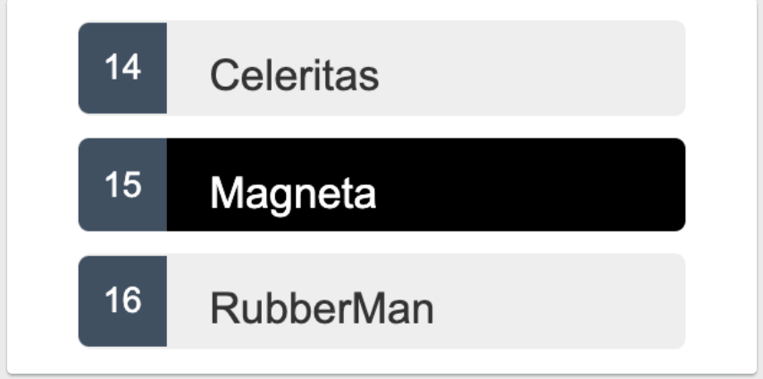

# MyApp

This project was generated with [Angular CLI](https://github.com/angular/angular-cli) version 13.3.6.

## Development server

Run `ng serve` for a dev server. Navigate to `http://localhost:4200/`. The application will automatically reload if you change any of the source files.

## Code scaffolding

Run `ng generate component component-name` to generate a new component. You can also use `ng generate directive|pipe|service|class|guard|interface|enum|module`.

## Build

Run `ng build` to build the project. The build artifacts will be stored in the `dist/` directory.

## Running unit tests

Run `ng test` to execute the unit tests via [Karma](https://karma-runner.github.io).

## Running end-to-end tests

Run `ng e2e` to execute the end-to-end tests via a platform of your choice. To use this command, you need to first add a package that implements end-to-end testing capabilities.

## Further help

To get more help on the Angular CLI use `ng help` or go check out the [Angular CLI Overview and Command Reference](https://angular.io/cli) page.

===================== tutorial =====================

## Create a new workspace and an initial application

You develop applications in the context of an Angular workspace. A workspace contains the files for one or more projects. A project is the set of files that comprise an application or a library. For this tutorial, you will create a new workspace.

1. To create a new workspace and an initial application project:

2. Ensure that you are not already in an Angular workspace folder. For example, if you have previously created the Getting Started workspace, change to the parent of that folder.

Run the CLI command ng new and provide the name angular-tour-of-heroes, as shown here:

~~~
ng new angular-tour-of-heroes
~~~

3. The ng new command prompts you for information about features to include in the initial application project. Accept the defaults by pressing the Enter or Return key.

The Angular CLI installs the necessary Angular npm packages and other dependencies. This can take a few minutes.

It also creates the following workspace and starter project files:

- A new workspace, with a root folder named angular-tour-of-heroes
- An initial skeleton app project in the src/app subfolder
- Related configuration files

The initial app project contains a simple Welcome application, ready to run.

## Run the application

The Angular CLI includes a server, for you to build and serve your app locally.

1. Navigate to the workspace folder, such as my-app.

2. Run the following command:
   
~~~
cd angular-tour-of-heroes
ng serve --open
~~~

> The ng serve command builds the app, starts the development server, watches the source files, and rebuilds the application as you make changes to those files.
>
>The --open flag opens a browser to http://localhost:4200.

You should see the application running in your browser.

 

## `Angular Components`

- The page you see is the `application shell`. The shell is controlled by an Angular `component` named `AppComponent`.
- `Components`are the fundamental building blocks of Angular applications. 
- They display data on the screen, listen for user input, and take action based on that input.

 

## Make changes to the application
****
Open the project in your favorite editor or IDE and navigate to the src/app folder to make some changes to the starter application.

You'll find the implementation of the shell AppComponent distributed over three files:

1) `app.component.ts` : The component class code, written in TypeScript.
2) `app.component.html`: The component template, written in HTML.
3) `app.component.css`: The component's private CSS styles.

 

### `Change the application title`

 

- Open the component class file (app.component.ts) and change the value of the `title` property to 'Tour of Heroes'.

~~~
title = 'Tour of Heroes';
~~~

- Open the component template file (app.component.html) and delete the default template generated by the Angular CLI.
- Replace it with the following line of HTML.

~~~
<h1>{{title}}</h1>
~~~

- The double curly braces are Angular's `interpolation binding syntax`. This interpolation binding presents the component's `title` property value inside the HTML header tag.
- The browser refreshes and displays the new application title.

### `Add application styles`

 

Most apps strive for a consistent look across the application. The CLI generated an empty styles.css for this purpose. Put your application-wide styles there.

Open src/styles.css and add the code below to the file.

~~~
/* Application-wide Styles */
h1 {
  color: #369;
  font-family: Arial, Helvetica, sans-serif;
  font-size: 250%;
}
h2, h3 {
  color: #444;
  font-family: Arial, Helvetica, sans-serif;
  font-weight: lighter;
}
body {
  margin: 2em;
}
body, input[type="text"], button {
  color: #333;
  font-family: Cambria, Georgia, serif;
}
button {
  background-color: #eee;
  border: none;
  border-radius: 4px;
  cursor: pointer;
  color: black;
  font-size: 1.2rem;
  padding: 1rem;
  margin-right: 1rem;
  margin-bottom: 1rem;
  margin-top: 1rem;
}
button:hover {
  background-color: black;
  color: white;
}
button:disabled {
  background-color: #eee;
  color: #aaa;
  cursor: auto;
}

/* everywhere else */
* {
  font-family: Arial, Helvetica, sans-serif;
}
~~~

 

### Summary

- You created the initial application structure using the Angular CLI
- You learned that Angular components display data
- You used the double curly braces of interpolation to display the application title

 

 

## `1 - The hero editor`

 

The application now has a basic title. Next you will create a new component to display hero information and place that component in the application shell.

 

### `Create the heroes component`
 

- Using the Angular CLI, generate a new component named heroes.

~~~
ng generate component heroes
~~~

The CLI creates a new folder, src/app/heroes/, and generates the three files of the HeroesComponent along with a test file.

The HeroesComponent class file is as follows:

~~~
import { Component, OnInit } from '@angular/core';

@Component({
  selector: 'app-heroes',
  templateUrl: './heroes.component.html',
  styleUrls: ['./heroes.component.css']
})
export class HeroesComponent implements OnInit {

  constructor() { }

  ngOnInit(): void {
  }

}
~~~

You always import the Component symbol from the Angular core library and annotate the component class with @Component.

@Component is a decorator function that specifies the Angular metadata for the component.

The CLI generated three metadata properties:
- `selector`: The component's CSS element selector.
- `templateUrl`: The location of the component's template file.
- `styleUrls`: The location of the component's private CSS styles.

The CSS element selector, 'app-heroes', matches the name of the HTML element that identifies this component within a parent component's template.

The ngOnInit() is a lifecycle hook. Angular calls ngOnInit() shortly after creating a component. It's a good place to put initialization logic.

Always export the component class so you can import it elsewhere … like in the AppModule.

#### `Add a hero property`

 

Add a hero property to the HeroesComponent for a hero named "Windstorm".

~~~
hero = 'Windstorm';
~~~

 

#### `Show the hero`

 

Open the heroes.component.html template file. Delete the default text generated by the Angular CLI and replace it with a data binding to the new hero property.

~~~
<h2>{{hero}}</h2>
~~~

 

### `Show the HeroesComponent view`

 

To display the HeroesComponent, you must add it to the template of the shell AppComponent.

Remember that app-heroes is the element selector for the HeroesComponent. So add an <app-heroes> element to the AppComponent template file, just below the title.

~~~
<h1>{{title}}</h1>
<app-heroes></app-heroes>
~~~

Assuming that the CLI ng serve command is still running, the browser should refresh and display both the application title and the hero name.

 

### `Create a Hero interface`

 

A real hero is more than a name.

- Create a Hero interface in its own file in the src/app folder. Give it id and name properties.

~~~
[app/components/hero.ts]
export interface Hero {
  id: number;
  name: string;
}
~~~

- Refactor the component's hero property to be of type Hero. Initialize it with an id of 1 and the name Windstorm.

The revised HeroesComponent class file should look like this:

~~~
import { Component, OnInit } from '@angular/core';
import { Hero } from '../hero';

@Component({
  selector: 'app-heroes',
  templateUrl: './heroes.component.html',
  styleUrls: ['./heroes.component.css']
})
export class HeroesComponent implements OnInit {
  hero: Hero = {
    id: 1,
    name: 'Windstorm'
  };

  constructor() { }

  ngOnInit(): void {
  }

}
~~~

> The page no longer displays properly because you changed the hero from a string to an object.

 

### `Show the hero object`

 

Update the binding in the template to announce the hero's name and show both id and name in a details layout like this:

~~~
<h2>{{hero.name}} Details</h2>

id: {{hero.id}}

name: {{hero.name}}

~~~

The browser refreshes and displays the hero's information.

 

### `Format with the UppercasePipe`

 

Modify the `hero.name` binding like this:

~~~
<h2>{{hero.name | uppercase}} Details</h2>
~~~

 

- The browser refreshes and now the hero's name is displayed in capital letters.
- The word `uppercase` in the interpolation binding, right after the pipe (`|`) character, activates the built-in `UppercasePipe`.
- [Pipes](https://angular.io/guide/pipes) are a good way to format strings, currency amounts, dates and other display data.
- Angular ships with several built-in pipes and you can create your own.

 

### Edit the hero

- Users should be able to edit the hero name in an `<input>` textbox.
- The textbox should both `display` the hero's `name` property and `update` that property as the user types.
- That means data flows from the component class `out to the screen` and from the screen `back to the class`.
- To automate that data flow, setup a two-way data binding between the `<input>` form element and the `hero.name` property.

 

#### `two-way binding`

 

- Refactor the details area in the `HeroesComponent` template so it looks like this:

~~~ 

  <label for="name">Hero name: </label>
  <input id="name" [(ngModel)]="hero.name" placeholder="name">

~~~

 

- `[(ngModule)]` : Is Angular's two-way data binding syntax.
- Here it binds the `hero.name` property to the HTML textbox so that data can flow in `both directions`: from the `hero.name` property to the textbox and from the textbox to the `hero.name`

 

#### `The missing FormsModule`

 

- Notice that the application stopped working when you added `[(ngModel)]`.
- To see the error, open the browser development tools and look in the console for a message like:

~~~
Template parse errors:
Can't bind to 'ngModel' since it isn't a known property of 'input'.
~~~

 

- Although `ngModel` is a valid Angular directive, it isn't available by default.
- It belongs to the optional `FormsModule` and you must opt-in to using it.

 

### AppModule

 

- Angular needs to know how the pieces of your application fit together and what other files and libraries the application requires. This information is called `metadata`.
- Some of the metadata is in the `@Component` decorators that you added to your component classes. 
- Other critical metadata is in `@NgModule` decorators.
- The mos important `@NgModule` decorator annotates the top-level `AppModule` class.
- The Angular CLI generated an `AppModule` class in `src/app/app.module.ts` when it created the project.
- There is where you opt-in to the `FormsModule`

 

#### `Import FormsModule`

 

- Open `AppModule` (app.module.ts) and import the `FormsModule` symbol from the `@angular/forms` library.

~~~
import { FormsModule } from '@angular/forms'; <-- NgModel lives here
~~~

 

- Then add `FormsModule` to the `@NgModule` metadata's `imports` arrya, which contains a list of external modules that the application needs.

~~~
[app.module.ts (#NgModule imports)]
imports: [
  BrowserModule,
  FormsModule
],
~~~

 

- When the browser refreshes, the application should work again. You can edit the hero's name and see the changes reflected immediately in the `<h2>` above the textbox.

 

### Declare HeroesComponent

 

- Every component must be declared in `exactly one` [NgModule](https://angular.io/guide/ngmodules).
- You didn't declare the `HeroesComponent`. So why did the application work?
- It worked because the Angular CLI declared `HeroesComponent` in the `AppModule` when it generated that component.
- Open `srx/app/app.module.ts` and find `HeroesComponent` imported near the top.

~~~
import { HeroesComponent } from './heroes/heroes.component';
~~~

 

- The `HeroesComponent` is declared in the `@NgModule.declarations` array.

~~~
[src/app/app.module.ts]
declarations: [
  AppComponent,
  HeroesComponent,
],
~~~

 

> `AppModule` declares both application components, `AppComponent` and `HeroesComponent`.

### `Summary`
- You used the CLI to create a second `HeroesComponent`
- You displayed the `HeroesComponent` by adding it to the `AppComponent` shell
- You applied the `UppercasePipe` to format the name.
- You used two-way data binding with the `ngModel` directive
- You leraned about the `AppModule`
- You imported the `FormsModule` in the `AppModule` so that Angular would recognize and apply the `ngModel` directive.
- You learned the importance of declaring components in the `AppModule` and appreciated that the CLI declared it for you.

 

## `2 - Display a seleciton list`

 

- In this page, you'll expand the Tour of heroes application to display a list of heroes, and allow users to select a hero and display the hero's details.

 

### Create mock heroes

 

- You'll need some heroes to display.
- Eventually you'll get them from a remote data server. For now, you'll create some `mock heroes` and pretend they came from the server.
- Create a file called `mock-heroes.ts` in the `src/app/` folder. Define a `HEROES` constant as an array of ten heroes and export it. The file should look like this.

~~~
import { hero } from './hero'

export const HEROES: Hero[] = [
  { id: 12, name: 'Dr.nice' },
  { id: 13, name: 'Bombasto' },
  { id: 14, name: 'Celeritas' },
  { id: 15, name: 'Magneta' },
  { id: 16, name: 'RubberMan' },
  { id: 17, name: 'Dynama' },
  { id: 18, name: 'Dr. IQ' },
  { id: 19, name: 'Magma' },
  { id: 20, name: 'Tornado' }
]
~~~

 

### Display Heroes

 

- Open the `HeroesComponent` class file and import the mock `HEROES`.

~~~
import { HEROES } from '../mock-heroes'
~~~

 

- In the same file (`HeroesComponent` class), define a component property called `heroes` to expose the `HEROES` array for binding.

~~~
export class HeroesComponent implements OnInit {
  heroes = HEROES;
}
~~~

 

#### `List heroes with *ngFor`

 

Open the `HeroesComponent` template file and make the following changes:
1) Add an `<h2>` at the top
2) Below it add an HTML unordered list (`<ul>`) element.
3) Insert an `<li>` within the `<ul>`
4) Place a `<button>` inside the `<li>` that displays properties of a `hero` inside `` elements.
5) Sprinkle some CSS classes for styling (you'll add the CSS styles shortly).

 

Make it look like this:

~~~
[heroes.component.html]

<h2> My Heroes </h2>
<ul class="heroes">
  <li>
    <button>
      {{hero.id}}
      {{hero.name}}
    </button>
  </li>
</ul>
~~~

 

That displays an error since the property 'hero' does not exist. To have access to each individual hero and list them all, add an `*ngFor` to the `<li>` to iterate through the list of heroes:

~~~
<li *ngFor="let hero of heroes">
~~~
 

- The `*ngFor` is Angular's `repeater` directive. It repeats the host element for each element in a list.
- The syntax in this example is as follows:

`<li>` : The host element.
`heroes`: Holds the mock heroes list from the `HeroesComponent` class, the mock heroes list.
`hero`: Holds the current hero object for each iteration through the list.

> Don't forget the asterisk (*) character in front of `NgFor`. It's a critical part of the syntax.

 

After the browser refreshes, the list of heroes appears.

> `Interactive Elements`
> 
> NOTE: Inside the `<li>` element, wee've wrapped the hero's details in a `<button>` element. Later on we make the hero clickable, and it is better for accessibility purposes to use natively interactive HTML elements (e.g `<button>`) instead of addign event listeners to non-interactive ones (e.g. `<li>`).
> 
> For more details on accessibility, see [Accessibility in Angular](https://angular.io/guide/accessibility)

 

### `Style the heroes`

 

- The heroes list should be attractive and should respond visually when users hover over and select a hero from the list.
- In the [first tutorial](https://angular.io/tutorial/toh-pt0#app-wide-styles), you set the basic styles for the entire application in `styles.css`.
- That stylesheet didn't include styles for this list of heroes.
- You could add more styles to `styles.css` and keep growing that stylesheet as you add components.
- You may prefer instead to define private styles for a specific component and keep everything a component needs - the code, the HTML, and the CSS - together in one place.
- This approach makes it easier to re-use the component somewhere else and deliver the component's intended appearance even if the global styles are different.
- You define private styles either inline in the `@Component.styles` array or as stylesheet file(s) identified in the `@Component.styleUrls` array.
- When the CLI generated the `HeroesComponent`, it created an empty `heroes.component.css` stylesheet for the `HeroesComponent` and pointed to it in `@Component.styleUrls` like this.

~~~
[src/app/components/heroes/heroes.component.ts](@Component)

@Component({
  selector: 'app-heroes',
  templateUrl: './heroes.component.html',
  styleUrls: ['./heroes.component.css']
})
~~~

 

- Open the `heroes.component.css` file and paste in the private CSS styles for the `HeroesComponent`. You'll find them in the [final code review](https://angular.io/tutorial/toh-pt2#final-code-review) at the bottom of this guide.

> Styles and stylesheets identified in `@Component` metadata are scoped to that specific component. The `heroes.component.css` styles apply only to the `HeroesComponent` and don't affect the outer HTML or the HTML in any other component.

 

### Viewing details

 

- When the user clicks a hero in the list, the component should display the selected hero's details at the bottom of the page.
- In this section, you'll listen for the hero item click event and display/update the hero details.

 

#### `Add a click event binding`

 

- Add a click event binding to the `<button>` in the `<li>` like this:

~~~
<li *ngFor="let hero of heroes">
  <button type="button" (click)="onSelect(hero)">
</li>
~~~

- This is an example of Angular's [event binding](https://angular.io/guide/event-binding) syntax.
- The parentheses around `click` tell Angular to listen for the `<button>` element's `click` event.
- When the user click in the `<button>`, Angular executes the `onSeleect(hero)` expression.
- In the next section, define an `onSelect()` method in `HeroesComponent` to display the hero that was defined in the `*ngFor` expression.

 

#### `Add the click event handler`

 

- Rename the component's `hero` property to `selectedHero` but don't assign any value to it since there is no `selected hero` when the application starts.
- Add the following `onSelect()` method, which assigns the clicked hero from the template to the component's `selectedHero`.

~~~
selectedHero?: Hero:
onSelect(hero: Hero): void {
  this.selectedHero = hero;
}
~~~

 

#### `Add a details section`

 

- Currently, you have a list in the component template.
- To click on a hero on the list and reveal details about that hero, you need a section for the detils to render in the template.
- Add the following to `heroes.component.html` beneath the list section:

~~~

  <h2>{{selectedHero.name | uppercase}} Details</h2>
  
id: {{selectedHero.id}}

  

    <label for="hero-name">Hero name: </label>
    <input id="hero-name" [(ngModel)]="selectedHero.name" placeholder="name">
  

~~~

 

- The hero details should only be displayed when a hero is selected.
- When a component is created initially, there is no selected hero, so we add the `*ngIf` directive to the `
` that wraps the hero details, to instruct Angular to render the section only when the `selectedHero` is actually defined (after it has been selected by clicking on a hero).

> Don't forget the asterisk (*) character in front of `ngIf`. It's a critical part of the syntax.

 

### Style the selected hero

 

- To help identify the selected hero, you can use the `.selected` CSS class in the [styles you added earlier](https://angular.io/tutorial/toh-pt2#styles).
- To apply the `.selected` class to the `<li>` when the user clicks it, use class binding.

 

- Angular's [class binding](https://angular.io/guide/attribute-binding#class-binding) can add and remove a CSS class conditionally.
- Add `[class.some-css-class]="some-condition"` to the element you want to style.
- Add the following `[class.selected]` binding to the `<button>` in the `HeroesComponent` template:

~~~
[class.selected]="hero === selectedHero"
~~~

 

- When the current row hero is the same as the `selectedHero`, Angular adds the `selected`CSS class.
- When the two heroes are different, Angular removes the class.
- The finished `<li>` looks like this:

~~~
<li *ngFor="let hero of heroes">
  <button [class.selected]="hero === selectedHero" type="button" (click)>="onSelect(hero)">
    {{hero.id}}
    {{hero.name}}
  </button>
</li>
~~~

 

### Summary

 

- The Tour of Heroes application displays a list of heroes with a detail view.
- The user can select a hero and see that hero's details.
- You used `*ngFor` to display a list
- You used `*ngIf` to conditionally include or exclude a block of HTML.
- You can toggle a CSS style class with a `class` binding.

 

## `3 - Create a feature component`

 

- At the moment, the `HeroesComponent` displays both the list of heroes and the selected hero's details.
- Keeping all features in one component as the application grows will not be maintainable.
- You'll want to split up large components into smaller sub-components, each focused on a specific task or workflow.
- In this page, you'll take the first step in that direction by moving the hero details into a separate, reusable `HeroDetailComponent`.
- The `HeroesComponent` will only present the list of heroes.
- The `HeroDetailComponent` will present details of selected hero.

 

### Make the HeroDetailComponent

 

- Use the Angular CLI to generate the new component named `hero-detail`.

~~~
ng g component hero-detail
~~~

 

The command scaffolds the following:
- Creates a directory `src/app/components/hero-detail`

Inside the directory four files are generated:
- A CSS file for the component styles.
- An HTML file for the component template.
- A TypeScript file with a component class named `HeroDetailComponent`
- A test file for the `HeroDetailComponent` class.

The command also adds the `HeroDetailComponent` as a declaration in the `@NgMOdule` decorator of the `src/app/app.module.ts` file.

 

#### `Write the template`

 

- Cut the HTML for the hero detail from the bottom of the `HeroesCOmponent` template and paste it over the generated boilerplate in the `HeroDetailComponent` template.
- The pasted HTML refers to a `selectedHero`.
- The new `HeroDetailComponent` can present `any` hero, not just a selected hero.
- So replace "selectedHero" with "hero" everywhere in the template.
- When you're done, the `HeroDetailComponent`template should look like this:

~~~

  <h2>{{hero.name | uppercase}} Details</h2>
  
id: {{hero.id}}

  

    <label for="hero-name">Hero name: </label>
    <input id="hero-name" [(ngModel)]="hero.name" placeholder="name">
  

~~~

 

#### `Add the `@Input()` hero property`

 

- The `HeroDetailComponent` template binds to the component's `hero` property which is of type `Hero`.
- Open the `HeroDetailComponent` class file and import the `Hero` symbol.

~~~
import { Hero } from './src/app/interfaces/hero.ts'
~~~

- The `hero` property [must be an `Input` property](https://angular.io/guide/inputs-outputs), annotated with the `@Input()` decorator, because the `external HeroesComponent` [will bind to it](https://angular.io/tutorial/toh-pt3#heroes-component-template) like this:

~~~
<app-hero-detail [hero]="selectedHero"></app-hero-detail>
~~~

- Amend the `@angular/core` import statement to include the `Input` symbol.

~~~
import { Component, OnInit, Input } from '@angular/core';
~~~

- Add a `hero` property, preceded by the `@Input()` decorator.

~~~
@Input() hero?: Hero;
~~~

- That's the only change you should make to the `HeroDetailComponent` class.
- There are no more properties.
- There's no presentation logic.
- This component only receives a hero object through its `hero` property and displays it.

 

### Show the HeroDetailComponent

 

- The `HeroesComponent` used to display the hero details on its own, before you removed that portion of the tempalte.
- This section guides you through delegating logic to the `HeroDetailComponent`.
- The two components will have a parent/child relationship.
- The parent `HeroesComponent`will control the child `HeroDetailComponent` by sending it a new hero to display whenever the user selects a hero from the list.
- You won't change the `HeroesComponent` class but you will change its tempalte.

 

#### `Update the HeroesComponent template`

 

- The `HeroDetailComponent` selector is `'app-hero-detail'`.
- Add an `<app-hero-detail>` element near the bottom of the `HeroesComponent` template, where the hero detail view used to be.
- Bind the `HeroesComponent.selectedHero` to the element's `hero` property like this:

~~~
<app-hero-detail [hero]="selectedHero"></app-hero-detail>
~~~

- `[hero]="selectedHero"` is Angular [property binding](https://angular.io/guide/property-binding).
- It's a `one way` data binding from the `selectedHero` property of the `HeroesComponent` to the `hero` property of the target element, which maps to the `hero` property of the `HeroDetailComponent`.
- Now when the user clicks a hero in the list, the `selectedHero` changes.
- When the `selectedHero` changes, the `property binding` updates `hero` and the `HeroDetailComponent` displays the new hero.
- The revised `HeroesComponent` template should look like this:

~~~
<h2>My Heroes</h2>

<ul class="heroes">
  <li *ngFor="let hero of heroes">
    <button [class.selected]="hero === selectedHero" type="button" (click)="onSelect(hero)">
      {{hero.id}}
      {{hero.name}}
    </button>
  </li>
</ul>

<app-hero-detail [hero]="selectedHero"></app-hero-detail>
~~~

- The browser refreshes and the application starts working again as it did before

 

### `What changed?`

 

- As [before](https://angular.io/tutorial/toh-pt2), whenever a user clicks on a hero name, the hero detail appears below the hero list. Now the `HeroDetailComponent` is presenting those details instead of the `HeroesComponent`.
- Refactoring the original `HeroesComponent` into two components yields benefits, both now and in the future:
    1) You reduced the `HeroesComponent` responsabilities.
    2) You can evolve the `HeroDetailComponent` into a rich hero editor without touching the parent `HeroesComponent`.
    3) You can evolve the `HeroesComponent` without touching the hero detail view.
    4) You can re-use the `HeroDetailComponent` in the template of some future component.

 

### `Summary`

- You created a separatem reusable `HeroDetailComponent`.
- You used a [property binding](https://angular.io/guide/property-binding) to give the parent `HeroesComponent`control over the child `HeroDetailComponent`.
- You used the [`@Input` decorator](https://angular.io/guide/property-binding) to make the `hero` property available for binding by the external `HeroesComponent`.

 

## `4 - Add Services`

 

- The Tour of Heroes `HeroesComponent` is currently getting and displaying fake data.
- After the refactoring in this tutorial, `HeroesComponent` will be lean and focused on supporting the view.
- It will also be easier to unit-test with a mock service.

 

### Why Services

 

- Components shouldn't fetch or save data directly and they certainly should'nt knowingly present fake data.
- They should focus on presenting data and delegate data access to a service.
- In this tutorial, you'll create a `HeroService`that all application classes can use to get heroes.
- Instead of creating that service with the `new` [keyword](https://developer.mozilla.org/docs/Web/JavaScript/Reference/Operators/new), you'll rely on Angular [dependency injection](https://angular.io/guide/dependency-injection) to inject it into the `HeroesComponent` constructor.
- Services are a great way to share information among classes that `don't know each other`.
- You'll create a `MessageService` and inject it in two places.
  -  Inject in `HeroService`, which uses the servicec to send a message.
  -  Inject in `MessagesComponent`, which displays that message, and also displays the ID when the user clicks a hero.

 

### Create the HeroService

 

- Using the Angular CLI, create a service called hero.

~~~
ng g service hero
~~~

- The command generates a skeleton `HeroService` class in `/src/app/services/hero/hero.service.ts` as follows:

~~~
import { Injectable } from '@angular/core';

@Injectable({
  providedIn: 'root',
})
export class HeroService {
  constructor(){ }
}
~~~

#### [@Injectable()](https://angular.io/api/core/Injectable) `services`

 

- Notice that the new service imports the Angular `Injectable` symbol and annotates the class with the `@Injectable()` decorator.
- This marks the class as one that participates in the `dependency injection system`.
- The `HeroService` class is going to provide an injectable service and it can also have its own injected dependencies.
- It doesn't have any dependencies yet, but [it will soon](https://angular.io/tutorial/toh-pt4#inject-message-service)
- The `@Injectable()` decorator accepts a metadata object for the service, the same way the `@Component()` decorator did for your component class.

 

#### `Get Hero data`

 

- The `HeroService` could het hero data from anywhere - a web service, local storage, or a mock data source.
- Removing data access from components means you can change your mind about the implementation anytime, without touching any components.
- They don't know how the service works.
- The implementation in this tutorial will continue to deliver mock heroes.
- Import the `Hero` and `HEROES`

~~~
[/src/app/services/hero/hero.service.ts]
import { HEROES } from './src/app/interfaces/mock-heroes'
import { Hero } from './src/app/interfaces/hero
~~~

- Add the `getHeroes` method to return the `mock heroes`

~~~
getHeroes(): Hero[] {
  return HEROES;
}
~~~

 

### Provide the HeroService

 

- You must make the `HeroService` available to the dependency injection system before Angular can `Inject` it into the `HeroesComponent` by registering a `provider`.
- A provider is something that can create or deliver a service; in this case, it instantiates the `HeroService` class to provide the service.
- To make sure that the `HeroService` can provide this service, register it with the `injector`, which is the object that is responsible for choosing and injecting the provider where the application requires it.
- By default, the Angular CLI command `ng generate service` registers a provider woth the `root injector` for your service by including provider metadata, that is `providedIn: 'root' ` in the `@Injectable()` decorator.

~~~
@Injectable({
  providedIn: 'root',
})
~~~

- When you provide the service at the root level, Angular creates a single, shared instance of `HeroService` and injects into any class that asks for it.
- Registering the provider in the `@Injectable` metadata also allows Angular to optmize an application by removing the service if it turns out not to be used after all.

> To learn more about providers, see the [Providers section](https://angular.io/guide/providers). To learn more about injectors, see the [Dependency Injection guide](https://angular.io/guide/dependency-injection).

- The `HeroService` is now ready to plug into the `HeroesComponent`.

> This is an interim code sample that will allow you to provide and use the `HeroService`. At this point, the code will differ from the `HeroService` in the ["final code review"](https://angular.io/tutorial/toh-pt4#final-code-review).

 

### Update HeroesComponent

 

- Open the `HeroesComponent`class file.
- Delete the `HEROES` import, because you won't need that anymore.
- Import the `HeroService`instead.

~~~
import { HeroService } from './src/app/services/hero/hero.service.ts
~~~

- Replace the definition of the `heroes` property with a declaration.

~~~
heroes: Hero[] = [];
~~~

 

### Inject the HeroService

 

- Add a private `heroService` parameter of type `HeroService` to the constructor.

~~~
constructor(
  private heroService: HeroService
) {}
~~~

- The parameter simultaneously defines a private `HeroService` property and identifies it as a `HeroService` injection site.
- When Angular creates a `HeroesComponent`, the [Dependency Injection](https://angular.io/guide/dependency-injection) system sets the `heroService` parameter to the singleton instance of `HeroService`.

 

### Add getHeroes()

- Create a method to retrive the heroes from the service.

~~~
getHeroes(): void {
  this.heroes = this.heroService.getHeroes();
}
~~~

 

### Call it in ngOnInit()

 

- While you could call `getHeroes()` in the constructor, that's not the best practice.
- Reserve the constructor for minimal initialization such as wiring constructor parameters to properties.
- The constructor shouldn't do `anything`.
- It certainly shouldn't call a function that makes HTTP requests to a remote server as a `real` data service would.
- Instead, call `getHeroes()` inside the [ngOnInit lifecycle hook](https://angular.io/guide/lifecycle-hooks) and let Angular call `ngOnInit()` at an appropriate time `after` constructing a `HeroesComponent` instance.

~~~
ngOnInit(): void {
  this.getHeroes();
}
~~~

 

### See it run

After the browser refreshes, the application should run as before, showing a list of heroes and a hero detail view when you click on a hero name.

