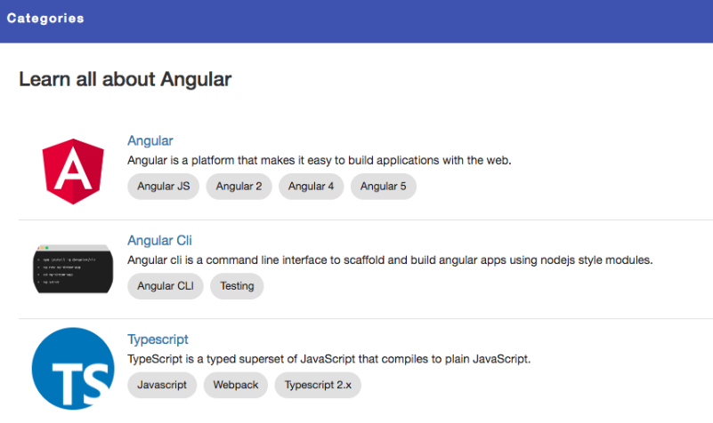
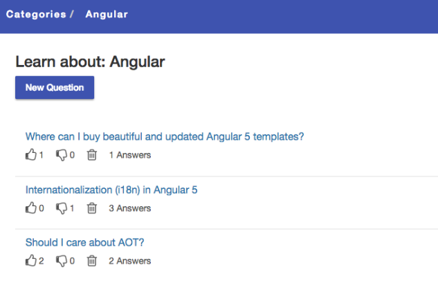
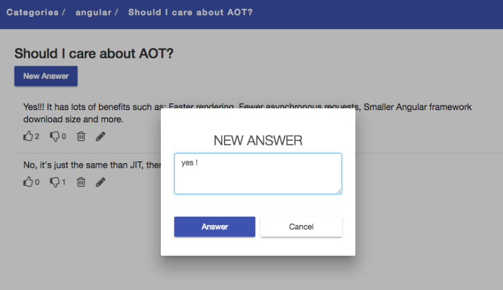
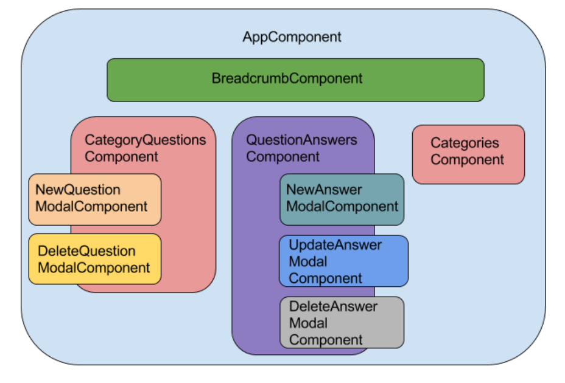
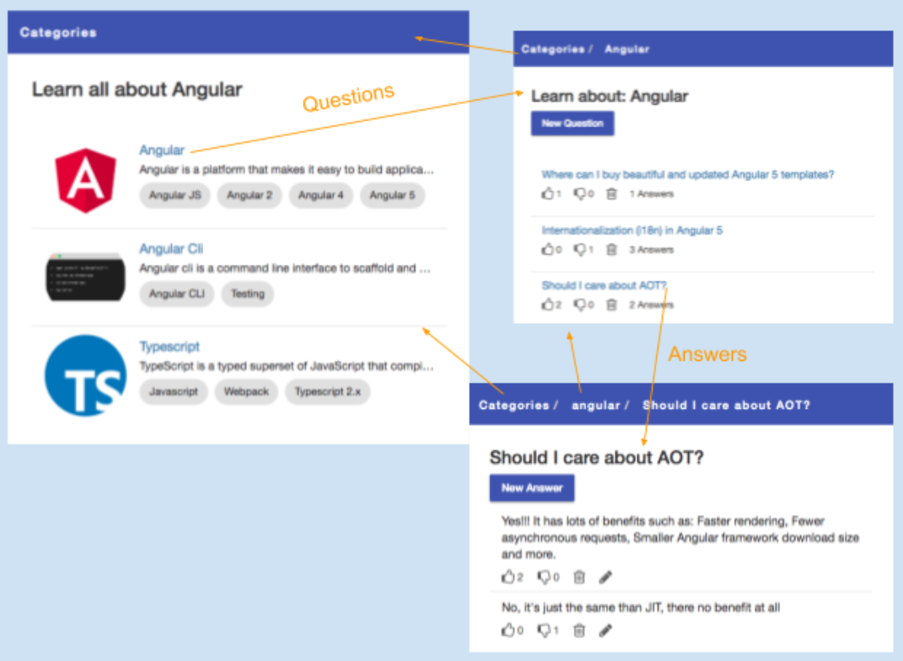

# MyNewAngularApp

This project was generated with [Angular CLI](https://github.com/angular/angular-cli) version 13.3.6.

## Development server

Run `ng serve` for a dev server. Navigate to `http://localhost:4200/`. The application will automatically reload if you change any of the source files.

## Code scaffolding

Run `ng generate component component-name` to generate a new component. You can also use `ng generate directive|pipe|service|class|guard|interface|enum|module`.

## Build

Run `ng build` to build the project. The build artifacts will be stored in the `dist/` directory.

## Running unit tests

Run `ng test` to execute the unit tests via [Karma](https://karma-runner.github.io).

## Running end-to-end tests

Run `ng e2e` to execute the end-to-end tests via a platform of your choice. To use this command, you need to first add a package that implements end-to-end testing capabilities.

## Further help

To get more help on the Angular CLI use `ng help` or go check out the [Angular CLI Overview and Command Reference](https://angular.io/cli) page.

======================================== tutorial ==================================
# AngularStudy [Link](https://angular-templates.io/tutorials/about/learn-angular-from-scratch-step-by-step)

 

## Learning Angular: What is Angular?

- Angular is a platform for building mobile and desktop web applications. 
- It has a big community of millions of developers who choose Angular to build compelling user interfaces.
- Angular is a JavaScript open-source front-end web application framework.
-  It is primarily sustained by Google together with an extended community of people and companies. 
-  Angular solves many of the challenges faced when developing single page, cross platform, performant applications. 
-  It's fully extensible and works very well with other libraries. For additional details visit their [official documentation page](https://angular.io/features).

 

> My goal in this Angular real world example tutorial is to provide a complete guide for you to learn Angular step by step. We will start explaining the why's and basic concepts and then continue exploring more advanced notions.

We want to help beginners through their first steps on the Angular world. As developers, we know that starting with a new technology can sometimes be a bit frustrating so want to help here. We will learn enough core Angular to get started and gain confidence that we can build any kind of app with Angular. We will be covering a lot of ground at an introductory level, but also, you will find plenty of references to topics with greater depth.

- To help you through your Angular learning process, we created an Angular app with a question and answer format (Q&A), where users will be able to ask, answer and vote questions.
- Also, we will explain how to connect this app with a remote API to handle data integration.

You can download all the source code of this angular free template by clicking the GET THE CODE button from above. Also, we published an [online demo](https://learn-angular-from-scratch.firebaseapp.com/) of the app we are going to build in this Getting Started with Angular guide.

 

### Our journey with Angular

 

We began testing and experimenting with the very first release of Angular 2.0.0-beta.0 on december 2015 with hopes of finding a framework that was clearly better than its predecessor (Angular 1.x also know as AngularJS).

I'm going to be completely honest with you here, we almost give up with all the inconsistency, breaking changes and a sort of identity crisis that happened in the middle of the Angular 2+ development.

It was a long way until Angular reached a solid milestone with Universal (server-side rendering), ahead-of-time compilation (AOT), lazy loading and a solid bundling config working together nicely. Back in those years it was not easy to create a production ready angular application. But thanks to the angular team and to the angular community, that changed.

 

>Amazing things can be created with the latest versionss of Angular. You can check our most recent creation with Angular latest version in [Fully - Angular Admin Template](https://angular-templates.io/product/fully-angular-admin-template)

 

Being working, using and trying things out with Angular from the very beginning made us really understand the way it was designed and how it evolved. We were witnesses of the constant improvements and saw how they were all aligned to one simple yet important goal: "Creating an app wit Angular should be easy".

As I mentioned before, for some time during the process, it wasn't. Now I can tell you, Angular is a super solid and stable framework you will love to work with. Current versions of Angular had evolved to the point where you will be quickly impressed.

Angular is a great tool that will:

- Enable you to create software quicker and with less effort
- Result in a more maintainable software
- Encourage good programming practices and design patterns like MVC
- Allow you to collaborate easier with other people
- Allow you to become proficient in a reasonable time
- Address problems that may arise in your software architecture such as Dependency Injection, DRY (Don't Repeat Yourself), etc

 

## Angular for beginners: AngularJS vs Angular 2 vs Angular 12+

 

 

When it all started, back in 2010, this framework was called AngularJS, and alludes to what we now know as Angular 1.x. Then in 2016, Angular 2 arrived as a complete rewrite of the framework, improving from lessons learned and promising performance improvements, and a more scalable and more modern framework.

AngularJS was completely based on controllers and the view communicates using $scope whereas Angular 2 is 100% a component-based approach. In Angular 2, we don't have anymore the controllers and $scope. Components are the building blocks of an Angular 2 app. We will see the benefits of this change in a few minutes.

The first version of Angular was named Angular 2. Later on, it was renamed to "Angular". Between Angular 2 and Angular 10 (the current latest stable version) there was Angular 4 (released early 2017), Angular 5 (released late 2017), Angular 6 (released early 2018), Angular 7 (released late 2018), Angular 8 (released mid 2019), Angular 9 (released early 2020). Angular 10 was released on June 2020. All the information related to versions can be found on the [CHANGELOG](https://github.com/angular/angular/blob/master/CHANGELOG.md).

Don't freak out will all these versions. Because all versions from Angular 2 to Angular 10 are the same framework, they share the same core but they differ in lots of amazing improvements!

 

> From now on, every time we use the term Angular we are referring to the latest version of the framework that currently is Angular 10.

 

### What's new in Angular compared to AngularJS

 

Just for the sake of history, let's go through the main differences between AngularJS and Angular:

- Angular is a complete rewrite of AngularJS.
- An Angular application and its architecture are different from AngularJS. The main building elements for Angular are modules, components, templates, metadata, data binding, directives, services and dependency injection.
- Angular does not have a "scope" concept or controllers, instead, it uses a component hierarchy as its main architecture.
- Angular follows a modularity concept. SImilar functionalities are kept together inside modules. This gives Angular an optmized lighter core.
- The controller concept, which was present in AngularJS, was removed from Angular 2 and above which are componente based UI. This help developers divide applications in components with desired features. These helped improve the flexibility and reusability compared to AngularJS.
- Angular expression syntax is focused on `"[]"` for property binding, and `"( )"` for event binding.
- With AngularJS, building a search engine (SEO) friendly Single Page Application was a major difficulty. But this bottleneck was eliminated with Angular 2 by enabling application rendering in the server. These tasks are possible thanks to the Angular Universal module.

 

Angular recommends using the TypeScript language, which introduces these features:
- Static Typing
- Object Oriented Programming based on class
- Support reactive programming using RxJS

 

On top of TypeScript features, Angular also includes the benefits taken from ES6:
- For/Of loops
- Improved dependency injection
- Iterators
- Reflection
- Dynamic loading
- Asynchronous template compilation
- Simpler Routing

 

### From Angular 2 to Angular 4

 

There were some major changes, but mostly on the project structure with lots of refactors that made the framework more stable.

- Smaller and faster. The upgrade from 2.0 to 4.0 has reduced the bundled file size by 60% while also improving the applications speed.
- Angular 4 is compatible with newer versions of TypeScript 2.1 and TypeScript 2.2.
- Angular Universal: The vast majority of the Angular Universal code has been merged into Angular core.
- Animation Package: Animations taken from the Angular core and set within their own package. Meaning that if you don't use animations, the excess code won't end up in your app.

 

### From Angular 5 to Angular 7

 

Angular 6 was the first release of Angular that unifies the versions of Framework, Material and CLI. This change was made to clarify cross compatibility.

Angular 7 was full of new features, bug fixes, performance improvements, and some code deprecation as a clean up of the refactors from old versions.

- Optimizations to the build process that reduces the application size by removing unnecessary code.
- Material Design components with server-side rendering.
- Angular Universal improvements for code allocation between the server and client-side versions of the application.
- Lots of improvements in the Angular CLI
- Smaller bundle sizes
- Improved compiler that supports incremental compilation meaning faster rebuilds.
- RxJS (reactive programming library) has been updated to version 6.x or later.
- Angular now requires TypeScript 3.x

 

### From Angular 8 to Angular 12+

 

Angular 8 was a release that spanned the entire platform, including the framework, Angular Material, and the CLI. This release improved application startup time on modern browsers. Also it changed the route configurations to use dynamic imports in favour of lazy loading.

Angular 9 was very expected by the community because it introduced the [Ivy compiler and runtime](https://angular.io/guide/ivy). Ivy is the name for Angular's next-generation compilation and rendering pipeline. With this release, the new compiler and runtime instructions are used by default instead of the older compiler and runtime, known as View Engine.

The Ivy compiler offers the following advantages:

- Smaller bundle sizes
- Faster testing
- Better debugging
- Improved CSS class and style binding
- Improved type checking
- Improved build errors
- Improved build times, enabling AOT on by default
- Improved Internationalization

More information about these advantages can be found on [Angular 9 release note](https://blog.angular.io/version-9-of-angular-now-available-project-ivy-has-arrived-23c97b63cfa3).

Angular 10 release was smaller than typical; it has only been 4 months since the release of Angular 9. More info about this release can be found [here](https://blog.angular.io/version-10-of-angular-now-available-78960babd41).

Moving ahead in this Angular tutorial, let's setup the development environment. After the previous introduction about the current state of the Angular Framework, we are now ready to get started working on our angular app. `The best way to learn Angular is by following this step by step tutorial for beginners`.

In the following section of this angular free course we will go through the setup and requirements needed to start developing Angular apps.

> If you are in the process of starting your Angular project and need help, take a look to our Angular Templates which will help you with Bootstrap, Angular Universal (Server Side Rendering), SEO, Lazy Loading and so much more!
>
> [Angular Site Template](https://angular-templates.io/product/angular-site-template) includes tons of use cases implemented the Angular way such as authentication flows, product listing, filtering, forms, routing guards and more.

 

## Requirements and setup to start learning Angular

 

### Setup the Angular development environment
 

- In this section we will show you how to setup your local development environment so you can start developing Angular apps.
- A real application development happens in a local development environment that could be your personal machine. Follow our setup instructions to create a new Angular project.

 

#### `Angular requirements: Install NodeJS and npm`

 

- Node.js and npm are fundamental to modern web development using Angular and other platforms.
- Node empowers client development and build tools.
- We are gonna use the node package manager (npm) to install all the JavaScript libraries dependencies.
- [Get these right now](https://docs.npmjs.com/getting-started/installing-node) if they're not installed on your computer.

 

> Note: Verify that you are running the latest stable versions of node and npm.

 

#### `The Angular CLI`

 

Angular apps are created and developed primarily through the Angular CLI (command line interface tool) that helps project creation, adding files, and performing a variety of ongoing development tasks such as testing, bundling, and deployment.

- The Angular CLI takes care of configuration and initialization of various libraries.
- It also helps us adding components, directives, services, etc, to already existing Angular applications.
- It's also worth mentioning that the CLI uses Typescript and Webpack for module bundling, Karma for unit testing, and Protractor for an end to end testing. 
- It includes everything you need to start writing your Angular application right away.

 

To install the Angular CLI globally, run the following command on your console

~~~
npm install -g @angular/cli
~~~

> Note: although it's not recommended, you may need to add "sudo" in front of these commands to install the utilities globally.
>
> Important note: If you have an older version of the CLI installed in your computer, make sure you properly update it to the latest Angular CLI.

 

### Now, let's get started building the Angular app example project

 

Now that you have Angular and its dependencies installed, we can move on and start building our Angular app. Let's get started!

Starting a new angular app with the CLI is easy! From your command line, run this command: 
~~~
ng new "my-new-angular-app"
~~~

 

The command above will create a folder named "my-new-angular-app" and will copy all the required dependencies and configuration settings. The Angular CLI does this for you:
1) Creates a new directory "my-new-angular-app"
2) Downloads and installs Angular libraries and any other dependencies
3) Installs and configures TypeScript
4) Installs and configures Karma & Protractor (testing libraries)

 

You can also use the `ng init` command. The difference between `` ng init` and `ng new` is that `ng new` requires you to specify the folder name and it will create a folder copying the files while `ng init` will copy the files to the current folder.

Now, you can `cd` into the created folder. To get a quick preview of your app inside the browser, use the serve command use `ng serve`.

This command runs the compiler in watch mode (looks for changes in the code and recompiles if needed), starts the server, launches the app in a browser, and keeps the app running while we continue building it.

The Webpack Development server listens on HTTP port 4200. Hence, if you open the url `http://localhost:4200/` you will see the app running.

 

#### Using the Angular CLI to add new pages

 

In Angular, there's some more boilerplate compared to AngularJS (Angular 1), but don't panic. The new Angular CLI also has more tools to help you out with this.

For example, the new generator functions. They provide an easy way to create angular pages and services for your app. This makes going from a basic app to a full featured navigation web app much easier. I call that an easy learning curve :).

To create a new component you can use the following command:
~~~
ng generate component my-new-component

ng g component my-new component #using the alias

√ Create app/pages/my-page/my-page.html
√ Create app/pages/my-page/my-page.ts
√ Create app/pages/my-page/my-page.scss
~~~

The angular-CLI will add a reference to components, directives and pipes automatically in the `app.module.ts`.

 

> Note: Please refer to [angular CLI documentation](https://github.com/angular/angular-cli#generating-components-directives-pipes-and-services) for more information about adding components and other elements to your app.

 

## Building an Angular CRUD example project step by step

 

This tutorial takes you through the steps of creating an Angular application with TypeScript.

- The example app aims to help you learn the fundamental concepts of Angular Framework. 
- With a questions and answers format (Q&A), the users will be able to make questions about different Angular key concepts and answer those from others. 
- It will have a listing of some Angular key concepts such as Angular CLI and Typescript and within each of these categories, a questions list with the corresponding answers, the option to vote them (up-vote, down-vote) and some forms to create/delete/update questions and answers.

The following screenshot is from the home page where you can see the list of categories:

 

The plan for this tutorial is to build an app that takes you step-by-step from setup to a full-featured example that serves to demonstrate the essential characteristics of a professional application: 
- A sensible project structure
- Data binding
- Services
- Resolvers
- Pipes
- Angular material
- Dependency injection
- Navigation
- Remote data access

 

We will learn enough core Angular to get started and gain the confidence that Angular can do whatever we need it to do. We will be covering a lot of ground at an introductory level but we will also link to plenty of references to topics with greater depth.

The app consists in a CRUD (Create, Read, Update, Delete) of Questions and Answers where people can post new questions and answer other people's questions.

In the next tutorial we will explore [how to add a backend for this Angular app, using the MEAN stack](https://angular-templates.io/tutorials/about/learn-how-to-build-a-mean-stack-application).

The App will have the following functionalities:
- Manage Questions (Create, Delete)
- Manage Answers (Create, Update, Delete)
- List all the Questions form a category in a list format
- List all the Answers from a particular Question in a list format
- Enable people to vote Questions and Answers (up-votes and down-votes)

 

This is how the final App will look like:

 

In this first part, you will learn how to:
- Create classes to represent objects from the model
- Create services to create, update and remove objects
- Create pages and components to represent the functionalities and display the user interface.

 

### Angular apps architecture

 

Angular is a framework designed to build single page applications (SPAs) and most of its architecture design is focused towards doing that in an effective manner.

Single-page application (or SPA) are applications that are accessed via web browser like other websites but offer more dynamic interactions resembling native mobile and desktop apps. The most notable difference between a regular website and SPA is the reduced amount of page refreshes.

Typically, 95 percent of SPA code runs in the browser; the rest works in the server when the user needs new data or must perform secured operations such as authentication.

As a result, the process of page rendering happens mostly on the client-side.

 

#### `Angular Modules`

 

Modules help organize an application into cohesive functionality blocks by wrapping components, pipes, directives, and services. They are just all about developer ergonomics.

- Angular applications are modular.
- Every Angular application has at least one module— the root module, conventionally named AppModule.
- The root module can be the only module in a small application, but most apps have many more modules. 
- As the developer, it's up to you to decide how to use the modules. 
- Typically, you map major functionality or a feature to a module.
- Let's say you have four major areas in your system. 
- Each one will have its own module in addition to the root module, for a total of five modules.

 

Any angular module is a class with the @NgModule decorator. Decorators are functions that modify JavaScript classes. They are basically used for attaching metadata to classes so that it knows the configuration of those classes and how they should work. 

The `@NgModule decorator` properties that describe the module are:
- `declarations`: The classes that belong to this module and are related to views. There are three classes in Angular that can contain views: components, directives and pipes.
- `exports`: The classes that should be accessible to other modules components.
- `imports`: Modules whose classes are needed by the components of this module.
- `providers`: Services present in one of the modules which are going to be used in other modules or components. Once a service is included in the providers, it becomes accessible in all parts of that application.
- `bootstrap`: The root component which is the main view of the application. Only the root module has this property and it indicates the component that's gonna be bootstrapped.
- `entryComponents`: An entry component is any component that Angular loads imperatively, (which means you're not referencing it in the template), by type.

 

#### `Angular Components`

 

Components are the most basic building block of an UI and Angular applications. A component controls one or more sections on the screen (what we call views). For example in this example we have components like `AppComponent` (the bootstrapped component), `CategoriesComponent`, `CategoryQuestionsComponent`, `QuestionAnswersComponent` etc.

A component is self contained and represents a reusable piece of UI that is usually constituted by three important things:
- A piece of html code that is known as the view
- A class that encapsulates all available data and interactions to that view through an API of properties and methods architectured by Angular. Here's where we define the application logic(what it does to support the view).
- And the aforementioned html element also known as selector.

 

Using the Angular `@Component` decorator we provide additional metadata that determines how the component should be processed, instantiated and used at runtime. For example we set the html template related to the view, then, we set the html selector that we are going to use for that component, we set stylesheets for that component.

The Component passes data to the view using a process called Data Binding. This is done by Binding the DOM Elements to component properties. Binding can be used to display property values to the user, change element styles, respond to an user event, etc.

A component must belong to an `NgModule` in order for it to be usable by another component or application. To specify that a component is a member of an `NgModule`, you should list it in the declarations property of that `NgModule`.

One side note on the components importance from a point of software architecture principles: It's super important and recommended to have separate components, and here's why. Imagine we have two different UI blocks in the same component and in the same file. At the beginning, they may be small but each could grow. We are sure to receive new requirements for one and not the other. Yet every change puts both components at risk and doubles the testing burden without any benefits. If we had to reuse some of those UI blocks elsewhere in our app, the other one would be glued along.

That scenario violates the [Single Responsibility Principle](https://en.wikipedia.org/wiki/Single_responsibility_principle). You may think this is only a tutorial, but we need to do things right — especially if doing them right is easy and we learn how to build Angular apps in the process.

Angular encourages this principle by having each patch of the page controlled with it's own component.

A typical Angular application looks like a tree of components. The following diagram illustrates this concept. Note that the modal components are on the side of the parent component because they are imperative components which are not declared on the component html template.

 

#### `Angular building blocks: Templates`

 

- Templates are used to define a component view. 
- A template looks like regular HTML, but it also has some differences. 
- Code like *ngFor, {{hero.name}}, (click), and [hero] uses Angular [template syntax](https://angular.io/guide/template-syntax) to enhance HTML markup capabilities. 
- Templates can also include custom components like <custom-element> in the form of non-regular html tags. 
- These components mix seamlessly with native HTML in the same layouts.

 

#### `Angular building blocks: Services`

 

Almost anything can be a service, any value, function, or feature that your application needs. A service is typically a class with a narrow, well-defined purpose. It should do something specific and do it well. The main purpose of Angular Services is sharing resources across components.

Take Component classes, they should be lean, component's job is to enable the user experience (mediate between the view and the application logic) and nothing more. They don't fetch data from the server, validate user input, or log directly to the console. They delegate such tasks and everything nontrivial to services.

Services are fundamental to any Angular application, and components are big consumers of services as they help them being lean.

The scenario we've just described has a lot to do with the [Separation of Concerns](https://en.wikipedia.org/wiki/Separation_of_concerns) principle. Angular doesn't enforce these principles, but it helps you follow these principles by making it easy to structure your application logic into services and make those services available to components through dependency injection.

In our example app we have three services: `AnswersService`, `QuestionsService`, `CategoriesService`. Each of them has only the functions related to them. In this specific tutorial we will only focus on `CategoriesService and` in the following parts we will discuss the others.

`CategoriesService` has the following methods:

~~~
// gets all the question categories from a local json
getCategories(){
  return this.http.get("./assets/categories.json")
  .map(
    (res:any) => res.json()
  )
  .toPromise();
}

// finds a specific category by slug
getCategoryBySlug(slug: string){
  return this.getCategories()
  .then(data => {
    return data.categories.find(
      (category) => {
        return category.slug == slug;
      }
    )
  })
}
~~~

 

#### `Angular building blocks: Other resources`

 

External resources like Databases, API's, etc, are fundamental as they will enable our app to interact with the outside world.

There's much more to cover about the basic building blocks of Angular applications like Dependency Injection, Data Binding, Directives, etc. You can find these and much more information in our upcoming post about "Angular: The learning path".

Now, let's go deeper and map the project structure to the app's architecture so we can understand better how all the pieces interact with each other.

 

### Angular example app project structure

 

After following the setup instructions for creating a new project in the previous section, let's walk through the anatomy of our Angular app. The cli setup procedures install lots of different files. Most of them can be safely ignored.

In the project root we have three important folders and some important files:

- `/src/`
  - This is the most important folder. Here we have all the files that make our Angular app.
- `/e2e/`
  - This folder is for the End-to-end tests of the application, written in Jasmine and run by the protractor e2e test runner. Please note that we will not enter in details about testing in this post.
- `nodemodules/`
  - The npm packages installed in the project with the npm install command.
- `package.json`
  - As every modern web application, we need a package system and package manager to handle all the third-party libraries and modules our app uses. Inside this file, you will find all the dependencies and some other handy stuff like the npm scripts that will help us a lot to orchestrate the development (bundling/compiling) workflow.
- `tsconfig.json`
  - Main configuration file. It needs to be in the root path as it's where the typescript compiler will look for it.

 

Inside of the /src directory we find our raw, uncompiled code. This is where most of the work for your Angular app will take place. When we run `ng serve`, our code inside of /src gets bundled and transpiled into the correct Javascript version that the browser understands (currently, ES5). That means we can work at a higher level using TypeScript, but compile down to the older form of Javascript that the browser needs.

Under this folder you will find two main folder structures.
- `/app`
  - Has all the components, modules, pages you will build the app upon.
- `/environments`
  - This folder is to manage the different environment variables such as dev and prod. For example we could have a local database for our development environment and a product database for production environment. When we run ng serve it will use by default the dev env. If you like to run in production mode you need to add the `--prod` flag to the ng serve.
- `index.html/`
  - It's the app host page but you won't be modifying this file often, as in our case it only serves as a placeholder. All the scripts and styles needed to make the app work are gonna be injected automatically by the webpack bundling process, so you don't have to do this manually. The only thing that comes to my mind now, that you may include in this file, are some meta tags (but you can also handle these through Angular as well).

 

And there are other secondary but also important folders

- `/assets`
  - In this folder you will find images, sample-data json's, and any other asset you may require in your app.

 

#### `Angular best practices: The app folder`

 

This is the core of the project. Let's have a look at the structure of this folder so you get an idea where to find things and where to add your own modules to adapt this project to your particular needs.
- `/shared`
  - The `SharedModule` that lives in this folder exists to hold the common components, directives, and pipes and share them with the modules that need them.
  - It imports the `CommonModule` because its component needs common directives. You will notice that it re-exports other modules. If you review the application, you may notice that many components requiring `SharedModule` directives also use `NgIf` and `NgFo`r from `CommonModule` and bind to component properties with [(ngModel)], a directive in the `FormsModule`. Modules that declare these components would have to import `CommonModule`, `FormsModule`, and `SharedModule`.
  - You can reduce repetition by having `SharedModule` re-export `CommonModule` and `FormsModule` so that importers of `SharedModule` get `CommonModule` and `FormsModule` for free. `SharedModule` can still export `FormsModule` without listing it among its imports.
- `/styles`
  - Here you will find all the variables, mixins, shared styles, etc, that will make your app customizable and extendable.
  - Maybe you don't know Sass? Briefly, it is a superset of css that will ease and speed your development cycles incredibly.
- `/services`
  - Here you will find all the services needed in this app. Each service has only the functions related to it.
- `Other Folders`
  - To gain in code modularity, we've created a folder for each component. Within those folders you will find every related file for the pages included in that component. This includes the html for the layout, sass for the styles and the main page component.
- `app.component.ts`
  - It's the Angular component that provides functionality to the app.component.html file I just mentioned about.
- `app-routing.module.ts`
  - Here we define the main routes. These routes are registered to the Angular RouterModule in the AppModule. If you use lazy modules, child routes of other lazy modules are defined inside those modules.
- `app.module.ts`
  - This is the main module of the project which will bootstrap the app.

 

As we advance in this tutorial we will be creating more pages and perform basic navigation.

 

### Angular app navigation and routing

 

After seeing the components diagram and the project structure, this is the navigation we propose for the app.

-  We start in the categories page and from there we can only navigate to the questions of one of the categories. 
- Then follow the arrows from the image below to see the other navigations available in this angular example app.
- Note that the modals for creating, updating and deleting are not shown in this image because they don't represent an app navigation.
- Another important thing to consider is that we used Breadcrumbs to navigate back to the previous pages.

 

 

Before we start thinking about navigation, we must consider the type and amount of data you want to display in your app. Don't forget you will use navigation to show and structure your data, that is why it should follow the information structure of your app and not the other way around.

It is important to keep the best practices for navigation design. This ensures that people will be able to use and find the most valuable features in your app.

Good navigation, like good design, is invisible.

> if you are looking for a more complex navigation with side menus, tabs, and many other advanced configurations you should definitely check [Angular Admin Template](https://angular-templates.io/product/angular-admin-template)

