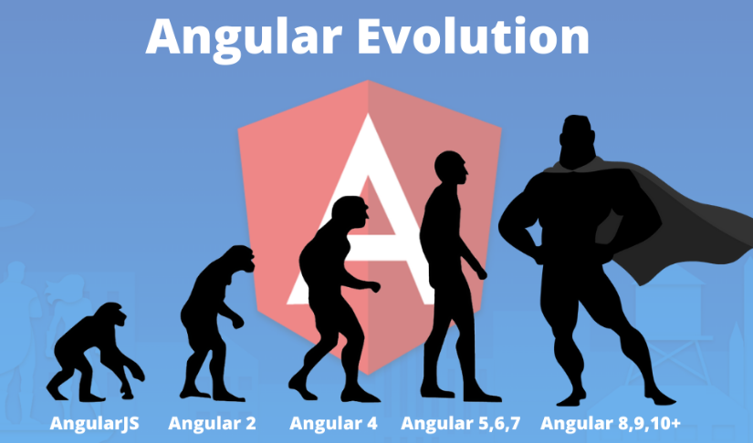

# MyNewAngularApp

This project was generated with [Angular CLI](https://github.com/angular/angular-cli) version 13.3.6.

## Development server

Run `ng serve` for a dev server. Navigate to `http://localhost:4200/`. The application will automatically reload if you change any of the source files.

## Code scaffolding

Run `ng generate component component-name` to generate a new component. You can also use `ng generate directive|pipe|service|class|guard|interface|enum|module`.

## Build

Run `ng build` to build the project. The build artifacts will be stored in the `dist/` directory.

## Running unit tests

Run `ng test` to execute the unit tests via [Karma](https://karma-runner.github.io).

## Running end-to-end tests

Run `ng e2e` to execute the end-to-end tests via a platform of your choice. To use this command, you need to first add a package that implements end-to-end testing capabilities.

## Further help

To get more help on the Angular CLI use `ng help` or go check out the [Angular CLI Overview and Command Reference](https://angular.io/cli) page.

======================================== tutorial ==================================
# AngularStudy [Link](https://angular-templates.io/tutorials/about/learn-angular-from-scratch-step-by-step)

 

## Learning Angular: What is Angular?

- Angular is a platform for building mobile and desktop web applications. 
- It has a big community of millions of developers who choose Angular to build compelling user interfaces.
- Angular is a JavaScript open-source front-end web application framework.
-  It is primarily sustained by Google together with an extended community of people and companies. 
-  Angular solves many of the challenges faced when developing single page, cross platform, performant applications. 
-  It's fully extensible and works very well with other libraries. For additional details visit their [official documentation page](https://angular.io/features).

 

> My goal in this Angular real world example tutorial is to provide a complete guide for you to learn Angular step by step. We will start explaining the why's and basic concepts and then continue exploring more advanced notions.

We want to help beginners through their first steps on the Angular world. As developers, we know that starting with a new technology can sometimes be a bit frustrating so want to help here. We will learn enough core Angular to get started and gain confidence that we can build any kind of app with Angular. We will be covering a lot of ground at an introductory level, but also, you will find plenty of references to topics with greater depth.

- To help you through your Angular learning process, we created an Angular app with a question and answer format (Q&A), where users will be able to ask, answer and vote questions.
- Also, we will explain how to connect this app with a remote API to handle data integration.

You can download all the source code of this angular free template by clicking the GET THE CODE button from above. Also, we published an [online demo](https://learn-angular-from-scratch.firebaseapp.com/) of the app we are going to build in this Getting Started with Angular guide.

 

### Our journey with Angular

 

We began testing and experimenting with the very first release of Angular 2.0.0-beta.0 on december 2015 with hopes of finding a framework that was clearly better than its predecessor (Angular 1.x also know as AngularJS).

I'm going to be completely honest with you here, we almost give up with all the inconsistency, breaking changes and a sort of identity crisis that happened in the middle of the Angular 2+ development.

It was a long way until Angular reached a solid milestone with Universal (server-side rendering), ahead-of-time compilation (AOT), lazy loading and a solid bundling config working together nicely. Back in those years it was not easy to create a production ready angular application. But thanks to the angular team and to the angular community, that changed.

 

>Amazing things can be created with the latest versionss of Angular. You can check our most recent creation with Angular latest version in [Fully - Angular Admin Template](https://angular-templates.io/product/fully-angular-admin-template)

 

Being working, using and trying things out with Angular from the very beginning made us really understand the way it was designed and how it evolved. We were witnesses of the constant improvements and saw how they were all aligned to one simple yet important goal: "Creating an app wit Angular should be easy".

As I mentioned before, for some time during the process, it wasn't. Now I can tell you, Angular is a super solid and stable framework you will love to work with. Current versions of Angular had evolved to the point where you will be quickly impressed.

Angular is a great tool that will:

- Enable you to create software quicker and with less effort
- Result in a more maintainable software
- Encourage good programming practices and design patterns like MVC
- Allow you to collaborate easier with other people
- Allow you to become proficient in a reasonable time
- Address problems that may arise in your software architecture such as Dependency Injection, DRY (Don't Repeat Yourself), etc

 

## Angular for beginners: AngularJS vs Angular 2 vs Angular 12+

 

 

When it all started, back in 2010, this framework was called AngularJS, and alludes to what we now know as Angular 1.x. Then in 2016, Angular 2 arrived as a complete rewrite of the framework, improving from lessons learned and promising performance improvements, and a more scalable and more modern framework.

AngularJS was completely based on controllers and the view communicates using $scope whereas Angular 2 is 100% a component-based approach. In Angular 2, we don't have anymore the controllers and $scope. Components are the building blocks of an Angular 2 app. We will see the benefits of this change in a few minutes.

The first version of Angular was named Angular 2. Later on, it was renamed to "Angular". Between Angular 2 and Angular 10 (the current latest stable version) there was Angular 4 (released early 2017), Angular 5 (released late 2017), Angular 6 (released early 2018), Angular 7 (released late 2018), Angular 8 (released mid 2019), Angular 9 (released early 2020). Angular 10 was released on June 2020. All the information related to versions can be found on the [CHANGELOG](https://github.com/angular/angular/blob/master/CHANGELOG.md).

Don't freak out will all these versions. Because all versions from Angular 2 to Angular 10 are the same framework, they share the same core but they differ in lots of amazing improvements!

 

> From now on, every time we use the term Angular we are referring to the latest version of the framework that currently is Angular 10.

 

### What's new in Angular compared to AngularJS

 

Just for the sake of history, let's go through the main differences between AngularJS and Angular:

- Angular is a complete rewrite of AngularJS.
- An Angular application and its architecture are different from AngularJS. The main building elements for Angular are modules, components, templates, metadata, data binding, directives, services and dependency injection.
- Angular does not have a "scope" concept or controllers, instead, it uses a component hierarchy as its main architecture.
- Angular follows a modularity concept. SImilar functionalities are kept together inside modules. This gives Angular an optmized lighter core.
- The controller concept, which was present in AngularJS, was removed from Angular 2 and above which are componente based UI. This help developers divide applications in components with desired features. These helped improve the flexibility and reusability compared to AngularJS.
- Angular expression syntax is focused on `"[]"` for property binding, and `"( )"` for event binding.
- With AngularJS, building a search engine (SEO) friendly Single Page Application was a major difficulty. But this bottleneck was eliminated with Angular 2 by enabling application rendering in the server. These tasks are possible thanks to the Angular Universal module.

 

Angular recommends using the TypeScript language, which introduces these features:
- Static Typing
- Object Oriented Programming based on class
- Support reactive programming using RxJS

 

On top of TypeScript features, Angular also includes the benefits taken from ES6:
- For/Of loops
- Improved dependency injection
- Iterators
- Reflection
- Dynamic loading
- Asynchronous template compilation
- Simpler Routing

 

### From Angular 2 to Angular 4

 

There were some major changes, but mostly on the project structure with lots of refactors that made the framework more stable.

- Smaller and faster. The upgrade from 2.0 to 4.0 has reduced the bundled file size by 60% while also improving the applications speed.
- Angular 4 is compatible with newer versions of TypeScript 2.1 and TypeScript 2.2.
- Angular Universal: The vast majority of the Angular Universal code has been merged into Angular core.
- Animation Package: Animations taken from the Angular core and set within their own package. Meaning that if you don't use animations, the excess code won't end up in your app.

 

### From Angular 5 to Angular 7

 

Angular 6 was the first release of Angular that unifies the versions of Framework, Material and CLI. This change was made to clarify cross compatibility.

Angular 7 was full of new features, bug fixes, performance improvements, and some code deprecation as a clean up of the refactors from old versions.

- Optimizations to the build process that reduces the application size by removing unnecessary code.
- Material Design components with server-side rendering.
- Angular Universal improvements for code allocation between the server and client-side versions of the application.
- Lots of improvements in the Angular CLI
- Smaller bundle sizes
- Improved compiler that supports incremental compilation meaning faster rebuilds.
- RxJS (reactive programming library) has been updated to version 6.x or later.
- Angular now requires TypeScript 3.x

 

### From Angular 8 to Angular 12+

 

Angular 8 was a release that spanned the entire platform, including the framework, Angular Material, and the CLI. This release improved application startup time on modern browsers. Also it changed the route configurations to use dynamic imports in favour of lazy loading.

Angular 9 was very expected by the community because it introduced the [Ivy compiler and runtime](https://angular.io/guide/ivy). Ivy is the name for Angular's next-generation compilation and rendering pipeline. With this release, the new compiler and runtime instructions are used by default instead of the older compiler and runtime, known as View Engine.

The Ivy compiler offers the following advantages:

- Smaller bundle sizes
- Faster testing
- Better debugging
- Improved CSS class and style binding
- Improved type checking
- Improved build errors
- Improved build times, enabling AOT on by default
- Improved Internationalization

More information about these advantages can be found on [Angular 9 release note](https://blog.angular.io/version-9-of-angular-now-available-project-ivy-has-arrived-23c97b63cfa3).

Angular 10 release was smaller than typical; it has only been 4 months since the release of Angular 9. More info about this release can be found [here](https://blog.angular.io/version-10-of-angular-now-available-78960babd41).

Moving ahead in this Angular tutorial, let's setup the development environment. After the previous introduction about the current state of the Angular Framework, we are now ready to get started working on our angular app. `The best way to learn Angular is by following this step by step tutorial for beginners`.

In the following section of this angular free course we will go through the setup and requirements needed to start developing Angular apps.

> If you are in the process of starting your Angular project and need help, take a look to our Angular Templates which will help you with Bootstrap, Angular Universal (Server Side Rendering), SEO, Lazy Loading and so much more!
>
> [Angular Site Template](https://angular-templates.io/product/angular-site-template) includes tons of use cases implemented the Angular way such as authentication flows, product listing, filtering, forms, routing guards and more.

 

## Requirements and setup to start learning Angular

 

### Setup the Angular development environment
 

- In this section we will show you how to setup your local development environment so you can start developing Angular apps.
- A real application development happens in a local development environment that could be your personal machine. Follow our setup instructions to create a new Angular project.

 

#### `Angular requirements: Install NodeJS and npm`

 

- Node.js and npm are fundamental to modern web development using Angular and other platforms.
- Node empowers client development and build tools.
- We are gonna use the node package manager (npm) to install all the JavaScript libraries dependencies.
- [Get these right now](https://docs.npmjs.com/getting-started/installing-node) if they're not installed on your computer.

 

> Note: Verify that you are running the latest stable versions of node and npm.

 

#### `The Angular CLI`

 

Angular apps are created and developed primarily through the Angular CLI (command line interface tool) that helps project creation, adding files, and performing a variety of ongoing development tasks such as testing, bundling, and deployment.

- The Angular CLI takes care of configuration and initialization of various libraries.
- It also helps us adding components, directives, services, etc, to already existing Angular applications.
- It's also worth mentioning that the CLI uses Typescript and Webpack for module bundling, Karma for unit testing, and Protractor for an end to end testing. 
- It includes everything you need to start writing your Angular application right away.

 

To install the Angular CLI globally, run the following command on your console

~~~
npm install -g @angular/cli
~~~

> Note: although it's not recommended, you may need to add "sudo" in front of these commands to install the utilities globally.
>
> Important note: If you have an older version of the CLI installed in your computer, make sure you properly update it to the latest Angular CLI.

 

### Now, let's get started building the Angular app example project

 

Now that you have Angular and its dependencies installed, we can move on and start building our Angular app. Let's get started!

Starting a new angular app with the CLI is easy! From your command line, run this command: 
~~~
ng new "my-new-angular-app"
~~~

 

The command above will create a folder named "my-new-angular-app" and will copy all the required dependencies and configuration settings. The Angular CLI does this for you:
1) Creates a new directory "my-new-angular-app"
2) Downloads and installs Angular libraries and any other dependencies
3) Installs and configures TypeScript
4) Installs and configures Karma & Protractor (testing libraries)

 

You can also use the `ng init` command. The difference between `` ng init` and `ng new` is that `ng new` requires you to specify the folder name and it will create a folder copying the files while `ng init` will copy the files to the current folder.

Now, you can `cd` into the created folder. To get a quick preview of your app inside the browser, use the serve command use `ng serve`.

This command runs the compiler in watch mode (looks for changes in the code and recompiles if needed), starts the server, launches the app in a browser, and keeps the app running while we continue building it.

The Webpack Development server listens on HTTP port 4200. Hence, if you open the url `http://localhost:4200/` you will see the app running.

 

#### 

